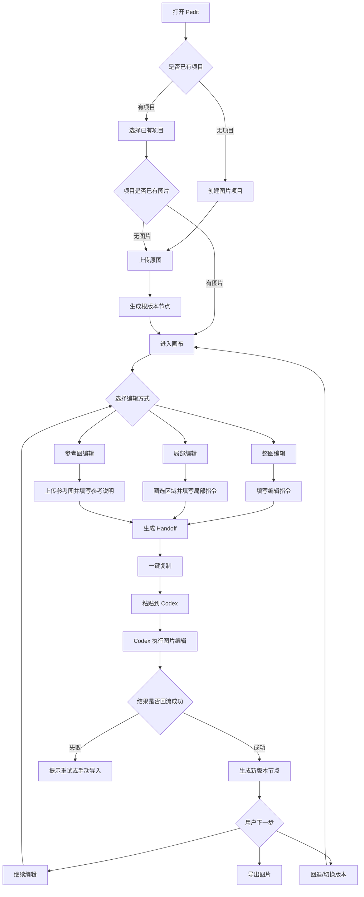
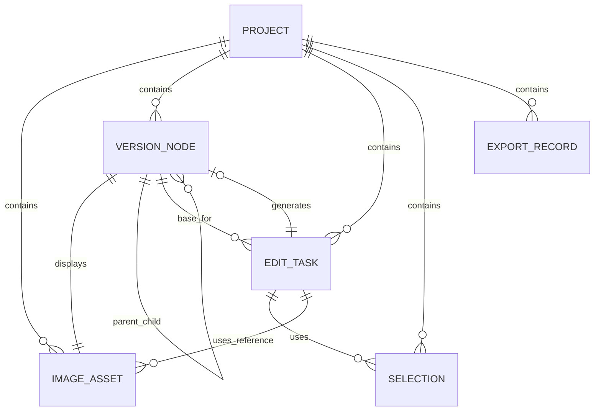
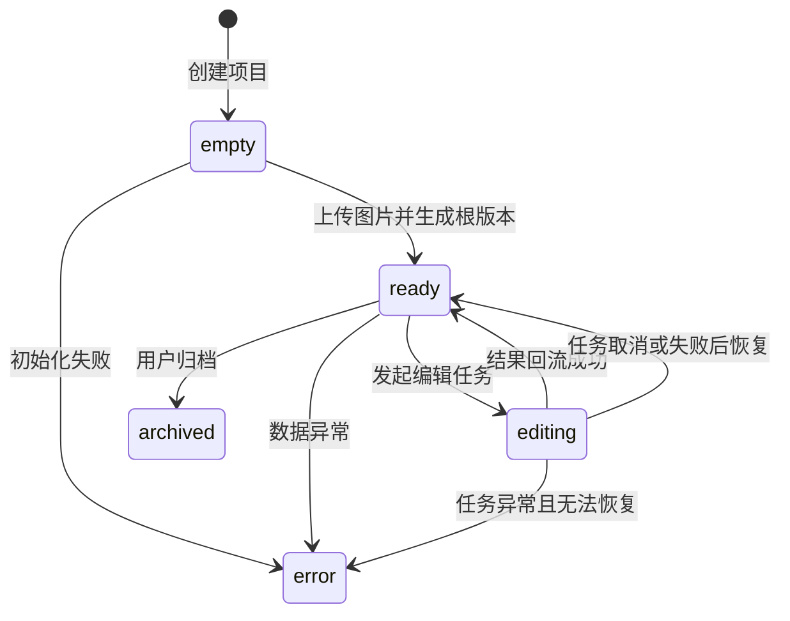
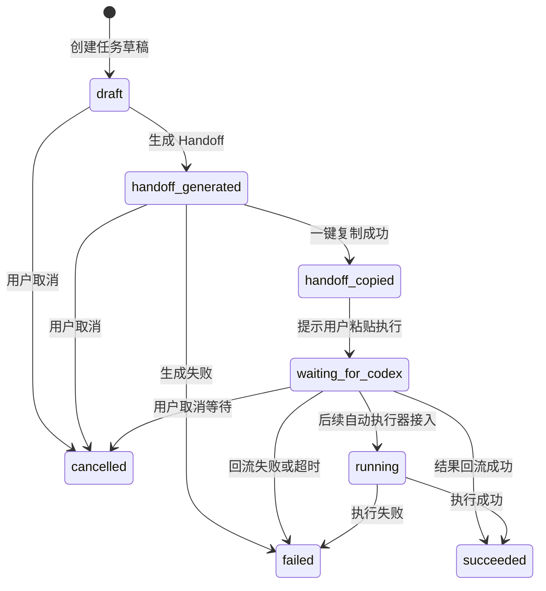
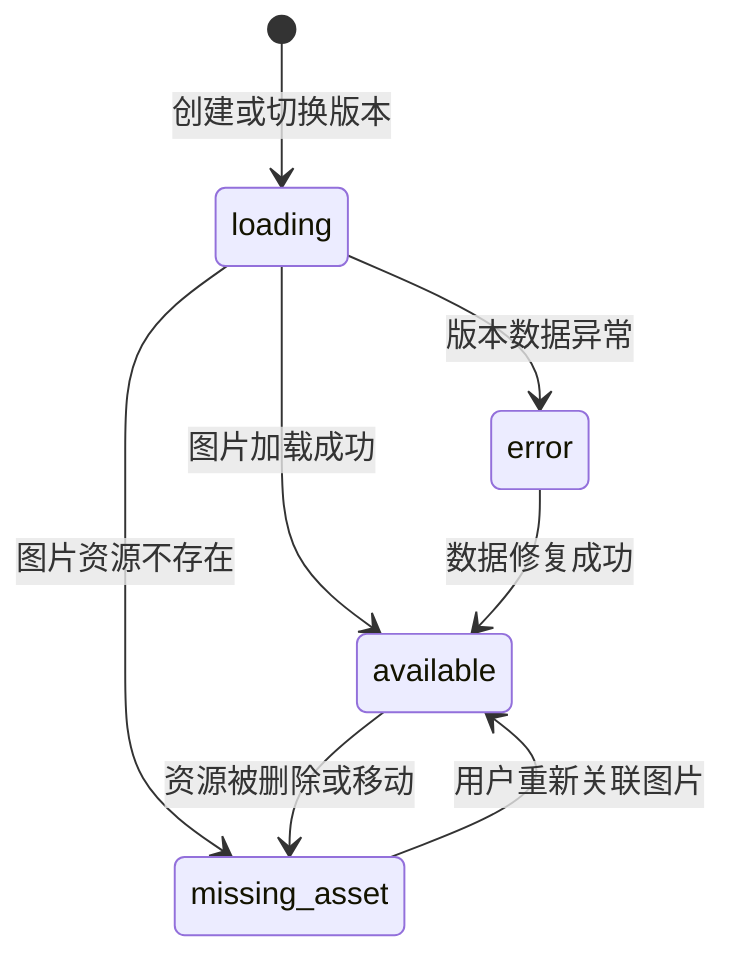

# Pedit PRD：面向 AI 图片编辑工作流的 Codex 本地插件

> 文档版本：v1.0 整理版
> 产品阶段：v0.1.0-alpha / MVP 验证阶段
> 产品形态：Codex 本地图片编辑插件
> 文档用途：产品需求定义、后续开发交接、项目复盘、作品集沉淀

---

## 0. 文档信息

| 字段 | 内容 |
|---|---|
| 产品名称 | Pedit |
| 文档类型 | 产品需求文档 PRD |
| 当前阶段 | v0.1.0-alpha / MVP 验证阶段 |
| 产品形态 | Codex 本地图片编辑插件 |
| 核心定位 | 面向 AI 图片编辑场景的工作流插件 |
| 当前执行方式 | 半自动 Handoff：Pedit 生成结构化任务，用户一键复制后粘贴到 Codex 执行 |
| 目标用户 | AI 修图用户、内容创作者、产品/运营/设计人员、AI Agent 工具探索者 |
| 核心能力 | 图片项目管理、画布编辑、局部标注、参考图上传、Handoff 任务生成、版本树管理、图片导出 |
| 文档目标 | 明确 Pedit MVP 阶段的需求背景、产品目标、用户场景、核心方案、功能边界、核心流程、数据结构、指标、风险和版本规划 |

### 0.1 术语统一

| 术语 | 统一写法 | 说明 |
|---|---|---|
| Pedit | Pedit | 产品名称 |
| Codex | Codex | 外部 AI 执行环境 |
| Codex/image2 | Codex/image2 | 长期重点探索的图像编辑执行能力 |
| Handoff | Handoff | Pedit 生成的结构化任务交接内容 |
| 半自动 Handoff | 半自动 Handoff | 当前主链路：一键复制后由用户粘贴到 Codex 执行 |
| 执行器 | Executor / 执行器 | 后续用于抽象 Codex/image2、外部 API、本地模型、用户 Skill 等执行能力 |
| 图片资产 | ImageAsset | 原图、生成图、参考图等图片资源对象 |
| 版本节点 | VersionNode | 版本树中的每个图片版本节点 |
| 编辑任务 | EditTask | 一次用户发起的图片编辑任务 |
| 选区 | Selection | 用户在画布中圈选的局部编辑区域 |
| Skill | Skill / 修图 Skill | 可复用的修图能力单元，可包含 Prompt 模板、任务结构、执行方式和质检要求 |

### 0.2 优先级定义

| 优先级 | 含义 |
|---|---|
| P0 | MVP 必须支持，缺失会导致核心流程无法跑通 |
| P1 | 强烈建议支持，影响用户体验和流程稳定性 |
| P2 | 可延后支持，用于增强体验或为后续版本预留能力 |

---

## 1. 背景与问题定义

### 1.1 行业背景

随着多模态大模型和 AI 图像生成能力的发展，用户已经可以通过自然语言完成图片生成、图片优化、风格迁移、局部修改、背景替换等任务。AI 图片编辑正在从专业设计软件中的辅助能力，逐步变成普通用户也可以使用的生产力工具。

但在真实使用过程中，用户的需求并不只是“生成一张图片”或“完成一次修图”。很多图片编辑任务本质上是一个连续过程：用户需要基于原图提出修改要求，查看结果，再继续微调、回退、对比不同版本，直到得到一个可用结果。

因此，AI 图片编辑的核心问题正在从“模型能不能生成”转向“用户能不能可控、连续、可回退地完成编辑过程”。

Pedit 正是在这个背景下产生的：它希望把 AI 修图从一次性 Prompt 交互，升级为一个由画布、选区、参考图、任务和版本树共同承载的 AI 图片编辑工作流。

### 1.2 用户问题

#### 1.2.1 局部编辑意图难以准确表达

很多修图任务并不是整图修改，而是针对图片中的局部区域进行编辑，例如改变人物眼睛颜色、替换包装文字、删除背景物体、调整衣服颜色、修复局部瑕疵等。

如果用户只能通过自然语言描述，很容易出现表达不清的问题。例如“把左边那个东西删掉”“修改人物旁边的文字”“让这里更亮一点”，模型可能无法准确理解具体范围。

因此，用户需要一种更直观的方式来表达“改哪里”。

#### 1.2.2 多轮编辑上下文容易断裂

AI 修图通常不是一次完成的。用户可能会经历以下过程：

```text
上传原图
→ 第一次整体优化
→ 发现局部不满意
→ 针对局部继续修改
→ 再上传参考图调整风格
→ 对比多个结果
→ 回到某个历史版本继续编辑
```

但在传统对话式修图流程中，图片、Prompt、参考图、历史结果往往分散在不同位置。用户需要依赖自己记忆或本地文件命名来管理上下文。

#### 1.2.3 版本管理能力不足

AI 生成结果天然存在不确定性。用户经常遇到：第一次结果整体不错但局部不好，第二次局部修好了但整体风格变差，或者想回到之前版本重新尝试另一种方向。如果没有版本管理，用户只能依赖本地文件夹手动保存不同结果，成本高且缺少父子关系和编辑历史。

#### 1.2.4 工具切换和任务交接成本高

当前用户完成一次 AI 修图，往往需要在多个工具之间切换：本地文件夹、AI 对话框、在线图片工具、下载结果、重新上传、再写 Prompt、再保存新版本。这种流程会带来明显摩擦：上传、下载、复制 Prompt 的操作成本高，图片、参考图、编辑指令和结果之间缺少统一组织。

### 1.3 当前方案痛点

| 方案 | 优势 | 主要问题 |
|---|---|---|
| 直接在 AI 对话框中上传图片并写 Prompt | 上手简单，适合单次任务 | 局部控制弱，版本难管理，多轮上下文容易断裂 |
| 使用在线 AI 修图工具 | 功能聚焦，适合轻量处理 | 工具之间割裂，难以沉淀完整工作流 |
| 使用传统设计软件 | 控制能力强，适合专业编辑 | 学习成本高，对普通用户不友好，AI Agent 协作弱 |
| 多工具组合使用 | 灵活度高 | 上传、下载、复制、命名和版本管理成本高 |
| 本地文件夹手动管理版本 | 可控，可离线保存 | 缺少版本关系、任务记录和编辑上下文 |

### 1.4 产品机会

Pedit 对 AI 修图场景做出一个核心判断：

> AI 修图需要的不只是更强的模型能力，还需要一个能够承载图片上下文、编辑意图、任务状态和版本历史的工作流工作台。

Pedit 的产品机会不是再做一个单独的图片生成工具，而是围绕 AI 图片编辑过程建立一层工作流界面。这层工作流界面需要具备以下能力：

1. 用图片项目组织同一张图的编辑过程；
2. 用画布承载原图、结果图、参考图和编辑上下文；
3. 用局部标注帮助用户明确“改哪里”；
4. 用结构化 Handoff 把用户意图转化为可执行任务；
5. 用版本树记录每一次编辑结果；
6. 用回退、分支和导出支持持续编辑；
7. 后续通过质检、反馈和 Skill 机制持续提升修图效果和复用能力。

因此，Pedit 的核心机会可以概括为：

> 将 AI 修图从“一次性 Prompt 生成”升级为“可组织、可追踪、可回退、可迭代的 Agentic Editing Workflow”。

---

## 2. 产品目标与阶段边界

### 2.1 产品愿景

Pedit 的长期愿景，是构建一个以画布为中心的 AI 图片编辑工作流平台。

在这个平台中，画布不只是展示图片的地方，而是用户组织图片上下文、表达编辑意图、管理历史版本、触发 AI 执行、查看结果质量、沉淀修图经验的核心工作台。

长期来看，Pedit 希望帮助用户完成以下完整闭环：

```text
上传图片
→ 组织原图、选区、参考图和编辑意图
→ 创建结构化修图任务
→ 调度 Codex/image2 或其他图像编辑执行器
→ 等待执行结果
→ 结果自动回流
→ 进行图片质检
→ 收集用户反馈
→ 生成版本节点
→ 支持继续编辑、回退、导出或沉淀为 Skill
```

Pedit 的最终价值不是让用户更方便地发送一个修图 Prompt，而是把 AI 图片编辑变成一个可控、连续、可评估、可沉淀、可复用的工作流系统。

### 2.2 MVP 目标

MVP 阶段的核心目标，不是直接实现完全自动化的 AI 修图，而是验证以下产品假设：

> “画布 + 局部标注 + 结构化 Handoff + 版本树”是否能够有效承载 AI 图片编辑工作流。

围绕这个假设，MVP 需要完成三类验证：

1. 验证用户是否需要画布承载图片编辑上下文；
2. 验证局部标注是否能降低 AI 修图表达成本；
3. 验证版本树是否能提升多轮编辑体验。

因此，MVP 阶段的重点是跑通 AI 修图工作流，而不是追求所有执行链路完全自动化。

### 2.3 本期目标

当前版本的本期目标，是完成 Pedit 作为 Codex 本地图片编辑插件的核心闭环：

```text
创建项目
→ 上传图片
→ 进入画布
→ 选择整图编辑 / 局部编辑 / 参考图编辑
→ 生成 Handoff
→ 一键复制
→ 粘贴到 Codex 执行
→ 结果回流
→ 生成版本节点
→ 继续编辑 / 回退 / 导出
```

本期需要支持：图片项目、图片上传、画布、整图编辑、局部标注、参考图上传、结构化 Handoff、一键复制、结果回流、版本树和图片导出。

### 2.4 非目标范围

为了保证 MVP 阶段聚焦，当前版本暂不解决以下问题：

| 非目标 | 说明 |
|---|---|
| 不内置中心化图像生成 API | 避免过早引入 API Key、账号、额度、成本、图片存储和合规问题 |
| 不承诺自动调用 Codex/image2 | 自动调用链路仍存在平台能力、耗时和稳定性不确定性 |
| 不做复杂图片质检 | 先验证任务组织和版本化闭环，质检后续补充 |
| 不做完整用户反馈系统 | 反馈系统进入 beta 阶段后建设 |
| 不做 Skill 市场和社区分发 | MVP 阶段只预留 Skill 扩展方向 |
| 不做多人协作 | 当前聚焦单用户本地图片编辑工作流 |
| 不做专业设计软件级图层系统 | Pedit 的核心是 AI 编辑工作流，不是替代 Photoshop/Figma |

---

## 3. 目标用户与核心场景

### 3.1 目标用户

#### 3.1.1 AI 修图尝鲜用户

这类用户已经开始使用 AI 工具进行图片编辑，但通常缺少专业设计能力。他们希望通过自然语言完成换背景、调色、局部修改、风格优化等任务，同时希望对修改范围有更强控制。

#### 3.1.2 内容创作者

这类用户经常处理社交媒体封面、营销图、头像、商品图、笔记配图等内容素材。他们需要快速生成多种风格方案，基于某个版本继续微调，并减少上传、下载、命名和整理文件的成本。

#### 3.1.3 产品、运营、设计人员

这类用户在工作中经常需要快速处理图片素材，例如产品示意图、营销海报、活动图、页面配图、汇报材料中的视觉素材。他们不一定是专业设计师，但需要快速完成可用结果，并保留清晰任务记录和版本历史。

#### 3.1.4 AI Agent 工具探索者

这类用户关注 Codex、MCP、AI Coding、Agent Workflow 等新型工具形态。他们不仅关心修图结果，也关心如何把 AI 能力整合进具体工作流中。

### 3.2 核心使用场景

| 场景 | 用户目标 | Pedit 价值 |
|---|---|---|
| 整图优化 | 整体提升画面质感、光线、色调、风格 | 将整图指令组织为结构化 Handoff |
| 局部修改 | 只修改某个区域，如文字、衣服、背景物体 | 通过选区表达“改哪里”，降低歧义 |
| 参考图辅助编辑 | 参考另一张图的风格、色调、构图、质感 | 将参考图和参考维度进入任务上下文 |
| 多版本探索与回退 | 尝试多个结果，回到历史版本继续编辑 | 版本树记录父子关系和编辑历史 |
| Codex 内完成图片编辑闭环 | 减少多工具切换和文件管理成本 | 在 Codex 中完成任务组织、执行和结果回流 |

### 3.3 用户旅程

以一次局部修图任务为例，用户旅程如下：

| 阶段 | 用户行为 | 用户目标 | Pedit 需要提供的能力 |
|---|---|---|---|
| 进入产品 | 在 Codex 中打开 Pedit | 开始图片编辑任务 | 插件入口、项目列表、创建项目 |
| 上传图片 | 上传原图 | 将图片纳入编辑工作流 | 图片上传、画布展示 |
| 表达意图 | 圈选局部区域并填写指令 | 明确改哪里、怎么改 | 局部标注、指令输入 |
| 组织任务 | 点击开始优化 | 将修图意图转成可执行任务 | 结构化 Handoff、任务摘要 |
| 交给 Codex | 一键复制并粘贴到 Codex | 让 Codex 执行修图 | 一键复制、下一步提示 |
| 等待结果 | Codex 执行图片编辑 | 获得修图结果 | 任务状态提示、结果回流 |
| 查看结果 | 在 Pedit 中查看新版本 | 判断结果是否可用 | 版本节点、图片预览 |
| 继续操作 | 继续编辑、回退或导出 | 完成最终图片产出 | 版本树、分支编辑、导出 |

---

## 4. 产品方案概述

### 4.1 一句话方案

Pedit 是一个运行在 Codex 中的本地图片编辑插件，通过图片项目、画布、局部标注、参考图、结构化 Handoff 和版本树，把 AI 修图从一次性 Prompt 交互升级为可追踪、可回退、可迭代的图片编辑工作流。

### 4.2 核心产品闭环

```text
用户创建项目
→ 上传原图
→ 在画布中表达编辑意图
→ Pedit 生成结构化 Handoff 任务
→ 用户一键复制并粘贴到 Codex
→ Codex 执行图像编辑任务
→ 结果回流到 Pedit
→ 生成新的版本节点
→ 用户继续编辑、回退或导出
```

这个闭环中，Pedit 负责三件事：

1. **组织上下文**：将原图、选区、参考图、编辑指令和当前版本统一组织起来；
2. **生成任务**：将用户自然语言需求转化为结构化 Handoff；
3. **管理结果**：将每次生成结果沉淀为版本节点，支持继续编辑、回退、分支和导出。

### 4.3 MVP 产品范围

#### 4.3.1 本期必须完成

| 模块 | 能力说明 |
|---|---|
| 图片项目管理 | 支持创建、进入和管理图片项目 |
| 图片上传 | 支持上传原图，并将图片纳入项目 |
| 画布展示 | 支持在画布中查看当前图片和版本结果 |
| 整图编辑 | 支持用户输入整图修图指令 |
| 局部标注 | 支持用户圈选图片区域并填写局部指令 |
| 参考图上传 | 支持上传参考图并说明参考维度 |
| Handoff 生成 | 根据图片、选区、参考图和指令生成结构化任务 |
| 一键复制 | 支持用户一键复制 Handoff 指令 |
| 结果回流 | 支持 Codex 结果回到 Pedit |
| 版本树 | 支持将每次结果生成新的版本节点 |
| 图片导出 | 支持导出当前版本图片 |

#### 4.3.2 本期可选增强

| 模块 | 能力说明 |
|---|---|
| 任务摘要 | 在复制前展示本次任务的结构化摘要 |
| task_id | 为每次编辑任务生成唯一 ID |
| Handoff 历史 | 保留历史任务记录，便于复查 |
| 任务状态 | 展示待复制、已复制、等待执行、执行成功、回流失败等状态 |
| 手动导入 | 当结果无法自动回流时，允许用户手动导入结果 |

#### 4.3.3 本期暂不支持

自动调用 Codex/image2、中心化图像 API、完整图片质检、用户反馈系统、自定义 Skill 系统、Skill 市场、多人协作、云端同步。

### 4.4 关键设计原则

1. **工作流优先，而不是功能堆砌**：所有功能设计都应围绕“上传 → 编辑 → Handoff → 回流 → 版本 → 导出”的闭环展开。
2. **画布是核心交互容器**：画布承载图片、选区、参考图、版本结果和用户编辑意图。
3. **半自动 Handoff 是阶段性取舍**：当前采用一键复制 + 粘贴到 Codex，不把自动调用作为 MVP 前提。
4. **版本必须成为一等对象**：每次编辑结果都应成为版本节点，并记录父版本、任务、时间和上下文。
5. **为未来自动化和 Skill 扩展预留空间**：Handoff、EditTask、VersionNode、Executor 等对象应结构化，便于后续接入自动执行器、质检、反馈和 Skill。

---

## 5. 功能需求

本章描述 Pedit MVP 阶段需要支持的核心功能。当前版本的功能设计围绕一个核心目标展开：帮助用户在 Pedit 中完成从图片上传、编辑意图表达、任务 Handoff、Codex 执行、结果回流到版本管理的完整 AI 图片编辑工作流。

### 5.1 图片项目管理

#### 5.1.1 需求背景

AI 图片编辑通常不是一次性任务。用户可能围绕同一张图片进行多轮修改，产生多个版本，并在不同方向上进行分支探索。Pedit 需要以“图片项目”为基本组织单位，将原图、编辑任务、参考图、版本节点和导出结果统一管理起来。

#### 5.1.2 用户故事

作为一个 AI 修图用户，我希望可以为每一次图片编辑创建一个独立项目，从而集中管理原图、历史版本、编辑任务和最终结果。

#### 5.1.3 功能说明

| 功能点 | 说明 | 优先级 |
|---|---|---|
| 创建项目 | 用户可以创建一个新的图片项目 | P0 |
| 项目命名 | 用户可以为项目设置名称 | P0 |
| 项目列表 | 用户可以查看已创建项目 | P0 |
| 进入项目 | 用户可以点击项目进入画布 | P0 |
| 项目更新时间 | 当项目发生编辑、回流或导出时，更新最近操作时间 | P1 |
| 删除项目 | 用户可以删除不再需要的项目 | P2 |
| 项目搜索 | 用户可以按名称查找项目 | P2 |

#### 5.1.4 交互规则

1. 用户打开 Pedit 后，默认进入项目列表页。
2. 如果当前没有项目，展示空状态，引导用户创建第一个图片项目。
3. 用户点击“新建项目”后，可输入项目名称。
4. 如果用户未填写项目名称，系统使用默认名称。
5. 项目创建成功后，系统进入图片上传或画布页面。
6. 项目列表按最近更新时间倒序展示。

#### 5.1.5 异常状态与验收标准

| 异常 | 处理方式 |
|---|---|
| 项目名称为空 | 使用默认项目名称 |
| 项目创建失败 | 提示“项目创建失败，请重试” |
| 项目数据损坏 | 提示用户重新打开或创建新项目 |
| 项目列表为空 | 展示空状态和创建引导 |

验收标准：用户可以创建项目、查看项目列表、进入项目继续编辑，项目可以关联原图、版本节点和编辑任务。

### 5.2 图片上传与画布展示

#### 5.2.1 需求背景

图片上传是 Pedit 工作流的起点。画布是 Pedit 的核心交互容器，它不只是展示图片的区域，还需要承载当前版本、选区、参考图关系、版本结果和后续编辑入口。

#### 5.2.2 功能说明

| 功能点 | 说明 | 优先级 |
|---|---|---|
| 上传原图 | 用户可以上传本地图片作为项目原图 | P0 |
| 图片预览 | 上传后在画布中展示图片 | P0 |
| 图片基础信息 | 记录图片尺寸、格式、路径等信息 | P0 |
| 画布缩放 | 支持用户缩放查看图片细节 | P1 |
| 画布拖拽 | 支持用户移动画布视图 | P1 |
| 当前版本标识 | 在画布中明确当前正在编辑的版本 | P1 |

MVP 阶段优先支持 PNG、JPG/JPEG、WebP。

#### 5.2.3 交互规则

1. 新项目未上传图片时，系统展示上传引导。
2. 用户选择本地图片后，系统校验格式和大小。
3. 图片上传成功后，系统自动进入画布视图。
4. 上传后的第一张图片作为项目原图，并生成根版本节点。

#### 5.2.4 异常状态与验收标准

| 异常 | 处理方式 |
|---|---|
| 图片格式不支持 | 提示支持 PNG、JPG、WebP |
| 图片文件过大 | 提示图片过大，建议压缩后重试 |
| 图片读取失败 | 提示上传失败，请重新选择图片 |
| 用户未上传图片就点击编辑 | 提示“请先上传图片” |

验收标准：用户可以上传图片、图片能在画布中显示、图片与项目和根版本节点建立关联。

### 5.3 局部标注与选区

#### 5.3.1 需求背景

AI 修图中的大量任务是局部编辑。仅依赖自然语言描述局部范围，容易产生理解偏差。Pedit 需要提供局部标注与选区能力，让用户通过画布直接表达“改哪里”。

#### 5.3.2 功能说明

| 功能点 | 说明 | 优先级 |
|---|---|---|
| 开启局部标注模式 | 用户可以进入局部编辑状态 | P0 |
| 创建选区 | 用户可以在图片上圈选一个区域 | P0 |
| 显示选区边界 | 圈选完成后展示选区范围 | P0 |
| 输入局部指令 | 用户可以为选区填写修图要求 | P0 |
| 选区进入 Handoff | 选区信息需要被组织进任务上下文 | P0 |
| 删除选区 | 用户可以删除已创建选区 | P1 |
| 编辑选区指令 | 用户可以修改选区对应指令 | P1 |
| 多选区 | 支持同一任务中多个选区 | P2 |

#### 5.3.3 选区数据要求

每个选区至少需要记录：选区 ID、所属项目 ID、所属版本 ID、选区坐标、选区尺寸、选区形状、局部编辑指令、创建时间。后续可扩展选区 mask、选区截图和选区质检要求。

#### 5.3.4 异常状态与验收标准

| 异常 | 处理方式 |
|---|---|
| 选区为空 | 提示重新圈选 |
| 选区过小 | 提示“选区过小，可能影响修图效果” |
| 选区过大 | 提示“选区接近整图，建议使用整图编辑” |
| 已圈选但未填写指令 | 提示补充局部修改要求 |

验收标准：用户可以创建选区、为选区填写指令，Handoff 中能包含选区信息和局部编辑意图。

### 5.4 整图编辑任务

#### 5.4.1 需求背景

很多高频任务是针对整张图片进行优化，例如提升画质、调整色调、改变风格、优化光线、替换背景氛围等。Pedit 需要支持整图编辑任务，让用户在不圈选区域的情况下，也可以直接表达整体修图需求。

#### 5.4.2 功能说明

| 功能点 | 说明 | 优先级 |
|---|---|---|
| 输入整图指令 | 用户可以描述整体修图目标 | P0 |
| 默认整图任务 | 无选区时默认识别为整图编辑 | P0 |
| 生成整图 Handoff | 将当前图片和整图指令组织成任务 | P0 |
| 与参考图结合 | 整图任务可以结合参考图 | P1 |
| 常用任务模板 | 提供常见整图优化模板 | P2 |

验收标准：用户不创建选区时，可以发起整图编辑任务；系统可以生成整图 Handoff；结果回流后可以生成新版本节点。

### 5.5 参考图上传

#### 5.5.1 需求背景

用户经常很难用自然语言准确描述风格、构图、色调、材质或氛围。参考图可以更直观地表达视觉要求，因此 Pedit 需要支持参考图上传，并允许用户说明参考维度。

#### 5.5.2 功能说明

| 功能点 | 说明 | 优先级 |
|---|---|---|
| 上传参考图 | 用户可以上传一张参考图片 | P0 |
| 参考图预览 | 上传后展示参考图缩略图 | P0 |
| 参考维度说明 | 用户可以说明参考风格、色调、构图等 | P0 |
| 参考图进入 Handoff | 参考图信息进入任务上下文 | P0 |
| 删除参考图 | 用户可以移除参考图 | P1 |
| 多参考图 | 同一任务支持多张参考图 | P2 |

参考维度包括风格、色调、光影、构图、背景、材质、质感、产品形态、人像氛围等。

验收标准：用户可以上传参考图、填写参考说明，Handoff 中包含参考图和参考维度。

### 5.6 Handoff 任务生成与一键复制

#### 5.6.1 需求背景

当前阶段，Pedit 不直接自动调用 Codex/image2，而是采用半自动 Handoff 方案。Pedit 的核心责任，是将用户在画布中组织的图片、选区、参考图和自然语言指令，转化为 Codex 可以理解和执行的结构化任务。

#### 5.6.2 功能说明

| 功能点 | 说明 | 优先级 |
|---|---|---|
| 生成 Handoff | 根据当前任务上下文生成结构化指令 | P0 |
| 一键复制 | 用户可以一键复制 Handoff 内容 | P0 |
| 任务摘要 | 展示任务类型、当前版本、选区、参考图和编辑要求 | P1 |
| task_id | 为每次任务生成唯一 ID | P1 |
| 下一步提示 | 提示用户粘贴到 Codex 对话中执行 | P1 |
| Handoff 历史 | 保留历史 Handoff 记录 | P2 |
| 模板优化 | 针对不同任务类型使用不同模板 | P2 |

#### 5.6.3 Handoff 内容要求

Handoff 至少应包含：task_id、项目名称、当前版本 ID、当前图片路径或可访问引用、任务类型、用户原始指令、选区信息、参考图信息、需要保留的内容、输出要求、结果回写要求。

推荐结构：

```text
任务 ID：
当前项目：
当前版本：
任务类型：
当前图片：
选区信息：
参考图：
用户编辑要求：
需要保留的内容：
输出要求：
请完成图片编辑，并将结果回写到 Pedit 对应任务。
```

#### 5.6.4 校验规则

| 校验项 | 规则 |
|---|---|
| 图片 | 必须存在当前图片 |
| 指令 | 必须存在用户编辑要求 |
| 局部任务 | 如为局部编辑，必须存在有效选区 |
| 参考图任务 | 如上传参考图，建议存在参考说明 |
| 版本 | 必须有当前版本 ID |
| 项目 | 必须有项目 ID |

验收标准：系统可以生成结构化 Handoff；用户可以一键复制；复制成功后有明确反馈；校验失败时有明确提示。

### 5.7 Codex 执行结果回流

#### 5.7.1 需求背景

Pedit 的核心价值不是只生成 Handoff，而是要将 Codex 执行后的图片结果重新纳入 Pedit 的版本管理体系中。如果结果无法回流，用户仍然需要手动下载、保存、命名和管理图片，Pedit 的版本树价值会大幅降低。

#### 5.7.2 功能说明

| 功能点 | 说明 | 优先级 |
|---|---|---|
| 识别任务结果 | 能够识别 Codex 针对某个 task_id 返回的结果 | P0 |
| 结果写入项目 | 将结果图片保存到当前项目 | P0 |
| 生成版本节点 | 结果回流后生成新版本节点 | P0 |
| 关联父版本 | 新版本应关联执行任务所基于的父版本 | P0 |
| 关联任务信息 | 新版本应关联 task_id 和 Handoff 摘要 | P1 |
| 回流失败提示 | 结果未能写回时提示用户 | P1 |
| 手动导入结果 | 支持用户手动导入 Codex 生成结果 | P2 |

#### 5.7.3 回流规则

1. 每次 Handoff 任务应有唯一 task_id。
2. Codex 执行完成后，结果应尽可能携带或匹配 task_id。
3. Pedit 根据 task_id 找到对应项目、父版本和任务上下文。
4. Pedit 将结果图片写入项目资产。
5. Pedit 创建新的版本节点，并将其设置为当前版本。

验收标准：Codex 生成结果后，可以写回 Pedit 项目，并生成新的版本节点。

### 5.8 版本树管理

#### 5.8.1 需求背景

AI 修图结果具有不确定性。用户需要尝试多个版本、比较不同方案、回退到历史版本，或者从某个中间结果重新分支探索。版本树是 Pedit 的核心能力之一。

#### 5.8.2 功能说明

| 功能点 | 说明 | 优先级 |
|---|---|---|
| 根版本节点 | 上传原图后生成根版本 | P0 |
| 新版本节点 | 每次结果回流后生成新节点 | P0 |
| 父子关系 | 新节点关联父版本 | P0 |
| 当前版本 | 用户可以知道当前正在编辑的版本 | P0 |
| 切换版本 | 用户可以点击历史版本查看 | P0 |
| 基于版本继续编辑 | 用户可以从任意版本继续生成新分支 | P1 |
| 版本摘要 | 展示版本对应任务摘要 | P1 |
| 删除版本 | 用户可以删除不需要的版本 | P2 |
| 版本重命名 | 用户可以为重要版本命名 | P2 |
| 版本对比 | 支持两个版本对比 | P2 |

每个版本节点建议包含 version_id、project_id、parent_version_id、image_id、task_id、创建时间、编辑类型、Prompt 摘要、是否使用选区、是否使用参考图、用户备注和版本状态。

验收标准：上传原图后可以生成根版本；每次结果回流后可以生成新版本；用户可以切换历史版本，并基于某个版本继续编辑。

### 5.9 图片导出

#### 5.9.1 需求背景

图片导出是 Pedit 工作流的终点。用户完成多轮编辑后，需要将满意版本保存为本地文件，用于发布、分享、设计、汇报或后续处理。

#### 5.9.2 功能说明

| 功能点 | 说明 | 优先级 |
|---|---|---|
| 导出当前版本 | 用户可以导出当前画布显示图片 | P0 |
| 文件命名 | 导出文件应有合理默认命名 | P1 |
| 导出格式 | 默认导出为原图片格式或 PNG | P1 |
| 导出成功提示 | 导出完成后提示用户 | P1 |
| 导出失败提示 | 失败时告知原因 | P1 |
| 批量导出 | 导出多个版本 | P2 |

建议默认命名格式：

```text
pedit_{projectName}_{versionId}_{timestamp}.png
```

验收标准：用户可以导出当前版本图片，导出文件可以正常打开，导出成功或失败均有明确提示。

### 5.10 异常状态与空状态

#### 5.10.1 核心空状态

| 场景 | 空状态文案方向 | 引导操作 |
|---|---|---|
| 无项目 | 还没有图片项目 | 新建项目 |
| 项目无图片 | 请上传一张图片开始编辑 | 上传图片 |
| 无版本记录 | 上传原图后会生成第一个版本 | 上传图片 |
| 无参考图 | 可上传参考图辅助编辑 | 上传参考图 |
| 无编辑任务 | 点击开始优化后会生成任务记录 | 填写指令 |
| 无回流结果 | 暂无 Codex 返回结果 | 确认执行或重试 |

#### 5.10.2 核心异常状态

| 模块 | 异常 | 用户提示 | 补救方式 |
|---|---|---|---|
| 项目 | 项目创建失败 | 项目创建失败，请重试 | 重新创建 |
| 上传 | 图片上传失败 | 图片上传失败，请检查格式或大小 | 重新上传 |
| 画布 | 图片加载失败 | 图片加载失败，请重新打开项目 | 重新加载 |
| 选区 | 选区无效 | 请重新圈选需要修改的区域 | 重新标注 |
| 指令 | 未填写编辑要求 | 请填写本次希望如何修改图片 | 补充指令 |
| Handoff | 生成失败 | 任务生成失败，请重试 | 重新生成 |
| 复制 | 复制失败 | 自动复制失败，请手动复制 | 展示文本框 |
| 回流 | 结果回流失败 | 结果未能写回 Pedit | 重试或手动导入 |
| 导出 | 导出失败 | 图片导出失败，请重试 | 重新导出 |

### 5.11 MVP 功能闭环验收

```text
用户可以创建图片项目
→ 上传一张原图
→ 在画布中查看图片
→ 选择整图编辑或局部编辑
→ 输入修图要求
→ 可选上传参考图
→ 生成结构化 Handoff
→ 一键复制 Handoff
→ 粘贴到 Codex 执行
→ 结果回流到 Pedit
→ 生成新的版本节点
→ 用户可以继续编辑、回退或导出
```

MVP 阶段不以“是否完全自动调用 Codex/image2”为验收前提，而以“是否成功组织 AI 修图工作流并完成版本化闭环”为核心验收标准。

---

## 6. 核心流程设计

### 6.1 总体流程



### 6.2 新建项目流程

```text
用户打开 Pedit
→ 点击新建项目
→ 输入项目名称
→ 系统创建项目
→ 进入图片上传页面
```

交互规则：用户不填写名称时使用默认名称；项目创建后默认进入上传图片流程；项目创建失败时提示重试。

### 6.3 图片上传与根版本生成流程

```text
用户进入新项目
→ 点击上传图片
→ 选择本地图片
→ 系统读取图片
→ 系统展示图片预览
→ 系统生成 ImageAsset
→ 系统生成根版本节点
→ 进入画布
```

根版本节点规则：`parentVersionId` 为空，`versionType = original`，关联上传的原图 ImageAsset，并设置为当前版本。

### 6.4 整图编辑流程

```text
用户进入画布
→ 确认当前版本
→ 输入整图编辑指令
→ 可选上传参考图
→ 点击开始优化
→ 系统校验任务信息
→ 生成整图 Handoff
→ 用户一键复制
→ 粘贴到 Codex 执行
→ 等待结果回流
→ 生成新版本节点
```

Handoff 中应明确任务作用范围为“整张图片”，并写入需要保留的主体或不应被改变的内容。

### 6.5 局部编辑流程

```text
用户进入画布
→ 选择局部编辑模式
→ 在图片上圈选区域
→ 系统展示选区边界
→ 用户填写局部编辑指令
→ 可选上传参考图
→ 点击开始优化
→ 系统校验选区和指令
→ 生成局部编辑 Handoff
→ 用户一键复制
→ 粘贴到 Codex 执行
→ 等待结果回流
→ 生成新版本节点
```

MVP 阶段优先支持单选区编辑。Handoff 中应明确说明“主要修改选区内内容，尽量保持非选区区域不变”。

### 6.6 参考图编辑流程

```text
用户进入画布
→ 上传参考图
→ 系统展示参考图预览
→ 用户填写参考说明
→ 选择整图编辑或局部编辑
→ 填写编辑指令
→ 点击开始优化
→ 系统生成包含参考图信息的 Handoff
→ 用户一键复制
→ 粘贴到 Codex 执行
→ 等待结果回流
→ 生成新版本节点
```

参考图默认只作用于当前任务，不自动影响后续任务。

### 6.7 Handoff 生成与复制流程

```text
用户完成任务信息填写
→ 点击开始优化
→ 系统校验任务上下文
→ 生成 task_id
→ 生成结构化 Handoff
→ 展示任务摘要
→ 用户点击一键复制
→ 系统复制到剪贴板
→ 状态更新为已复制
→ 提示用户粘贴到 Codex
```

状态流转：

```text
task_draft
→ handoff_generated
→ handoff_copied
→ waiting_for_codex
→ result_returned / failed
```

### 6.8 Codex 执行与结果回流流程

```text
用户将 Handoff 粘贴到 Codex
→ Codex 理解任务并执行图片编辑
→ Codex 生成结果图片
→ 结果写回 Pedit
→ Pedit 匹配 task_id
→ 保存结果图片
→ 创建新版本节点
→ 更新当前版本
→ 画布展示新结果
```

若 task_id 缺失或无法识别，后续应支持用户手动选择项目和父版本进行挂载。

### 6.9 版本切换、回退与分支编辑流程

```text
用户查看版本树
→ 点击某个版本节点
→ 系统加载该版本图片
→ 画布展示选中版本
→ 当前版本状态更新
```

用户从历史版本继续编辑时，新结果应挂载为该历史版本的子节点。回退版本不应删除后续版本，只改变当前查看或编辑的版本。

### 6.10 图片导出流程

```text
用户在画布中查看某个版本
→ 点击导出
→ 系统生成默认文件名
→ 用户确认保存
→ 图片写入本地
→ 系统提示导出成功
```

导出对象默认为当前画布展示版本。导出操作不改变版本树结构。

### 6.11 异常兜底流程

关键异常兜底：

| 异常 | 兜底方式 |
|---|---|
| Handoff 复制失败 | 展示完整 Handoff 文本，允许用户手动复制 |
| Codex 长时间未返回结果 | 提示检查 Codex 是否已执行，提供重新复制或手动导入入口 |
| 结果无法匹配任务 | 允许用户选择目标项目和父版本进行手动挂载 |
| 版本图片资源缺失 | 标记版本节点异常，提示用户重新关联或切换其他版本 |

### 6.12 核心流程验收标准

Pedit MVP 阶段至少需要跑通：项目创建与图片上传流程、整图编辑流程、局部编辑流程、参考图编辑流程、版本管理与导出流程。

---

## 7. 数据结构与状态设计

### 7.1 数据设计原则

1. Project 是最高层组织单位；
2. VersionNode 是图片编辑历史的核心对象；
3. EditTask 是连接用户意图与执行结果的关键对象；
4. ImageAsset 负责统一管理图片资源；
5. Selection 与 Reference Image 只在任务上下文中生效；
6. 为后续自动执行、质检、反馈和 Skill 预留字段。

### 7.2 核心对象关系

```text
Project
├── ImageAsset[]
│   ├── original image
│   ├── generated images
│   └── reference images
├── VersionNode[]
│   ├── root version
│   └── generated versions
├── EditTask[]
│   ├── global edit task
│   ├── local edit task
│   └── reference edit task
├── Selection[]
│   └── local edit regions
└── ExportRecord[]
    └── exported versions
```



### 7.3 Project

```typescript
type Project = {
  id: string;
  name: string;
  rootImageId?: string;
  rootVersionId?: string;
  currentVersionId?: string;
  createdAt: string;
  updatedAt: string;
  status: ProjectStatus;
  metadata?: {
    description?: string;
    coverImageId?: string;
    lastOpenedAt?: string;
  };
};

type ProjectStatus = "empty" | "ready" | "editing" | "archived" | "error";
```

业务规则：Project 创建后默认 `empty`；上传原图并生成根版本后变为 `ready`；发起编辑任务后可变为 `editing`；结果回流后恢复 `ready`。

### 7.4 ImageAsset

```typescript
type ImageAsset = {
  id: string;
  projectId: string;
  role: ImageAssetRole;
  fileName: string;
  filePath: string;
  mimeType: string;
  width?: number;
  height?: number;
  sizeBytes?: number;
  source: ImageAssetSource;
  createdAt: string;
  metadata?: {
    checksum?: string;
    thumbnailPath?: string;
    importedFrom?: string;
  };
};

type ImageAssetRole = "original" | "generated" | "reference" | "manual_import";
type ImageAssetSource = "user_upload" | "codex_result" | "manual_import" | "system_generated";
```

业务规则：根版本必须关联 `original` 类型 ImageAsset；每次结果回流后创建 `generated` 类型 ImageAsset；参考图作为 `reference` 类型 ImageAsset 存储。

### 7.5 VersionNode

```typescript
type VersionNode = {
  id: string;
  projectId: string;
  parentVersionId?: string;
  childVersionIds?: string[];
  imageId: string;
  taskId?: string;
  versionType: VersionType;
  status: VersionStatus;
  name?: string;
  promptSummary?: string;
  createdAt: string;
  updatedAt?: string;
  metadata?: {
    usedSelectionIds?: string[];
    usedReferenceImageIds?: string[];
    executorType?: ExecutorType;
    isExported?: boolean;
    userNote?: string;
  };
};

type VersionType = "original" | "generated" | "manual_import";
type VersionStatus = "available" | "loading" | "missing_asset" | "error";
```

业务规则：根版本 `parentVersionId` 为空；生成版本必须有关联 `taskId`；用户从历史版本继续编辑时，新版本应挂载到该历史版本下。

### 7.6 EditTask

```typescript
type EditTask = {
  id: string;
  projectId: string;
  baseVersionId: string;
  taskType: EditTaskType;
  status: EditTaskStatus;
  userPrompt: string;
  handoffText?: string;
  handoffCopiedAt?: string;
  selectionIds?: string[];
  referenceImageIds?: string[];
  resultVersionId?: string;
  resultImageId?: string;
  executorType?: ExecutorType;
  createdAt: string;
  updatedAt?: string;
  completedAt?: string;
  error?: {
    code: string;
    message: string;
    recoverable: boolean;
  };
  metadata?: {
    promptSummary?: string;
    preserveRequirements?: string;
    outputRequirements?: string;
    retryCount?: number;
    skillId?: string;
  };
};

type EditTaskType =
  | "global_edit"
  | "local_edit"
  | "reference_edit"
  | "global_with_reference"
  | "local_with_reference";

type EditTaskStatus =
  | "draft"
  | "handoff_generated"
  | "handoff_copied"
  | "waiting_for_codex"
  | "running"
  | "succeeded"
  | "failed"
  | "cancelled";

type ExecutorType =
  | "codex_handoff"
  | "codex_image2"
  | "external_api"
  | "local_model"
  | "user_skill";
```

业务规则：当前 MVP 阶段 `executorType` 默认为 `codex_handoff`；局部编辑任务必须关联 Selection；使用参考图的任务必须关联 Reference ImageAsset；任务成功后写入 `resultVersionId` 和 `resultImageId`。

### 7.7 Selection

```typescript
type Selection = {
  id: string;
  projectId: string;
  versionId: string;
  shapeType: SelectionShapeType;
  bounds: {
    x: number;
    y: number;
    width: number;
    height: number;
  };
  points?: Array<{ x: number; y: number }>;
  maskImageId?: string;
  previewImageId?: string;
  instruction?: string;
  createdAt: string;
  updatedAt?: string;
  metadata?: {
    label?: string;
    confidenceNote?: string;
  };
};

type SelectionShapeType = "rectangle" | "freehand" | "polygon" | "mask";
```

选区坐标应使用相对原图的像素坐标，而不是屏幕显示坐标，以避免画布缩放和平移影响 Handoff 和后续质检。

### 7.8 ReferenceImage 关系

参考图本质上是 `role = reference` 的 ImageAsset。任务层面需要记录参考图用途和参考说明。

```typescript
type TaskReference = {
  id: string;
  taskId: string;
  imageId: string;
  referencePurpose: ReferencePurpose;
  instruction: string;
  createdAt: string;
};

type ReferencePurpose =
  | "style"
  | "color"
  | "lighting"
  | "composition"
  | "background"
  | "material"
  | "object_form"
  | "other";
```

### 7.9 HandoffRecord

```typescript
type HandoffRecord = {
  id: string;
  taskId: string;
  projectId: string;
  content: string;
  format: HandoffFormat;
  copiedAt?: string;
  copyCount: number;
  createdAt: string;
  metadata?: {
    templateVersion?: string;
    tokenEstimate?: number;
    contentHash?: string;
  };
};

type HandoffFormat = "plain_text" | "markdown" | "structured_markdown" | "json";
```

MVP 阶段可以先将 Handoff 存在 `EditTask.handoffText` 中；如果需要保留历史记录，再拆为独立对象。

### 7.10 ExportRecord

```typescript
type ExportRecord = {
  id: string;
  projectId: string;
  versionId: string;
  imageId: string;
  fileName: string;
  exportPath?: string;
  exportFormat: string;
  createdAt: string;
  metadata?: {
    width?: number;
    height?: number;
    sizeBytes?: number;
  };
};
```

### 7.11 预留扩展对象

#### 7.11.1 QualityCheck

用于后续图片质检，包括基础可用性、任务一致性和感知质量检查。

```typescript
type QualityCheck = {
  id: string;
  projectId: string;
  taskId: string;
  versionId: string;
  status: "pending" | "passed" | "warning" | "failed" | "skipped";
  checks: {
    basic?: {
      imageReadable: boolean;
      sizeValid: boolean;
      formatValid: boolean;
    };
    taskConsistency?: {
      selectionPreserved?: boolean;
      targetAreaEdited?: boolean;
      nonTargetAreaPreserved?: boolean;
      referenceFollowed?: boolean;
    };
    perceptual?: {
      visualNaturalness?: "good" | "medium" | "poor";
      artifactsDetected?: boolean;
      textIssueDetected?: boolean;
      faceIssueDetected?: boolean;
    };
  };
  createdAt: string;
  completedAt?: string;
};
```

#### 7.11.2 UserFeedback

用于后续记录用户对某次修图结果的主观评价。

```typescript
type UserFeedback = {
  id: string;
  projectId: string;
  taskId: string;
  versionId: string;
  rating: "satisfied" | "neutral" | "unsatisfied";
  actionAfterResult: "accepted" | "continued_editing" | "reverted" | "exported" | "abandoned";
  issueTypes?: Array<
    | "wrong_area"
    | "style_mismatch"
    | "reference_not_followed"
    | "text_error"
    | "face_issue"
    | "artifact"
    | "too_slow"
    | "other"
  >;
  comment?: string;
  createdAt: string;
};
```

#### 7.11.3 EditSkill

用于后续支持用户自定义修图 Skill。

```typescript
type EditSkill = {
  id: string;
  name: string;
  description?: string;
  category: "portrait" | "product" | "social_media" | "background" | "text_replacement" | "style_transfer" | "other";
  promptTemplate: string;
  supportedTaskTypes: EditTaskType[];
  defaultPreserveRequirements?: string;
  defaultOutputRequirements?: string;
  requiredInputs?: Array<{
    type: "image" | "selection" | "reference_image" | "text";
    required: boolean;
    description?: string;
  }>;
  createdBy: "system" | "user";
  createdAt: string;
  updatedAt?: string;
  metadata?: {
    usageCount?: number;
    successRate?: number;
    averageRating?: number;
  };
};
```

### 7.12 状态设计

#### 7.12.1 Project 状态



#### 7.12.2 EditTask 状态



#### 7.12.3 VersionNode 状态



### 7.13 本地存储建议

```text
.pedit/
├── projects/
│   └── {project_id}/
│       ├── project.json
│       ├── assets/
│       │   ├── original/
│       │   ├── generated/
│       │   ├── reference/
│       │   └── thumbnails/
│       ├── tasks/
│       │   └── {task_id}.json
│       ├── versions/
│       │   └── versions.json
│       ├── selections/
│       │   └── selections.json
│       └── exports/
│           └── export_records.json
```

存储原则：图片文件与 JSON 元数据分离；项目独立目录；尽量使用相对路径；关键写入尽量原子化；删除项目时统一清理项目目录。

### 7.14 数据结构验收标准

MVP 阶段的数据结构需要支持：Project 创建、ImageAsset 管理、根版本生成、EditTask 创建、Selection/Reference 关联、Handoff 生成、结果回流、新 VersionNode 创建、Project.currentVersionId 更新。

---

## 8. 指标设计

### 8.1 指标设计原则

1. 关注工作流闭环，而不是单点功能点击；
2. 区分“功能可用”和“结果可用”；
3. 区分 MVP 验证指标和长期增长指标；
4. 每个指标都要能反向指导产品迭代。

### 8.2 北极星指标

Pedit MVP 阶段建议使用以下指标作为北极星指标：

> 单个图片项目内成功生成的有效编辑版本数。

计算方式：

```text
单项目有效编辑版本数 = generated 类型且 status = available 的 VersionNode 数量
```

不包括原始根版本、生成失败的版本、图片资源缺失的版本、未回流成功的任务和异常版本。

选择该指标的原因是：Pedit 的核心价值不是生成单张图，而是帮助用户持续编辑、回退、分支和管理版本。

### 8.3 核心漏斗指标

```text
打开 Pedit
→ 创建项目
→ 上传图片
→ 进入画布
→ 填写编辑任务
→ 生成 Handoff
→ 一键复制
→ Codex 执行
→ 结果回流
→ 生成版本节点
→ 继续编辑 / 导出
```

| 漏斗阶段 | 指标 | 计算方式 |
|---|---|---|
| 项目创建 | 项目创建成功率 | 成功创建项目数 / 点击新建项目次数 |
| 图片导入 | 图片上传成功率 | 成功上传图片数 / 尝试上传图片次数 |
| Handoff | Handoff 生成成功率 | 成功生成 Handoff 的任务数 / 点击开始优化次数 |
| 复制 | 一键复制成功率 | 复制成功次数 / 点击一键复制次数 |
| 执行 | 结果回流成功率 | 成功回流任务数 / Handoff 已复制任务数 |
| 版本 | 版本节点生成成功率 | 成功生成版本节点数 / 成功回流结果数 |
| 产出 | 导出率 | 至少导出一次的项目数 / 至少生成一个编辑版本的项目数 |

### 8.4 MVP 验证指标

#### 8.4.1 画布假设

验证问题：用户是否愿意在 Pedit 画布中管理图片和编辑过程，而不是直接在 Codex 对话中发图和写 Prompt？

指标：画布进入率、画布停留时长、画布操作次数、从画布发起任务率、单项目版本数。

#### 8.4.2 局部标注假设

验证问题：相比只写自然语言，用户是否会使用局部标注来表达“改哪里”？

指标：局部编辑任务占比、选区创建成功率、选区后 Handoff 生成率、局部任务结果回流率、局部任务采纳率。

#### 8.4.3 版本树假设

验证问题：用户是否会基于版本树进行回退、分支、继续编辑或导出？

指标：单项目平均版本数、版本切换率、历史版本继续编辑率、分支节点数、回退率、导出版本来源。

### 8.5 体验效率指标

| 指标 | 含义 |
|---|---|
| 首次任务完成时长 | 首次生成版本节点时间 - 首次打开 Pedit 时间 |
| Handoff 准备时长 | Handoff 生成时间 - 用户进入画布时间 |
| 结果等待时长 | 结果回流时间 - Handoff 复制时间 |
| 回流后下一步操作耗时 | 用户是否知道继续编辑、回退或导出 |

结果等待时长受 Codex 执行速度和用户粘贴行为影响，当前阶段需谨慎解读。

### 8.6 质量指标

MVP 阶段先通过行为进行间接判断，后续引入质检和反馈。

| 指标 | 计算方式 | 含义 |
|---|---|---|
| 版本采纳率 | 被继续编辑或导出的版本数 / 成功生成版本数 | 用户是否认为版本值得保留 |
| 结果导出率 | 被导出的版本数 / 成功生成版本数 | 结果是否可用于实际场景 |
| 回退率 | 用户切换回历史版本的次数 / 成功生成版本数 | 结果是否不稳定，或用户是否在多方向探索 |
| 放弃率 | 生成版本后无后续操作的版本数 / 成功生成版本数 | 结果质量或下一步引导可能存在问题 |

### 8.7 Handoff 指标

| 指标 | 含义 |
|---|---|
| Handoff 生成成功率 | Pedit 是否能稳定生成任务 |
| Handoff 复制成功率 | 一键复制是否可用 |
| Handoff 复制后回流率 | 用户复制后是否完成 Codex 执行并获得结果 |
| Handoff 重复生成率 | 用户是否频繁修改或重新生成任务 |
| 手动复制使用率 | 一键复制失败或用户偏好手动复制的比例 |

其中 Handoff 复制后回流率是判断当前半自动方案是否可用的关键指标。

### 8.8 版本树指标

| 指标 | 含义 |
|---|---|
| 单项目平均版本数 | 用户是否进行多轮编辑 |
| 版本树查看率 | 用户是否打开或查看版本树 |
| 版本切换率 | 用户是否切换历史版本 |
| 历史版本继续编辑率 | 用户是否从历史版本发起新任务 |
| 分支节点数 | 用户是否探索多个编辑方向 |
| 异常版本率 | 版本节点是否存在资源缺失或错误 |

### 8.9 局部编辑指标

| 指标 | 计算方式 |
|---|---|
| 局部编辑任务占比 | local_edit 类型任务数 / 总编辑任务数 |
| 选区创建成功率 | 成功创建选区次数 / 尝试创建选区次数 |
| 局部任务采纳率 | 被继续编辑或导出的局部编辑结果数 / 成功回流的局部编辑结果数 |

### 8.10 参考图指标

| 指标 | 计算方式 |
|---|---|
| 参考图上传率 | 上传参考图的项目数 / 创建图片项目数 |
| 参考说明填写率 | 填写参考说明的参考图数 / 上传参考图数 |
| 参考图任务采纳率 | 被继续编辑或导出的参考图任务结果数 / 成功回流的参考图任务结果数 |

### 8.11 用户反馈与 Skill 指标

后续补充反馈系统后，可追踪满意率、失败类型占比、Skill 沉淀意愿率。Skill 系统上线后，可追踪 Skill 创建数、复用率、结果采纳率、留存率和分享率。

### 8.12 稳定性与错误指标

| 模块 | 指标 |
|---|---|
| 项目 | 项目创建失败率、项目加载失败率 |
| 图片 | 上传失败率、图片加载失败率、图片资源缺失率 |
| 画布 | 画布初始化失败率、选区渲染失败率 |
| Handoff | 生成失败率、复制失败率 |
| 回流 | task_id 匹配失败率、结果保存失败率、版本创建失败率 |
| 版本树 | 异常节点率、图片缺失节点率 |
| 导出 | 导出失败率 |

### 8.13 埋点建议

MVP 阶段可先采用本地日志，不默认上传云端。核心事件包括：`pedit_opened`、`project_created`、`image_uploaded`、`canvas_opened`、`selection_created`、`reference_uploaded`、`edit_task_created`、`handoff_generated`、`handoff_copied`、`result_returned`、`version_created`、`version_switched`、`export_completed`、`error_occurred`。

隐私原则：默认不上传用户图片原始内容，不上传敏感路径；Prompt 和图片内容如需采集，应明确获得用户授权。

### 8.14 阶段性指标目标

| 阶段 | 核心目标 |
|---|---|
| Alpha | 跑通完整流程，降低阻断错误，验证局部标注和版本树 |
| Beta | 关注多项目创建、局部编辑成功率、反馈满意率、模板复用情况 |
| v1.0 | 扩展到活跃用户、留存、效果质量、Skill 生态和商业化指标 |

---

## 9. 风险、限制与应对策略

### 9.1 风险分级

| 风险级别 | 含义 | 示例 |
|---|---|---|
| P0 | 影响核心闭环，导致用户无法完成一次有效编辑 | 图片无法上传、Handoff 无法生成、结果无法回流、版本无法生成 |
| P1 | 明显影响用户体验，但不一定完全阻断流程 | 复制失败、选区不准、任务状态不清晰、导出失败 |
| P2 | 影响长期体验、传播或扩展，但不影响 MVP 跑通 | Demo 不够丰富、文档不完善、Skill 机制未成熟 |

### 9.2 平台能力依赖风险

Pedit 依赖 Codex、本地插件、MCP 和图像编辑能力。如果 Codex 插件加载异常、MCP server 未正确启动、Codex 无法识别 Handoff，都会影响核心体验。

应对策略：

1. MVP 阶段采用半自动 Handoff 降低平台依赖；
2. 将 Codex/image2 抽象为执行器之一，而非唯一执行方案；
3. 保留一键复制、手动导入和手动关联版本等兜底路径；
4. 在 UI 和文档中明确 alpha 阶段能力边界；
5. 持续跟踪 Codex 插件能力变化。

### 9.3 自动执行链路不稳定风险

长期目标是自动调用 Codex/image2 或其他执行器，但此前尝试中存在耗时较长、执行不稳定、环境依赖复杂等问题。

应对策略：当前版本不把自动调用作为 MVP 验收前提；继续保留半自动 Handoff 作为稳定主链路；后续建立任务状态机、超时与重试机制、多执行器适配层。

### 9.4 Handoff 理解偏差风险

Handoff 表达不清可能导致改错区域、参考图未遵循、非目标区域被过度修改、回写失败等问题。

应对策略：使用结构化 Handoff 模板；区分整图、局部、参考图任务模板；增加任务摘要确认；强化保留要求；记录 Handoff 与结果之间的关系；后续引入反馈和质检。

### 9.5 用户理解成本风险

用户可能不理解 Pedit 与 Codex 的关系、为什么需要复制 Handoff、版本树有什么用、哪些能力是自动的。

应对策略：在 UI 中明确流程说明；优化空状态引导；使用任务步骤条；提供示例任务、Demo GIF 和 Before/After 案例；文档中透明描述 alpha 阶段边界。

### 9.6 安装与本地环境风险

Pedit 需要 Codex、本地插件、Node.js、pnpm、MCP server 等环境，首次使用门槛高于普通 Web 产品。

应对策略：完善安装文档；增加环境检测；提供错误码和排查指引；降低命令行依赖；明确支持环境范围。

### 9.7 图片文件与本地数据管理风险

图片文件被移动或删除、元数据和图片不一致、项目目录损坏、版本节点引用错误图片，都会影响版本树可靠性。

应对策略：统一 ImageAsset 管理；每个 Project 独立目录；元数据与图片分离；使用相对路径；版本异常标记为 `missing_asset`；关键写入尽量原子化。

### 9.8 版本树复杂度风险

随着版本增多，用户可能难以找到目标版本或理解父子关系。

应对策略：MVP 采用简化版本树；增加版本摘要、版本备注、重要版本命名；后续支持折叠分支和筛选；强化当前版本标识。

### 9.9 局部编辑效果不稳定风险

AI 模型可能无法严格遵循选区，导致改错区域、非选区变化、边缘不自然等问题。

应对策略：在 Handoff 中明确选区约束；记录选区坐标和选区截图；MVP 限制为单选区；增加选区大小提示；后续引入局部质检和失败反馈。

### 9.10 参考图理解偏差风险

用户上传参考图但不说明参考维度时，模型可能参考错误维度或过度模仿参考图。

应对策略：强引导填写参考说明；提供参考维度选项；Handoff 中明确参考关系；MVP 限制参考图数量；后续引入参考图遵循反馈。

### 9.11 结果质量与用户预期风险

AI 修图结果可能不好看、偏离指令、人像失真、文字错误或风格不统一。

应对策略：MVP 阶段先关注工作流闭环；后续建立图片质检和用户反馈；按场景优化 Handoff 模板；支持用户 Skill 沉淀稳定经验。

### 9.12 反馈数据不足风险

缺少反馈会导致后续迭代依赖主观判断。

应对策略：先通过行为指标间接判断；后续增加轻量反馈；将反馈与 task_id、version_id 关联；反馈不打断主流程；为 Skill 沉淀提供入口。

### 9.13 Skill 机制复杂度风险

Skill 系统涉及 Prompt 模板、参数、执行器、质检规则、共享分发和商业化，过早引入会导致 MVP 失焦。

应对策略：MVP 只预留数据结构；先从“保存为模板”开始；从高频场景切入；用反馈和采纳率筛选 Skill 候选；Skill 分发和商业化延后。

### 9.14 隐私与数据安全风险

Pedit 处理用户图片，可能包含私人照片、人脸、商业素材或未公开设计稿。

应对策略：默认本地存储；不默认上传用户图片内容；敏感数据采集需用户授权；删除项目时清理关联数据；文档中明确数据流向；日志避免记录完整敏感路径和图片内容。

### 9.15 性能风险

大图、多版本和缩略图可能导致画布卡顿、加载慢、内存占用高。

应对策略：限制 MVP 图片大小；生成缩略图；懒加载版本图片；优化画布渲染；提供项目清理能力。

### 9.16 产品传播与作品集表达风险

如果对外表达不清，Pedit 容易被误解为普通 P 图工具、Prompt 生成器或未完成的小插件。

应对策略：统一项目叙事；突出阶段性取舍；补充 Demo GIF、流程图和 Before/After；沉淀完整文档体系。

### 9.17 需求膨胀风险

Pedit 长期方向很多，如果过早并行推进，会导致 MVP 失焦。

应对策略：坚持 MVP 核心假设；区分本期目标与长期规划；用 P0/P1/P2 管理优先级；先补齐闭环，再提升体验，再扩展生态。

### 9.18 当前阶段重点风险

当前 alpha 阶段最需要优先关注：结果回流失败、Handoff 质量不稳定、用户不理解半自动流程、本地数据与版本节点异常。

---

## 10. 版本规划

### 10.1 版本规划原则

Pedit 的版本规划围绕一个核心原则展开：

> 先保障 AI 图片编辑工作流闭环稳定，再逐步提升自动化程度、结果质量和 Skill 扩展能力。

演进路径：

```text
v0.1 alpha：验证核心工作流
→ v0.2 alpha：提升半自动 Handoff 与回流稳定性
→ v0.3 beta：补齐任务状态、异常兜底和基础反馈
→ v0.5 beta：探索质检、Skill 模板和执行器抽象
→ v1.0：形成稳定的 AI 图片编辑工作流平台
```

### 10.2 v0.1 alpha：核心工作流验证

阶段目标：完成 Pedit 的最小可行闭环验证，验证“画布 + 局部标注 + Handoff + 版本树”是否能够承载 AI 图片编辑工作流。

核心能力：项目管理、图片上传、画布、整图编辑、局部编辑、参考图、Handoff、一键复制、结果回流、版本树、导出、基础异常提示。

非目标：自动调用 Codex/image2、多执行器适配、完整图片质检、用户反馈系统、自定义 Skill 系统、Skill 市场、多人协作、云端同步。

验收标准：用户可以创建项目、上传图片、进入画布、发起整图或局部编辑、生成 Handoff、一键复制、在 Codex 中执行、结果回流、生成版本节点、导出图片。

### 10.3 v0.2 alpha：Handoff 稳定性与体验优化

阶段目标：将 Pedit 从“流程能跑通”提升到“半自动 Handoff 流程更加稳定、清晰、低摩擦”。

核心优化：区分整图/局部/参考图任务模板；复制前展示任务摘要；生成 task_id；复制成功/失败提示；复制后下一步引导；通过 task_id 匹配结果和任务；结果未回流时提供重试或手动导入入口。

### 10.4 v0.3 beta：任务状态、异常兜底与用户反馈雏形

阶段目标：让 Pedit 从“可用”走向“顺手可用”。

核心能力：任务状态机、步骤条、手动导入结果、关键错误提示、轻量用户反馈、失败原因标签、版本备注、Demo 示例。

轻量反馈流程：

```text
结果回流
→ 生成版本节点
→ 用户查看结果
→ 系统询问：这个结果是否符合预期？
→ 用户选择：满意 / 一般 / 不满意
→ 如不满意，选择原因标签
```

### 10.5 v0.5 beta：质检、模板复用与执行器抽象

阶段目标：在稳定工作流基础上，补齐结果质量优化和可复用能力。

核心能力：基础图片质检、任务一致性质检、参考图遵循反馈、Handoff 模板复用、模板分类、执行器抽象、Codex/image2 自动调用可行性探索、本地任务队列。

模板到 Skill 的演进路径：

```text
一次 Handoff
→ 保存为常用模板
→ 多次复用
→ 结构化参数
→ 增加质检规则
→ 演进为 Skill
```

执行器抽象：

```text
Executor 可以包括：
- codex_handoff
- codex_image2
- external_api
- local_model
- user_skill
```

### 10.6 v1.0：AI 图片编辑工作流平台

v1.0 的目标，是让 Pedit 从一个 Codex 本地图片编辑插件，演进为一个相对稳定的 AI 图片编辑工作流平台。

v1.0 理想链路：

```text
用户上传图片
→ 在画布中组织原图、选区、参考图和编辑意图
→ 选择通用编辑方式或自定义 Skill
→ Pedit 创建结构化修图任务
→ 调度 Codex/image2 或其他执行器
→ 等待执行结果
→ 结果自动或半自动回流
→ 系统进行基础质检
→ 用户反馈满意度和问题类型
→ 结果进入版本树
→ 用户继续编辑、回退、导出或保存为 Skill
```

v1.0 核心能力：稳定的工作台、结构化任务、至少支持 codex_handoff 的执行器、结果回流、基础质检、用户反馈、模板/Skill 复用、稳定导出、完整文档、明确隐私说明。

### 10.7 长期方向：从插件到 AI 修图工作流生态

长期方向包括：

1. 自动执行能力增强：Codex/image2 自动调用、Codex 原生插件任务接口、本地任务队列、外部图像编辑 API、本地模型、用户自定义执行器；
2. 图片质检能力增强：基础质检、局部一致性、参考图遵循、人像质量、文字质量、感知质量；
3. Skill 生态：保存 Handoff 模板 → 个人 Skill → Skill 参数化 → Skill 质检规则 → Skill 分享 → Skill 市场 → Skill 商业化；
4. 多执行器适配：Pedit Task → Executor Adapter → Codex image2 / External API / Local Model / User Skill → Result Return → Version Tree；
5. 作品集和传播资产：Demo GIF、Before/After、流程图、架构图、AI Coding 复盘、用户手册、Release Notes、项目复盘文章。

### 10.8 版本规划总览

| 版本 | 阶段定位 | 核心目标 | 关键能力 |
|---|---|---|---|
| v0.1 alpha | MVP 验证 | 跑通核心工作流 | 项目、上传、画布、选区、Handoff、回流、版本树、导出 |
| v0.2 alpha | 体验稳定 | 优化半自动 Handoff | task_id、任务摘要、复制提示、回流匹配、Handoff 模板 |
| v0.3 beta | 可用性提升 | 状态可见、异常可恢复 | 任务状态、手动导入、错误提示、轻量反馈 |
| v0.5 beta | 质量与复用 | 质检雏形、模板复用、执行器抽象 | 基础质检、反馈标签、任务模板、executor_type |
| v1.0 | 工作流平台 | 稳定的 AI 图片编辑闭环 | 稳定回流、版本管理、反馈、模板/Skill、基础质检 |
| v1.x+ | 生态探索 | 自动执行与 Skill 生态 | Codex/image2 自动化、多执行器、Skill 分享和商业化 |

### 10.9 功能优先级总表

#### P0：核心闭环能力

创建项目、上传图片、画布展示、整图编辑、局部标注、参考图上传、Handoff 生成、一键复制、task_id、结果回流、版本节点生成、版本切换、图片导出、基础异常提示。

#### P1：体验优化能力

任务摘要、Handoff 历史、任务状态机、步骤条、手动导入结果、轻量用户反馈、失败原因标签、版本备注、基础图片质检、Handoff 模板复用。

#### P2：长期扩展能力

多选区编辑、复杂 mask、版本对比、Codex/image2 自动调用、多执行器适配、自定义 Skill、Skill 分享、Skill 市场、云端同步、多人协作。

### 10.10 版本规划总结

Pedit 的版本规划应避免过早追求“大而全”，而要按照产品成熟度逐步演进：

```text
v0.1 跑通闭环
v0.2 打磨 Handoff
v0.3 补齐状态与兜底
v0.5 建立质量与复用基础
v1.0 形成稳定工作流平台
```

Pedit 的长期目标不是成为一个单点 AI 修图按钮，而是成为一个能持续组织图片、任务、版本、质量和经验复用的 AI 图片编辑工作流平台。
