# Pedit 产品架构设计：面向 AI 图片编辑工作流的本地插件架构

## 0. 文档信息

| 字段 | 内容 |
|---|---|
| 产品名称 | Pedit |
| 文档类型 | 产品架构设计 |
| 当前版本 | v0.1.0-alpha |
| 产品形态 | Codex 本地图片编辑插件 |
| 架构阶段 | MVP 验证阶段 |
| 核心架构关键词 | Local-first、Canvas、MCP、Handoff、Version Graph、Executor-extensible |
| 文档目标 | 从产品视角说明 Pedit 的系统模块、架构原则、数据流、任务流、状态流和后续架构演进方向 |
| 适用读者 | 项目维护者、AI 产品经理、研发接手人、AI Coding 助手、开源项目阅读者 |

---

## 1. 架构设计背景

### 1.1 Pedit 面临的产品架构问题

Pedit 不是一个单次图片上传和结果展示工具，而是一个面向 AI 图片编辑过程的本地工作流插件。

在传统 AI 修图流程中，用户通常通过对话框上传图片、输入 Prompt、等待模型生成结果。如果结果不满意，用户需要重新描述、重新上传、重新保存，并依靠本地文件夹手动管理多个版本。这种方式适合一次性任务，但不适合连续、多轮、局部可控的图片编辑场景。

Pedit 想解决的问题是：

> 如何让用户围绕一张图片，持续组织原图、选区、参考图、编辑任务、生成结果和历史版本，并在 Codex 中完成可追踪、可回退、可迭代的 AI 图片编辑工作流。

从架构角度看，这意味着 Pedit 不能只围绕页面或组件拆分，而要围绕 **Project、ImageAsset、EditTask、Selection、Handoff、VersionNode** 这些核心领域对象组织。

---

### 1.2 从一次性修图到工作流修图

Pedit 的架构出发点，是将 AI 修图从“一次性 Prompt 生成”升级为“可持续编辑的工作流”。

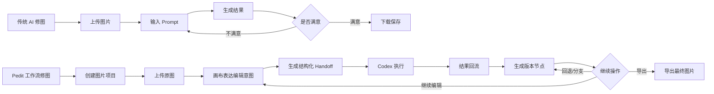

这张图说明了 Pedit 的核心架构目标：它不是只承接“输入 → 输出”的一次性链路，而是要承接“任务 → 执行 → 结果 → 版本 → 再编辑”的循环链路。

因此，Pedit 的架构必须支持：

1. 以图片项目为单位组织编辑过程；
2. 在画布中展示当前图片、历史版本和局部选区；
3. 把用户自然语言编辑意图转化为结构化任务；
4. 通过 Handoff 与 Codex 建立任务交接关系；
5. 接收 Codex 执行后的结果，并写回到项目中；
6. 将每一次结果沉淀为版本节点；
7. 支持用户基于任意版本继续编辑、回退或导出；
8. 为后续自动执行、图片质检、用户反馈和 Skill 扩展预留空间。

---

### 1.3 当前阶段的核心约束

Pedit 当前处于 v0.1.0-alpha 阶段，主要目标是验证 AI 图片编辑工作流是否成立，而不是一步到位实现完整自动化。

当前阶段存在四个关键约束。

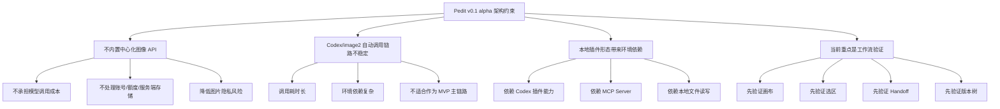

#### 1.3.1 不内置中心化图像生成 API

Pedit 当前不直接内置图像生成或图像编辑 API，也不承担用户的模型调用成本。

如果在 MVP 阶段直接接入中心化模型 API，会引入一系列额外复杂度：API Key 管理、模型调用成本、用户账号体系、额度管理、服务端图片存储、图片隐私和合规问题、服务稳定性和运维成本。这些能力并不是 Pedit 当前阶段验证工作流所必需的。

因此，Pedit 选择优先复用用户自己的 Codex 能力，通过本地插件和 Handoff 方式完成任务交接。

#### 1.3.2 Codex/image2 自动调用链路尚不稳定

Pedit 的长期理想链路是：

```text
Pedit 创建任务
→ 自动调用 Codex/image2
→ 等待执行结果
→ 结果自动回流
→ 生成版本节点
```

但在当前阶段，Codex 的图像编辑能力并没有稳定暴露为一个可被插件直接调用的标准化接口。此前尝试中，自动调用链路存在耗时较长、执行不稳定、环境依赖复杂等问题。

因此，Pedit 当前不把自动调用 Codex/image2 作为 MVP 的主链路，而是采用半自动 Handoff：

```text
Pedit 组织任务
→ 生成结构化 Handoff
→ 用户一键复制
→ 用户粘贴到 Codex 执行
→ 结果回流到 Pedit
```

这个设计是阶段性取舍。它牺牲了一部分自动化体验，但显著降低了当前版本的技术不确定性。

#### 1.3.3 本地插件形态带来环境依赖

Pedit 作为 Codex 本地插件运行，需要依赖本地环境，包括 Codex 插件能力、本地 MCP Server、Node.js / pnpm 等运行和构建环境、本地文件读写权限、本地图片资源管理和本地项目数据存储。

这意味着，Pedit 的架构必须重视本地环境不稳定、文件路径变化、图片资源缺失、MCP Server 异常等问题，并在数据结构和状态流中预留异常处理能力。

#### 1.3.4 当前重点是工作流验证，而不是复杂编辑能力

Pedit 当前并不试图复刻 Photoshop、Figma 或专业图层系统。它的 MVP 目标不是提供完整图层、蒙版、滤镜、调色和设计工具能力，而是先验证：

> 画布、选区、Handoff 和版本树是否能够有效组织 AI 图片编辑过程。

因此，架构设计需要聚焦工作流闭环，而不是过早引入复杂图层系统。

---

### 1.4 架构设计要解决的问题

基于产品目标和当前约束，Pedit 的架构需要重点解决六个问题。

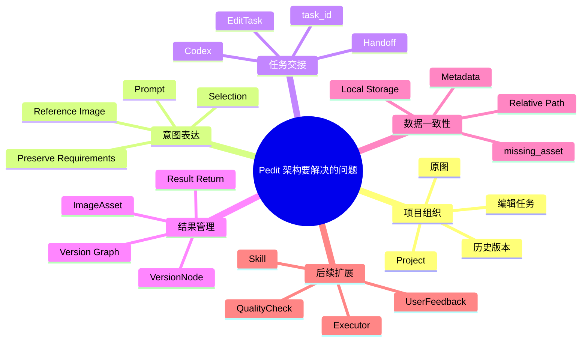

#### 1.4.1 如何组织图片编辑项目

AI 图片编辑不是孤立的文件处理，而是一个围绕项目持续发生的过程。架构上需要有 Project 作为最高层组织单位，承载原图、当前版本、历史版本、编辑任务、局部选区、参考图、导出记录以及后续反馈和质检结果。

#### 1.4.2 如何表达用户的编辑意图

用户的编辑意图不只是一段 Prompt，还可能包含当前基于哪张图片、当前基于哪个版本、是否是整图编辑、是否包含局部选区、选区坐标和范围、是否使用参考图、参考图用于什么维度、哪些内容需要保留、输出结果应如何回写。

因此，架构需要通过 EditTask 将用户意图结构化，而不是只把用户输入当成一段普通文本。

#### 1.4.3 如何连接 Pedit 与 Codex 执行能力

当前阶段，Pedit 通过 Handoff 连接 Codex 执行能力。Handoff 层需要收集当前任务上下文、校验任务信息完整性、生成 task_id、生成结构化任务说明、支持一键复制、提示用户粘贴到 Codex，并为结果回流提供匹配依据。

长期来看，Handoff 需要演进为更通用的 Executor Layer，让 Codex/image2、外部 API、本地模型或用户 Skill 都可以成为可接入执行器。

#### 1.4.4 如何管理 AI 生成结果的不确定性

AI 修图结果具有不确定性。用户经常需要保存多个结果、回到历史版本、对比不同探索方向、基于某个中间版本继续编辑、放弃某个结果但不破坏历史记录。

因此，Pedit 架构需要将 VersionNode 作为核心对象。每一次生成结果都不应直接覆盖原图，而应作为版本树中的新节点，被追踪、回退、分支和继续编辑。

#### 1.4.5 如何保障本地数据一致性

Pedit 需要同时管理图片文件和元数据。如果图片文件、项目 JSON、版本节点和任务记录之间关系不一致，就会出现版本丢失、图片无法加载、结果无法回流等问题。

因此，架构上需要明确：ImageAsset 管理所有图片资源；VersionNode 只引用 ImageAsset；EditTask 关联 baseVersionId 和 resultVersionId；Project.currentVersionId 指向当前版本；本地存储使用项目独立目录；图片文件与元数据分离但通过 ID 关联；资源缺失时使用 missing_asset 状态，而不是静默失败。

#### 1.4.6 如何为后续能力预留扩展

Pedit 的长期方向包括自动调用 Codex/image2、多执行器适配、图片质检、用户反馈、自定义修图 Skill、Skill 分享和分发、更复杂的版本对比和分支管理。

因此，当前架构不能只服务 v0.1 alpha，而应为后续演进预留扩展点。例如 EditTask 中预留 executorType；VersionNode 中记录 taskId 和 promptSummary；Handoff 结构化存储；Selection 使用原图坐标；ImageAsset 区分 original、generated、reference；预留 QualityCheck、UserFeedback、Skill 等对象。

---

## 2. 架构设计原则

Pedit 的架构设计应遵循六个原则。

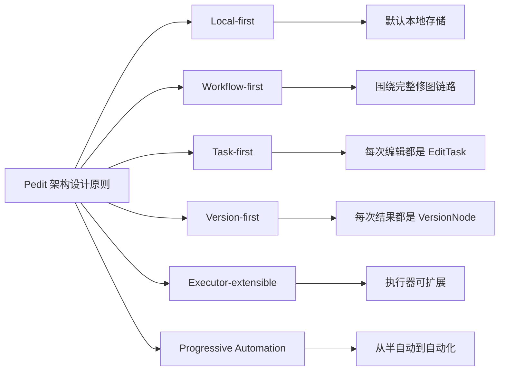

### 2.1 Local-first：优先本地化

Pedit 当前采用 Local-first 架构，即图片、项目、版本、任务和元数据默认存储在用户本地环境中。

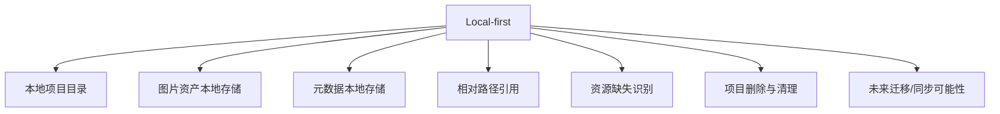

Pedit 当前阶段选择 Local-first，主要基于以下原因：降低 MVP 复杂度、降低模型调用和存储成本、降低隐私风险、符合 Codex 本地插件形态，并便于快速验证产品方向。

Local-first 不是简单把文件放在本地，而是要求架构具备本地项目目录管理、图片资产与元数据分离、相对路径引用、本地文件异常处理、图片资源缺失状态识别、删除项目时的资源清理，以及后续迁移或同步的可能性。

---

### 2.2 Workflow-first：工作流优先

Pedit 的架构设计应优先服务完整工作流，而不是单点功能。

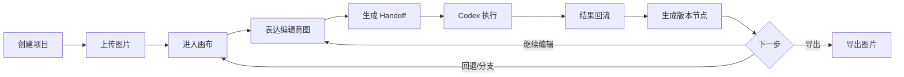

如果只围绕单点功能设计，Pedit 很容易变成一个图片上传页面、Prompt 生成器、画布 UI 或版本展示工具。但 Pedit 真正要验证的是：用户是否需要一个能够组织 AI 修图全过程的工作台。

因此，架构上必须确保每个模块都服务于工作流闭环：项目、图片、任务、版本之间必须有关联关系；用户每次编辑都应形成任务记录；Codex 结果必须回流到版本树；用户可以基于任意版本继续编辑；异常流程必须可恢复；后续质检、反馈和 Skill 都应挂载到工作流节点上。

---

### 2.3 Task-first：任务优先

Pedit 中的每次 AI 修图行为都应被抽象为一个 EditTask。EditTask 是连接用户意图、Handoff、Codex 执行、结果回流和版本生成的关键对象。

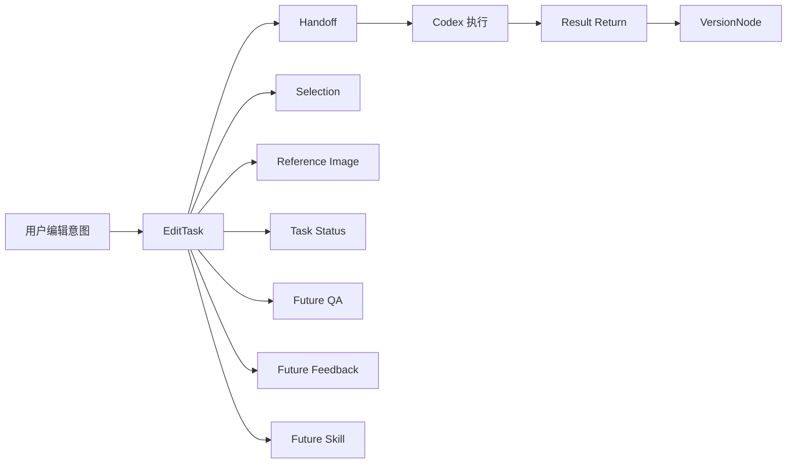

如果不抽象 EditTask，用户的编辑行为就会分散在 UI 状态、Prompt 文本、图片路径和版本节点中，难以追踪和复用。

有了 EditTask，Pedit 可以清晰记录用户想做什么、基于哪个版本发起、是否包含选区、是否包含参考图、Handoff 内容是什么、是否已经复制、是否等待 Codex 执行、是否成功回流、生成了哪个版本、失败原因是什么。

EditTask 也是后续自动执行器、图片质检、用户反馈、Skill 复用、指标分析和多执行器适配的基础。

---

### 2.4 Version-first：版本优先

Pedit 应将每次图片编辑结果都作为版本节点管理，而不是覆盖当前图片。

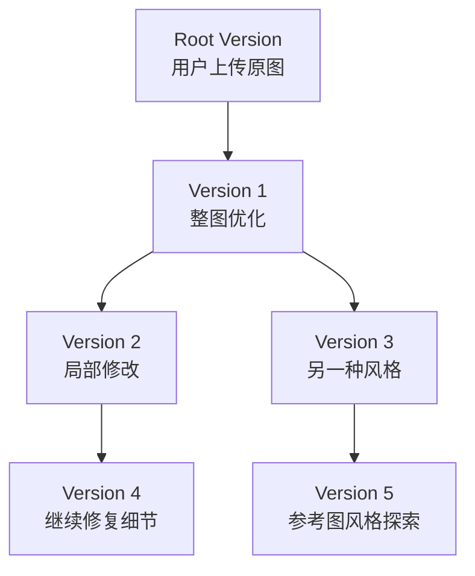

AI 图片编辑结果不稳定，用户经常需要多次尝试。如果每次结果都覆盖当前图片，用户会失去原始图片、中间结果、分支探索、回退能力、结果对比和编辑历史。

因此，Pedit 采用版本树机制，让每次生成结果成为一个 VersionNode。上传原图后生成 root VersionNode；每次结果回流后生成 generated VersionNode；generated VersionNode 必须记录 parentVersionId；Project.currentVersionId 决定画布当前展示版本；用户可以从任意 VersionNode 发起新 EditTask；回退只是切换 currentVersionId，不删除历史节点。

Pedit 当前不优先做复杂图层系统，而是优先做版本树。原因是 Pedit 的核心问题不是专业设计软件中的图层精修，而是 AI 生成式编辑中的多结果管理。

---

### 2.5 Executor-extensible：执行器可扩展

Pedit 当前默认执行方式是 `codex_handoff`，即通过 Handoff 让用户将任务交给 Codex 执行。但从架构上，Pedit 不应把 Codex Handoff 写死为唯一执行方式，而应把它抽象为 Executor 的一种。

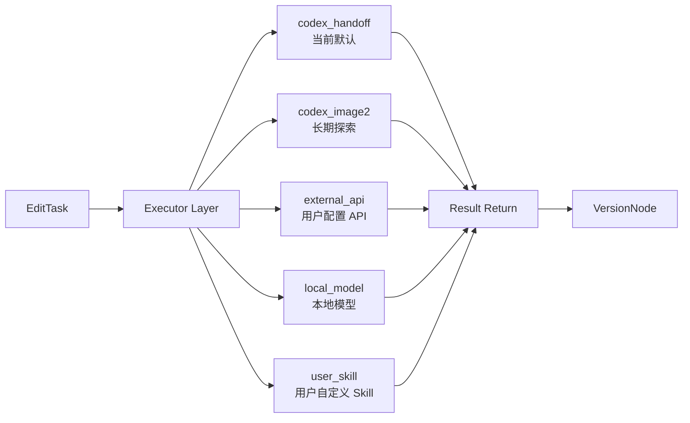

当前 MVP 默认执行器为 `codex_handoff`：

```text
EditTask
→ Handoff
→ 用户复制
→ Codex 执行
→ 结果回流
```

未来可以扩展为 `codex_image2`、`external_api`、`local_model`、`user_skill`。不同执行器可以使用同一套 EditTask 输入，但执行方式不同。

这样设计可以避免过早绑定单一平台能力，保留 Codex/image2 自动化探索空间，支持用户自带模型或 API，为 Skill 系统预留执行基础，并降低未来架构重构成本。

---

### 2.6 Progressive Automation：渐进式自动化

Pedit 的长期目标是自动化执行，但自动化不应一步到位。当前阶段的技术和平台边界决定了 Pedit 更适合采用渐进式自动化路径。

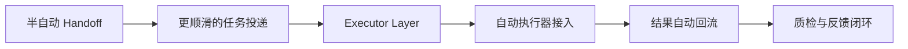

全自动链路虽然体验最好，但当前存在不确定性：Codex/image2 是否可稳定被插件调用、调用链路耗时是否可接受、用户授权和模型消耗如何表达、执行失败如何恢复、结果如何稳定回流、平台能力变化后如何兼容。

为了支持渐进式自动化，当前架构必须从一开始就做到：每个任务有 task_id；任务状态可追踪；执行器类型可记录；结果回流可匹配；版本节点可关联任务；失败可以恢复或手动接管。

---

## 3. 总体架构概览

### 3.1 架构分层

Pedit 的整体架构可以分为八层。

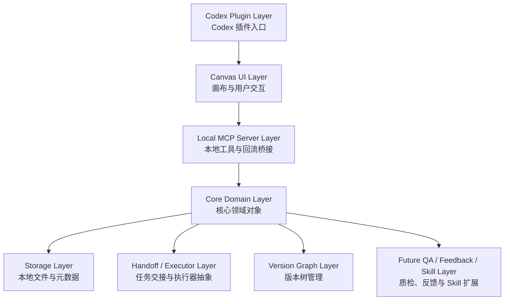

| 架构层 | 核心职责 |
|---|---|
| Codex Plugin Layer | 作为 Pedit 在 Codex 中的入口，连接 Codex 插件环境 |
| Canvas UI Layer | 提供图片画布、选区、参考图、指令输入、版本树等用户界面 |
| Local MCP Server Layer | 连接 Canvas、Codex 和本地数据，提供工具调用和结果回写能力 |
| Core Domain Layer | 管理 Project、ImageAsset、EditTask、Selection、VersionNode 等领域对象 |
| Storage Layer | 管理本地项目目录、图片文件和元数据 |
| Handoff / Executor Layer | 当前生成结构化 Handoff，未来扩展为多执行器调度 |
| Version Graph Layer | 管理版本树、父子关系、回退、分支和当前版本 |
| Future QA / Feedback / Skill Layer | 后续扩展图片质检、用户反馈和自定义 Skill |

这套分层的核心目标，是让 Pedit 不只是一个前端画布，而是一个具备任务组织、执行交接、结果回流和版本管理能力的本地工作流系统。

---

### 3.2 当前 MVP 架构

当前 MVP 阶段采用半自动 Handoff 架构。

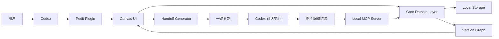

当前架构中，Pedit 通过 Canvas 承载图片、选区、参考图和编辑指令；通过 Core Domain Layer 管理 Project、ImageAsset、EditTask、Selection 和 VersionNode；通过 Handoff Generator 将任务上下文转化为结构化 Handoff；通过一键复制让用户将任务交给 Codex；通过 Local MCP Server 接收或处理结果回流；通过 Version Graph 将结果转化为新的版本节点；通过 Canvas 展示当前版本和版本树。

在这个阶段，Pedit 不直接调用 Codex/image2，而是通过 Handoff 连接 Codex 执行能力。

#### 3.2.1 当前架构中的关键链路

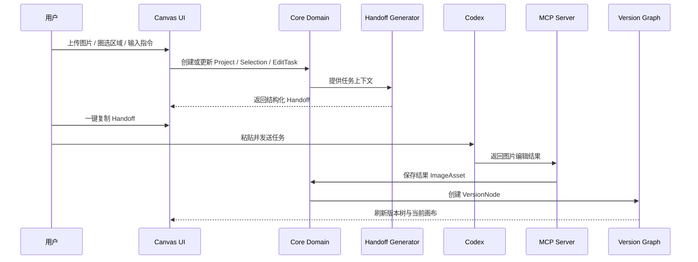

这条时序图说明了当前 MVP 中最核心的产品链路：Pedit 负责组织任务和管理结果，Codex 负责执行图片编辑，二者通过 Handoff 和结果回流完成协作。

#### 3.2.2 当前架构的优点与限制

| 优点 | 说明 |
|---|---|
| 实现成本相对可控 | 不需要中心化 API、账号体系和服务端存储 |
| 平台依赖较低 | 不强依赖 Codex/image2 自动调用接口 |
| 用户授权明确 | 用户需要主动复制并发送任务 |
| 适合 MVP 验证 | 可以优先验证画布、选区、任务和版本树是否成立 |
| 便于后续演进 | EditTask 和 Handoff 可以逐步升级为 Executor |

| 限制 | 影响 |
|---|---|
| 仍需要用户复制粘贴 | 执行链路不够顺滑 |
| Codex 执行不完全受 Pedit 控制 | 结果回流稳定性受影响 |
| Handoff 质量影响结果 | 模板设计非常关键 |
| 任务状态存在断点 | 用户可能不知道 Codex 是否已执行 |
| 自动调用 image2 尚未实现 | 当前还不是完整自动化 Agent |

这些限制是当前 MVP 阶段的阶段性取舍，而不是最终产品形态。

---

### 3.3 核心模块关系

Pedit 的核心模块关系可以从领域对象角度理解。

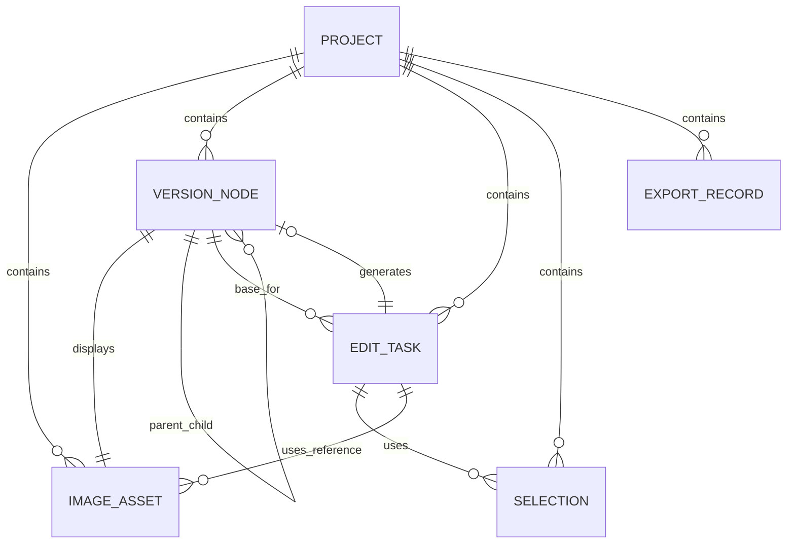

一个 Project 是一次图片编辑工作的最高层容器；一个 Project 可以包含多个 ImageAsset、VersionNode、EditTask 和 Selection。用户上传原图后，会创建 root VersionNode。用户每次点击开始优化，会创建 EditTask。EditTask 可以关联 Selection 和 Reference Image。EditTask 生成 Handoff。Codex 执行后返回结果，结果保存为 generated ImageAsset，并被挂载到新的 VersionNode。新 VersionNode 关联父版本和任务，Project.currentVersionId 更新为最新版本。

这套关系保证了 Pedit 不只是保存图片结果，而是能够追踪每张图片从哪个任务、哪个版本、哪些输入上下文中产生。

---

### 3.4 核心链路概览

Pedit 的核心链路可以拆成五段。

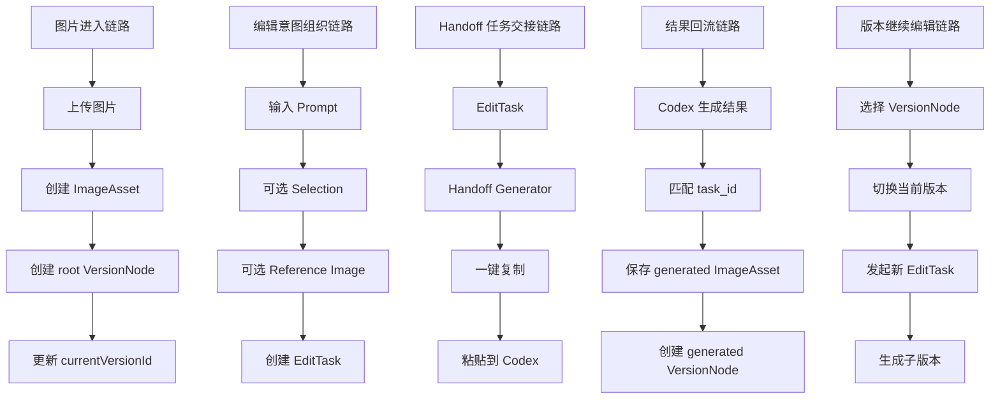

这五段链路共同构成 Pedit 的核心工作流：图片进入系统，用户表达编辑意图，Pedit 生成任务交接，Codex 执行并回流结果，结果进入版本树并可继续编辑。

---

### 3.5 当前架构中的数据闭环

从数据角度看，Pedit 的闭环不是“图片进来、图片出去”，而是一个由 Project、Task 和 Version 串联起来的数据闭环。

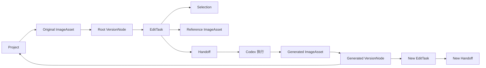

这张图说明了 Pedit 最重要的数据闭环：Project 管理一次图片编辑工作；原图作为 ImageAsset 进入系统；原图生成 root VersionNode；用户基于某个 VersionNode 创建 EditTask；EditTask 关联 Selection、Reference Image 和 Handoff；Codex 执行后生成新的 ImageAsset；新 ImageAsset 生成新的 VersionNode；新 VersionNode 回到 Project，并可以继续产生新的 EditTask。

这也是 Pedit 能支持连续编辑、回退、分支和版本管理的基础。

---

### 3.6 长期目标架构

Pedit 的长期目标不是停留在 Handoff 工具，而是逐步演进为 AI 图片编辑工作流平台。

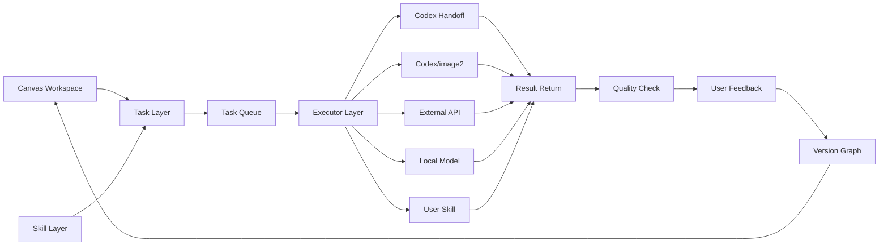

相比当前 MVP 架构，长期架构会发生几个变化：Handoff 从主执行方式升级为 Executor Layer 中的一种执行器；用户复制到 Codex 的半自动链路会逐步探索自动任务投递和自动执行；用户肉眼判断结果会逐步引入 Quality Check；用户反馈会结构化为 UserFeedback；Handoff 模板会演进为可复用 Skill；版本树会承载任务、质检、反馈和 Skill 历史。

长期来看，Pedit 希望支持以下完整链路：

```text
用户上传图片
→ 在画布中组织原图、选区、参考图和编辑意图
→ 选择通用任务或自定义 Skill
→ 创建结构化 EditTask
→ Executor 执行任务
→ 结果回流
→ 图片质检
→ 用户反馈
→ 生成 VersionNode
→ 继续编辑、回退、导出或沉淀为 Skill
```

---

### 3.7 当前架构与长期架构的关系

当前 MVP 架构并不是长期架构的临时替代品，而是长期架构的基础形态。

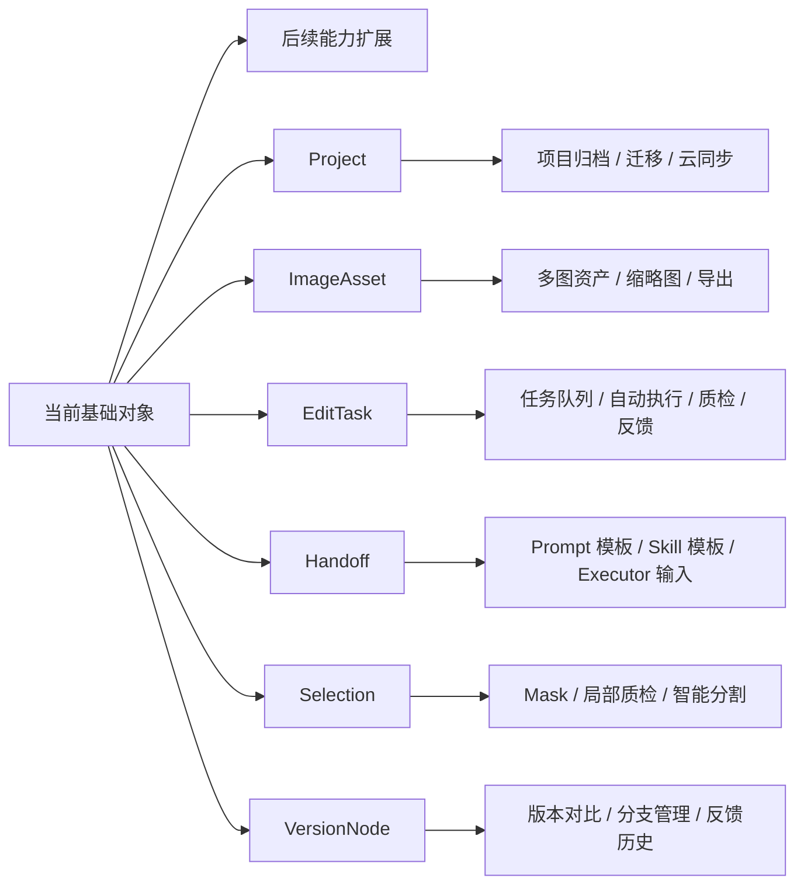

当前已经建设或需要优先稳定的对象包括 Project、ImageAsset、EditTask、Selection、Handoff 和 VersionNode。这些对象可以直接支撑后续自动执行器、任务队列、质检、反馈、Skill、版本对比、分支管理、缩略图和导出等能力。

因此，Pedit 当前架构的关键任务不是把所有长期能力一次性做完，而是把这些基础对象设计清楚、关系稳定、状态可追踪。只要基础对象稳定，后续从 Handoff 到 Executor、从模板到 Skill、从人工判断到质量闭环，都可以在现有架构上自然演进。

---

### 3.8 本章总结

Pedit 当前架构可以概括为：

```text
Local-first 的本地插件
+ Canvas 驱动的图片编辑工作台
+ EditTask 驱动的任务组织层
+ Handoff 驱动的半自动执行链路
+ VersionNode 驱动的版本树管理
```

长期架构目标则是：

```text
Workspace
+ Task
+ Executor
+ Result Return
+ Quality Check
+ User Feedback
+ Skill
+ Version Graph
```

这套架构设计的核心判断是：

> Pedit 的架构不是围绕单次图片生成设计的，而是围绕 AI 图片编辑工作流设计的。

当前版本采用半自动 Handoff，是为了在平台能力和自动执行链路尚不稳定的情况下，优先验证画布、任务、版本树和结果回流的核心闭环。后续架构会从 Handoff 驱动逐步演进到 Executor 驱动，并在此基础上扩展质检、反馈和 Skill 能力。

---

## 4. 核心模块设计

本章从模块角度拆解 Pedit 当前架构。每个模块都应明确自己的职责、输入、输出、依赖关系和后续演进方向。

Pedit 的核心模块如下：

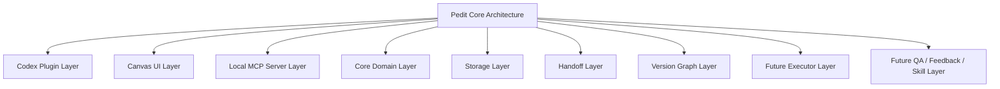

---

### 4.1 Codex Plugin Layer

#### 4.1.1 模块定位

Codex Plugin Layer 是 Pedit 与 Codex 环境之间的连接层。它负责将 Pedit 注册为 Codex 可识别的本地插件，并提供打开 Canvas、连接 MCP Server 和暴露本地工具能力的基础入口。

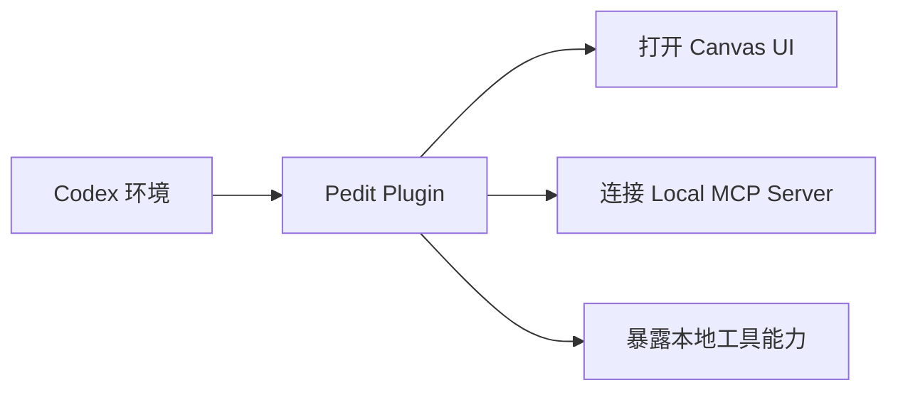

#### 4.1.2 核心职责

| 职责 | 说明 |
|---|---|
| 插件注册 | 让 Codex 识别 Pedit 插件 |
| Canvas 启动 | 提供进入 Pedit UI 的入口 |
| MCP 连接 | 连接本地 MCP Server |
| 能力声明 | 声明 Pedit 支持图片编辑工作流、版本管理、任务交接等能力 |
| 用户入口 | 让用户可以在 Codex 中打开 Pedit |

#### 4.1.3 输入与输出

| 类型 | 内容 |
|---|---|
| 输入 | Codex 插件环境、用户打开插件指令、本地配置 |
| 输出 | Pedit Canvas、MCP Server 连接、插件能力入口 |

#### 4.1.4 设计边界

Codex Plugin Layer 不直接处理图片编辑逻辑，不直接生成版本节点，也不直接管理本地文件。它更像是 Pedit 在 Codex 环境中的入口和连接器。

---

### 4.2 Canvas UI Layer

#### 4.2.1 模块定位

Canvas UI Layer 是用户与 Pedit 交互的核心界面。它不是普通图片预览区，而是 Pedit 的图片编辑工作台。

```mermaid
flowchart TD
    Canvas[Canvas UI Layer] --> A[图片展示]
    Canvas --> B[局部选区]
    Canvas --> C[参考图上传]
    Canvas --> D[编辑指令输入]
    Canvas --> E[任务摘要]
    Canvas --> F[一键复制]
    Canvas --> G[版本树展示]
    Canvas --> H[导出入口]
```

#### 4.2.2 核心职责

| 职责 | 说明 |
|---|---|
| 展示当前图片 | 根据 currentVersionId 展示当前版本图片 |
| 创建选区 | 用户在图片上圈选局部区域 |
| 输入指令 | 用户填写整图或局部编辑要求 |
| 上传参考图 | 用户上传并说明参考图用途 |
| 发起任务 | 用户点击开始优化，触发任务校验与 Handoff 生成 |
| 展示任务摘要 | 在复制前展示任务上下文 |
| 展示版本树 | 展示根版本、生成版本和分支关系 |
| 版本切换 | 用户点击版本节点后切换画布图片 |
| 导出结果 | 导出当前版本图片 |

#### 4.2.3 输入与输出

| 类型 | 内容 |
|---|---|
| 输入 | 用户上传图片、选区操作、编辑指令、参考图、版本选择 |
| 输出 | Project 操作、Selection、EditTask、Handoff 请求、Version 切换请求 |

#### 4.2.4 设计边界

Canvas UI 不应承担复杂业务对象的最终状态管理。它负责收集用户输入并展示结果，核心数据写入、任务创建、版本生成和存储应由 Core Domain、MCP Server 和 Storage Layer 完成。

---

### 4.3 Local MCP Server Layer

#### 4.3.1 模块定位

Local MCP Server Layer 是 Pedit 在本地环境中连接 Canvas、Codex 和本地数据的桥接层。它让 Pedit 不只是一个静态网页，而是一个可被 Agent 接入、可读写本地数据、可接收结果回流的本地工作流系统。

```mermaid
flowchart LR
    Canvas[Canvas UI] --> MCP[Local MCP Server]
    Codex[Codex / Agent] --> MCP
    MCP --> Core[Core Domain]
    MCP --> Storage[Local Storage]
    MCP --> Version[Version Graph]
```

#### 4.3.2 核心职责

| 职责 | 说明 |
|---|---|
| 提供本地工具 | 为 Codex 或 Canvas 提供项目、图片、任务、版本相关工具 |
| 本地数据读写 | 读写 Project、ImageAsset、EditTask、VersionNode 等数据 |
| 结果回流入口 | 接收 Codex 生成结果并写回项目 |
| 文件处理 | 保存上传图片、生成图片和参考图 |
| 状态同步 | 将任务和版本状态同步给 Canvas |
| 异常处理 | 处理文件写入失败、task_id 匹配失败、版本创建失败等问题 |

#### 4.3.3 输入与输出

| 类型 | 内容 |
|---|---|
| 输入 | Canvas 操作请求、Codex 结果回流、文件读写请求 |
| 输出 | 项目数据、任务数据、版本节点、图片资产、错误状态 |

#### 4.3.4 设计边界

MCP Server 不应承载 UI 展示逻辑，也不应直接决定产品交互。它负责把本地能力和数据状态可靠地暴露给 Canvas 和 Codex。

---

### 4.4 Core Domain Layer

#### 4.4.1 模块定位

Core Domain Layer 是 Pedit 的业务核心层，负责维护稳定的领域对象和对象关系。

```mermaid
erDiagram
    PROJECT ||--o{ IMAGE_ASSET : contains
    PROJECT ||--o{ VERSION_NODE : contains
    PROJECT ||--o{ EDIT_TASK : contains
    PROJECT ||--o{ SELECTION : contains
    EDIT_TASK ||--o{ SELECTION : uses
    EDIT_TASK ||--o{ IMAGE_ASSET : references
    EDIT_TASK ||--o| VERSION_NODE : generates
    VERSION_NODE ||--|| IMAGE_ASSET : displays
```

#### 4.4.2 核心领域对象

| 对象 | 职责 |
|---|---|
| Project | 组织一次完整图片编辑项目 |
| ImageAsset | 管理原图、生成图、参考图等图片资源 |
| VersionNode | 记录图片版本、父子关系和版本状态 |
| EditTask | 记录一次编辑任务、Handoff 和执行结果 |
| Selection | 表达局部编辑区域 |
| HandoffRecord | 记录结构化任务交接内容 |
| ExportRecord | 记录导出行为 |
| QualityCheck | 后续记录质检结果 |
| UserFeedback | 后续记录用户反馈 |
| Skill | 后续记录可复用修图能力 |

#### 4.4.3 核心职责

Core Domain Layer 需要保证对象关系清晰、状态可追踪、数据完整性可校验。它是后续自动执行、质检、反馈和 Skill 扩展的基础。

---

### 4.5 Storage Layer

#### 4.5.1 模块定位

Storage Layer 负责管理本地项目目录、图片文件和元数据。由于 Pedit 采用 Local-first 架构，Storage Layer 是产品可靠性的关键基础。

```mermaid
flowchart TD
    Storage[Local Storage] --> ProjectDir[projects/{project_id}]
    ProjectDir --> ProjectJSON[project.json]
    ProjectDir --> Assets[assets]
    Assets --> Original[original]
    Assets --> Generated[generated]
    Assets --> Reference[reference]
    Assets --> Thumbnails[thumbnails]
    ProjectDir --> Tasks[tasks]
    ProjectDir --> Versions[versions]
    ProjectDir --> Selections[selections]
    ProjectDir --> Exports[exports]
```

#### 4.5.2 建议目录结构

```text
.pedit/
├── projects/
│   └── {project_id}/
│       ├── project.json
│       ├── assets/
│       │   ├── original/
│       │   ├── generated/
│       │   ├── reference/
│       │   └── thumbnails/
│       ├── tasks/
│       │   └── {task_id}.json
│       ├── versions/
│       │   └── versions.json
│       ├── selections/
│       │   └── selections.json
│       └── exports/
│           └── export_records.json
```

#### 4.5.3 设计要求

- 每个项目独立目录，减少项目之间数据污染；
- 图片文件与 JSON 元数据分离存储；
- 元数据使用相对路径引用图片；
- 被版本节点引用的 ImageAsset 不应被直接删除；
- 图片资源缺失时标记 `missing_asset`；
- 关键写入流程应尽量保证原子性；
- 删除项目时统一清理关联数据。

---

### 4.6 Handoff Layer

#### 4.6.1 模块定位

Handoff Layer 是当前 MVP 阶段 Pedit 与 Codex 执行能力之间的核心连接层。它负责把用户在画布中组织好的图片、选区、参考图和编辑指令转化为结构化任务。

```mermaid
flowchart LR
    A[Project / Version / ImageAsset] --> H[Handoff Generator]
    B[Selection] --> H
    C[Reference Image] --> H
    D[User Prompt] --> H
    H --> E[task_id]
    H --> F[Structured Handoff]
    F --> G[一键复制]
    G --> I[Codex 执行]
```

#### 4.6.2 核心职责

| 职责 | 说明 |
|---|---|
| 收集任务上下文 | 收集 Project、Version、ImageAsset、Selection、Reference、Prompt |
| 校验任务信息 | 确认图片、指令、选区、参考说明是否完整 |
| 生成 task_id | 为任务回流和追踪提供唯一标识 |
| 生成结构化 Handoff | 使用固定模板组织任务说明 |
| 支持一键复制 | 降低用户手动组织 Prompt 的成本 |
| 提示下一步 | 告诉用户需要粘贴到 Codex 执行 |

#### 4.6.3 Handoff 模板原则

Handoff 不应是一段随意拼接的 Prompt，而应包含结构化字段：任务 ID、项目名称、当前版本、任务类型、当前图片、选区信息、参考图信息、用户编辑要求、需要保留的内容、输出要求和结果回写要求。

---

### 4.7 Version Graph Layer

#### 4.7.1 模块定位

Version Graph Layer 负责管理 Pedit 中的版本树。它是 Pedit 对抗 AI 生成不确定性的核心产品机制。

```mermaid
flowchart TD
    V0[Root Version] --> V1[Generated Version 1]
    V1 --> V2[Generated Version 2]
    V1 --> V3[Generated Version 3]
    V2 --> V4[Generated Version 4]
    V3 --> V5[Generated Version 5]
```

#### 4.7.2 核心职责

| 职责 | 说明 |
|---|---|
| 创建根版本 | 上传原图后生成 root VersionNode |
| 创建生成版本 | 结果回流后生成 generated VersionNode |
| 维护父子关系 | 记录 parentVersionId 和 childVersionIds |
| 切换当前版本 | 更新 Project.currentVersionId |
| 支持回退 | 回退不删除历史，只切换当前版本 |
| 支持分支 | 从历史版本继续编辑时生成子节点 |
| 关联任务 | generated VersionNode 关联 EditTask |

#### 4.7.3 设计边界

Version Graph 不是图层系统。它不负责像 Photoshop 那样管理图层叠加和混合，而是负责管理 AI 编辑结果之间的历史关系。

---

### 4.8 Future Executor Layer

#### 4.8.1 模块定位

Executor Layer 是 Pedit 后续自动化演进的关键扩展层。当前版本的默认执行方式是 `codex_handoff`，未来可以接入 `codex_image2`、外部 API、本地模型或用户 Skill。

```mermaid
flowchart LR
    Task[EditTask] --> Executor[Executor Layer]
    Executor --> A[codex_handoff]
    Executor --> B[codex_image2]
    Executor --> C[external_api]
    Executor --> D[local_model]
    Executor --> E[user_skill]
    A --> Result[Result Return]
    B --> Result
    C --> Result
    D --> Result
    E --> Result
    Result --> Version[VersionNode]
```

#### 4.8.2 设计价值

Executor Layer 可以让 Pedit 不再绑定单一执行方式。当前 Handoff 方案可以继续作为兜底执行器，未来当 Codex/image2 自动调用能力稳定后，可以作为新的执行器接入。

---

### 4.9 Future QA / Feedback / Skill Layer

#### 4.9.1 模块定位

QA、Feedback 和 Skill 是 Pedit 从“可用工具”走向“可持续优化工作流平台”的关键扩展层。

```mermaid
flowchart LR
    Result[Result Version] --> QA[Quality Check]
    QA --> Feedback[User Feedback]
    Feedback --> Improve[优化 Handoff / Skill]
    Improve --> Skill[User Skill]
    Skill --> Task[New EditTask]
```

#### 4.9.2 未来职责

| 模块 | 职责 |
|---|---|
| QualityCheck | 判断结果是否可用、是否符合任务、是否存在明显瑕疵 |
| UserFeedback | 记录用户满意度、失败原因、采纳或回退行为 |
| Skill | 沉淀用户可复用修图方法、Prompt 模板、输入要求和质检规则 |

这些模块当前不是 MVP 必做能力，但当前架构需要为它们预留数据基础。

---

## 5. 核心数据流

Pedit 的数据流围绕图片、任务、结果和版本展开。本章用数据流说明核心对象如何被创建、关联和更新。

### 5.1 图片上传数据流

```mermaid
sequenceDiagram
    participant U as 用户
    participant UI as Canvas UI
    participant MCP as MCP Server
    participant S as Storage
    participant Core as Core Domain
    participant V as Version Graph

    U->>UI: 上传原图
    UI->>MCP: 提交图片文件
    MCP->>S: 保存图片到 assets/original
    S-->>MCP: 返回 filePath
    MCP->>Core: 创建 ImageAsset(role=original)
    Core->>V: 创建 root VersionNode
    V->>Core: 更新 Project.currentVersionId
    Core-->>UI: 返回当前版本
    UI-->>U: 展示原图
```

数据流说明：用户上传原图后，系统先保存图片文件，再创建 ImageAsset，然后创建 root VersionNode，并将 Project.currentVersionId 指向该根版本。这样后续所有编辑任务都有明确的版本起点。

---

### 5.2 局部标注数据流

```mermaid
flowchart LR
    A[用户在画布圈选区域] --> B[Canvas 获取屏幕坐标]
    B --> C[转换为原图坐标]
    C --> D[创建 Selection]
    D --> E[绑定 projectId / versionId]
    E --> F[写入 EditTask 上下文]
    F --> G[进入 Handoff]
```

选区坐标必须基于原图，而不是画布显示坐标。因为画布可能缩放和平移，不同设备显示尺寸也不同，只有原图坐标才能稳定进入 Handoff、结果回流和后续质检。

---

### 5.3 Handoff 生成数据流

```mermaid
sequenceDiagram
    participant UI as Canvas UI
    participant Core as Core Domain
    participant H as Handoff Generator
    participant Clip as Clipboard

    UI->>Core: 请求创建 EditTask
    Core->>Core: 校验 Project / Version / ImageAsset / Prompt
    Core->>Core: 关联 Selection / Reference
    Core->>H: 提供任务上下文
    H->>H: 生成 task_id 与结构化 Handoff
    H-->>Core: 返回 HandoffRecord
    Core-->>UI: 返回任务摘要
    UI->>Clip: 一键复制 Handoff
```

Handoff 生成前必须校验图片、当前版本、用户指令、选区和参考说明。生成后应保留 task_id，以便结果回流时匹配任务。

---

### 5.4 结果回流数据流

```mermaid
sequenceDiagram
    participant C as Codex
    participant MCP as MCP Server
    participant S as Storage
    participant Core as Core Domain
    participant V as Version Graph
    participant UI as Canvas UI

    C->>MCP: 返回图片结果与 task_id
    MCP->>Core: 匹配 EditTask
    Core-->>MCP: 返回 projectId / baseVersionId
    MCP->>S: 保存 generated image
    S-->>MCP: 返回 imageId / filePath
    MCP->>Core: 创建 ImageAsset(role=generated)
    Core->>V: 创建 generated VersionNode
    V->>Core: 更新 EditTask.resultVersionId
    Core->>Core: 更新 Project.currentVersionId
    Core-->>UI: 通知刷新
    UI-->>UI: 展示新版本
```

结果回流的关键是 task_id 匹配、图片保存、ImageAsset 创建、VersionNode 创建和 currentVersionId 更新。如果任一环节失败，需要进入异常兜底流程。

---

### 5.5 版本生成数据流

```mermaid
flowchart LR
    A[baseVersionId] --> B[EditTask]
    B --> C[resultImageId]
    C --> D[new VersionNode]
    D --> E[parentVersionId = baseVersionId]
    D --> F[taskId = EditTask.id]
    D --> G[Project.currentVersionId = newVersionId]
```

版本生成的核心规则是：新版本必须知道自己基于哪个父版本生成，也必须知道由哪个任务生成。这样才能支撑回退、分支和结果追踪。

---

## 6. 核心任务流

核心任务流描述系统模块如何协作完成整图编辑、局部编辑、参考图编辑、结果回流和分支编辑。

### 6.1 整图编辑任务流

```mermaid
flowchart LR
    A[Canvas 当前版本] --> B[用户输入整图指令]
    B --> C[创建 EditTask global_edit]
    C --> D[Handoff Generator]
    D --> E[一键复制]
    E --> F[Codex 执行]
    F --> G[结果回流]
    G --> H[创建 generated ImageAsset]
    H --> I[创建 generated VersionNode]
    I --> J[Canvas 展示新版本]
```

整图编辑任务不需要 Selection，默认作用范围是当前版本整张图片。Handoff 中应明确任务类型为 `global_edit`，并说明需要保留的主体、人物身份或原图核心结构。

---

### 6.2 局部编辑任务流

```mermaid
flowchart LR
    A[Canvas 当前版本] --> B[创建 Selection]
    B --> C[填写局部指令]
    C --> D[创建 EditTask local_edit]
    D --> E[Handoff Generator]
    E --> F[包含选区信息与非选区保留要求]
    F --> G[Codex 执行]
    G --> H[结果回流]
    H --> I[创建子 VersionNode]
```

局部编辑任务必须关联 Selection。Handoff 中需要明确“主要修改选区内内容，尽量保持非选区区域不变”。MVP 阶段建议优先支持单选区，以降低任务复杂度。

---

### 6.3 参考图编辑任务流

```mermaid
flowchart LR
    A[上传 Reference ImageAsset] --> B[填写参考说明]
    B --> C[选择整图或局部任务]
    C --> D[创建 EditTask]
    D --> E[关联 referenceImageIds]
    E --> F[Handoff 中说明参考维度]
    F --> G[Codex 执行]
    G --> H[结果回流并生成版本]
```

参考图不应默认影响整个项目，而应作用于具体 EditTask。用户需要说明参考维度，例如风格、色调、光影、构图、材质或背景氛围。

---

### 6.4 结果回流任务流

```mermaid
flowchart TD
    A[Codex 返回结果] --> B{是否有 task_id}
    B -->|有| C[匹配 EditTask]
    B -->|无| D[进入手动关联流程]
    C --> E[保存图片]
    E --> F[创建 ImageAsset]
    F --> G[创建 VersionNode]
    G --> H[更新任务状态 succeeded]
    H --> I[刷新 Canvas]
    D --> J[用户选择项目和父版本]
    J --> E
```

结果回流应优先通过 task_id 自动匹配任务。如果缺少 task_id，应允许用户手动选择项目和父版本，将结果挂载到版本树中。

---

### 6.5 版本分支任务流

```mermaid
flowchart TD
    A[用户选择历史 VersionNode] --> B[Canvas 切换当前版本]
    B --> C[用户创建新 EditTask]
    C --> D[Codex 执行]
    D --> E[结果回流]
    E --> F[新 VersionNode.parentVersionId = 历史版本 ID]
    F --> G[形成分支]
```

分支编辑是版本树的核心价值之一。用户从历史版本发起任务时，新结果应挂载为该历史版本的子节点，而不是默认挂载到最新版本下。

---

## 7. 状态流设计

状态流设计的目标，是让 Pedit 在半自动链路中保持可解释、可恢复，而不是让用户面对黑盒等待。

### 7.1 Project 状态流

```mermaid
stateDiagram-v2
    [*] --> empty: 创建项目
    empty --> ready: 上传图片并生成根版本
    ready --> editing: 发起编辑任务
    editing --> ready: 结果回流成功
    editing --> ready: 任务取消或失败后恢复
    ready --> archived: 用户归档
    empty --> error: 初始化失败
    ready --> error: 数据异常
    editing --> error: 任务异常且无法恢复
```

| 状态 | 含义 |
|---|---|
| empty | 项目已创建，但尚未上传图片 |
| ready | 项目已有图片和版本，可以编辑 |
| editing | 项目中存在进行中的编辑任务 |
| archived | 项目已归档 |
| error | 项目存在数据异常 |

---

### 7.2 EditTask 状态流

```mermaid
stateDiagram-v2
    [*] --> draft: 创建任务草稿
    draft --> handoff_generated: 生成 Handoff
    handoff_generated --> handoff_copied: 一键复制成功
    handoff_generated --> failed: 生成失败
    handoff_copied --> waiting_for_codex: 提示用户粘贴执行
    waiting_for_codex --> succeeded: 结果回流成功
    waiting_for_codex --> failed: 回流失败或超时
    draft --> cancelled: 用户取消
    handoff_generated --> cancelled: 用户取消
    waiting_for_codex --> cancelled: 用户取消等待

    waiting_for_codex --> running: 后续自动执行器接入
    running --> succeeded: 执行成功
    running --> failed: 执行失败
```

| 状态 | 含义 |
|---|---|
| draft | 用户正在填写任务，还未生成 Handoff |
| handoff_generated | Handoff 已生成 |
| handoff_copied | 用户已复制 Handoff |
| waiting_for_codex | 等待用户在 Codex 中执行或等待结果回流 |
| running | 后续自动执行场景中，执行器正在处理 |
| succeeded | 结果已回流并生成版本 |
| failed | 任务失败 |
| cancelled | 用户取消任务 |

---

### 7.3 VersionNode 状态流

```mermaid
stateDiagram-v2
    [*] --> loading: 创建或切换版本
    loading --> available: 图片加载成功
    loading --> missing_asset: 图片资源不存在
    loading --> error: 版本数据异常
    available --> missing_asset: 资源被删除或移动
    missing_asset --> available: 用户重新关联图片
    error --> available: 数据修复成功
```

只有 `available` 状态的版本可以继续编辑和导出。`missing_asset` 状态的版本应保留在版本树中，但需要标记异常并禁止继续编辑。

---

### 7.4 Result Return 状态流

```mermaid
flowchart LR
    A[not_started] --> B[waiting]
    B --> C[matched]
    C --> D[saved]
    D --> E[version_created]
    B --> F[failed]
    C --> F
    D --> F
```

| 状态 | 含义 |
|---|---|
| not_started | 任务还未进入等待结果阶段 |
| waiting | 等待 Codex 结果回流 |
| matched | 已匹配到 task_id |
| saved | 结果图片已保存 |
| version_created | 新版本节点已创建 |
| failed | 回流失败 |

---

### 7.5 异常状态设计

Pedit 需要对关键异常提供可恢复路径。

| 异常 | 状态表现 | 兜底方式 |
|---|---|---|
| Handoff 生成失败 | EditTask failed | 重新生成 |
| 复制失败 | handoff_generated 保持 | 展示手动复制文本 |
| 结果无 task_id | Result Return failed | 手动选择项目和父版本 |
| 图片保存失败 | Result Return failed | 保留临时文件，允许重试 |
| 版本图片缺失 | VersionNode missing_asset | 重新关联或标记异常 |
| Codex 长时间无结果 | waiting_for_codex 超时 | 提示检查 Codex 或重新复制 |

---

## 8. 本地存储与数据组织

### 8.1 本地存储目标

Pedit 采用 Local-first 架构，因此本地存储需要同时满足以下目标：

- 保存用户图片资产；
- 保存项目元数据；
- 保存任务和 Handoff 记录；
- 保存版本树关系；
- 支持结果回流；
- 支持导出和项目清理；
- 支持后续质检、反馈和 Skill 扩展。

---

### 8.2 建议目录结构

```text
.pedit/
├── projects/
│   └── {project_id}/
│       ├── project.json
│       ├── assets/
│       │   ├── original/
│       │   ├── generated/
│       │   ├── reference/
│       │   └── thumbnails/
│       ├── tasks/
│       │   └── {task_id}.json
│       ├── versions/
│       │   └── versions.json
│       ├── selections/
│       │   └── selections.json
│       └── exports/
│           └── export_records.json
```

```mermaid
flowchart TD
    P[projects/{project_id}] --> A[project.json]
    P --> B[assets]
    B --> B1[original]
    B --> B2[generated]
    B --> B3[reference]
    B --> B4[thumbnails]
    P --> C[tasks]
    P --> D[versions]
    P --> E[selections]
    P --> F[exports]
```

---

### 8.3 图片资产管理

ImageAsset 负责统一管理原图、生成图、参考图和手动导入结果。

| 图片类型 | 存储目录 | role |
|---|---|---|
| 原图 | assets/original | original |
| 生成图 | assets/generated | generated |
| 参考图 | assets/reference | reference |
| 缩略图 | assets/thumbnails | thumbnail |
| 手动导入结果 | assets/generated 或 manual_import | manual_import |

所有 VersionNode 都应通过 imageId 引用 ImageAsset，而不是直接引用裸文件路径。

---

### 8.4 元数据管理

Pedit 的核心元数据包括：

| 文件 | 内容 |
|---|---|
| project.json | Project 基础信息、rootVersionId、currentVersionId |
| tasks/{task_id}.json | EditTask、Handoff、任务状态、错误信息 |
| versions/versions.json | VersionNode 列表和父子关系 |
| selections/selections.json | Selection 坐标、指令、所属版本 |
| exports/export_records.json | 导出记录 |

元数据中应尽量使用 ID 和相对路径，避免写死用户本机绝对路径。

---

### 8.5 数据完整性规则

| 对象 | 完整性规则 |
|---|---|
| Project | currentVersionId 必须指向存在的 VersionNode |
| ImageAsset | filePath 应可访问，图片资源缺失时要被识别 |
| VersionNode | 必须关联 ImageAsset；非根版本必须有关联父版本 |
| EditTask | 必须关联 baseVersionId；成功后必须关联 resultVersionId |
| Selection | 坐标必须在图片范围内，并关联 versionId |

关键写入流程应遵循：先保存图片，再创建 ImageAsset，再创建 VersionNode，最后更新 Project.currentVersionId。

---

### 8.6 隐私与本地化原则

由于 Pedit 处理的是用户图片资产，默认应遵循以下原则：

1. 图片和项目数据默认保存在本地；
2. 不默认上传用户图片原始内容；
3. 行为日志不应记录完整敏感路径；
4. 用户删除项目时应清理关联数据；
5. 如果后续引入云同步或反馈样本上传，需要明确授权；
6. 文档中应说明哪些数据保存在本地，哪些内容会被交给 Codex 执行。

---

## 9. 当前架构的阶段性取舍

### 9.1 为什么采用半自动 Handoff

当前 Pedit 采用半自动 Handoff，不是因为没有考虑自动化，而是因为 MVP 阶段需要优先保证工作流可控。

```mermaid
flowchart LR
    A[完全自动调用] --> A1[体验更顺滑]
    A --> A2[但稳定性不确定]
    A --> A3[依赖平台能力]

    B[半自动 Handoff] --> B1[用户主动确认]
    B --> B2[实现成本更低]
    B --> B3[适合 MVP 验证]
```

半自动 Handoff 的价值在于：不需要 Pedit 承担模型成本，不强依赖 Codex/image2 的自动调用接口，用户授权明确，并且可以优先验证画布、任务、版本树和结果回流是否成立。

---

### 9.2 为什么不直接内置图像 API

直接内置图像 API 会让 Pedit 从本地插件变成中心化服务，带来 API Key、账号体系、成本、额度、图片存储、隐私合规和服务稳定性等复杂问题。

当前阶段，Pedit 更需要验证的是“AI 图片编辑工作流是否成立”，而不是先构建完整云端图像编辑 SaaS。因此，Pedit 暂不内置中心化图像 API。

---

### 9.3 为什么暂不强依赖自动调用 Codex/image2

自动调用 Codex/image2 是长期目标，但不适合作为当前 alpha 主链路。原因是此前尝试中存在耗时较长、环境依赖复杂、调用链路不稳定、结果回流不确定等问题。

因此，Pedit 将 Codex/image2 视为未来可接入的 Executor，而不是当前写死的唯一执行依赖。

---

### 9.4 为什么先做版本树而不是图层系统

Pedit 当前不是要复刻 Photoshop，而是要解决 AI 修图过程中的多轮结果管理问题。

在 AI 生成式编辑中，用户最需要的是：

- 每次结果可追踪；
- 不满意可以回退；
- 可以从历史版本分支探索；
- 可以保留多个候选结果；
- 可以基于任意版本继续编辑。

因此，版本树比复杂图层系统更符合 Pedit 当前的产品阶段和架构重点。

---

## 10. 架构风险与应对

### 10.1 风险总览

| 风险 | 影响 | 应对策略 |
|---|---|---|
| Codex 平台能力依赖 | 自动化链路受平台影响 | Executor 抽象，保留 Handoff 兜底 |
| MCP Server 不稳定 | 任务交接和回流失败 | 状态提示、错误码、手动兜底 |
| 本地文件不一致 | 版本节点异常或图片丢失 | ImageAsset 管理、missing_asset 状态 |
| Handoff 理解偏差 | Codex 执行结果不符合预期 | 结构化模板、任务摘要、task_id |
| 自动执行扩展复杂 | 全自动链路不可控 | 渐进式自动化、任务队列、超时重试 |
| 数据结构过早复杂 | 开发成本上升 | 核心对象先稳定，扩展对象后置 |
| 用户隐私风险 | 图片数据敏感 | Local-first、最小采集、明确数据流 |

---

### 10.2 Codex 平台能力依赖

Pedit 当前依赖 Codex 插件环境、Codex 对 Handoff 的理解和 Codex 图像编辑能力。平台能力变化可能影响 Pedit 体验。

应对策略是：当前保留 `codex_handoff` 作为稳定主链路，长期通过 Executor 抽象支持 `codex_image2`、外部 API、本地模型和用户 Skill，降低对单一路径的依赖。

---

### 10.3 MCP 稳定性风险

Local MCP Server 是连接 Canvas、Codex 和本地数据的桥。如果 MCP Server 启动失败、工具不可用或结果回流失败，会影响核心闭环。

应对策略是：增加环境检测、错误提示、任务状态、手动导入和本地日志，确保用户在失败时知道如何恢复。

---

### 10.4 本地文件一致性风险

本地图片文件和元数据不一致，可能导致版本图片缺失、项目无法打开、结果无法回流。

应对策略是：使用 ImageAsset 统一管理图片资源；元数据中使用相对路径；关键写入流程保证顺序；资源缺失时使用 `missing_asset` 状态；删除项目时统一清理关联资源。

---

### 10.5 Handoff 理解偏差风险

Handoff 是当前 Pedit 与 Codex 的核心桥梁。模板不清晰会导致 Codex 改错区域、忽略参考图、未保留主体或无法回写结果。

应对策略是：整图、局部、参考图任务使用不同模板；复制前展示任务摘要；局部任务明确非选区保留要求；Handoff 中包含 task_id；后续通过反馈和质检持续优化模板。

---

### 10.6 自动执行扩展风险

自动执行链路需要处理任务队列、执行器状态、超时、重试、用户授权、模型成本和结果回流等问题。如果过早上线，可能导致主流程不可控。

应对策略是：采用渐进式自动化路径，先稳定半自动 Handoff，再引入 Executor Layer 和任务队列，最后探索 Codex/image2 自动调用。

---

## 11. 后续架构演进

Pedit 的后续架构演进可以分为四条主线：从 Handoff 到 Executor，从任务模板到 Skill，从人工判断到质量闭环，从本地插件到工作流平台。

### 11.1 从 Handoff 到 Executor

当前链路是：

```text
EditTask → Handoff → 用户复制 → Codex → Result Return
```

长期链路是：

```text
EditTask → Executor Layer → Result Return → Version Graph
```

```mermaid
flowchart LR
    A[当前：Handoff 驱动] --> A1[EditTask]
    A1 --> A2[Handoff]
    A2 --> A3[用户复制到 Codex]
    A3 --> A4[结果回流]

    B[未来：Executor 驱动] --> B1[EditTask]
    B1 --> B2[Executor Layer]
    B2 --> B3[Codex/image2 或其他执行器]
    B3 --> B4[结果自动/半自动回流]
```

Executor Layer 的出现，可以让 Pedit 支持多种执行方式，而不是被单一平台或单一模型锁死。

---

### 11.2 从任务模板到 Skill

当前 Handoff 模板主要用于生成一次任务说明。未来可以逐步沉淀为可复用 Skill。

```mermaid
flowchart LR
    A[一次 Handoff] --> B[保存为模板]
    B --> C[多次复用]
    C --> D[参数化输入]
    D --> E[增加质检规则]
    E --> F[演进为 User Skill]
```

Skill 可以封装 Prompt 模板、输入要求、适用任务类型、默认保留要求、输出要求、执行器类型和质检规则。

---

### 11.3 从人工判断到质量闭环

当前用户主要靠肉眼判断结果是否可用。未来可以引入 QualityCheck 和 UserFeedback。

```mermaid
flowchart LR
    A[Result Version] --> B[QualityCheck]
    B --> C[UserFeedback]
    C --> D[分析失败原因]
    D --> E[优化 Handoff 模板]
    D --> F[优化 Skill]
    E --> G[更高质量任务]
    F --> G
```

质量闭环可以帮助 Pedit 从“生成结果”升级为“帮助用户判断和持续优化结果”。

---

### 11.4 从本地插件到工作流平台

Pedit 当前是 Codex 本地插件，长期可以逐步演进为 AI 图片编辑工作流平台。

```mermaid
flowchart LR
    A[v0.1 本地插件] --> B[v0.2 稳定 Handoff]
    B --> C[v0.3 状态与反馈]
    C --> D[v0.5 质检与模板]
    D --> E[v1.0 工作流平台]
    E --> F[v1.x Skill 生态]
```

演进路径应保持克制：先稳定核心闭环，再补齐状态与异常，再建立质检和反馈，最后扩展 Skill 和多执行器生态。

---

### 11.5 架构演进总结

Pedit 的架构演进可以概括为：

```text
当前阶段：Local-first + Canvas + Handoff + Version Graph
中期阶段：Task State + Result Return + Feedback + Template
长期阶段：Executor + QA + Skill + Workflow Platform
```

架构演进的核心不是不断堆功能，而是让 Pedit 逐步具备以下能力：

1. 组织图片上下文；
2. 表达编辑意图；
3. 调度执行能力；
4. 管理生成结果；
5. 评估结果质量；
6. 收集用户反馈；
7. 沉淀可复用 Skill；
8. 支持持续、可控、可回退的 AI 图片编辑工作流。

最终，Pedit 的架构目标不是成为一个单点 AI 修图按钮，而是成为一个以画布为中心、以任务为驱动、以版本为结果管理方式、以 Executor 和 Skill 为扩展基础的 AI 图片编辑工作流系统。
