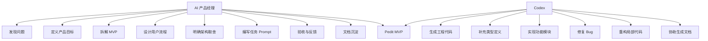
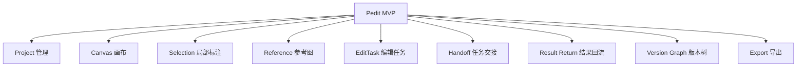
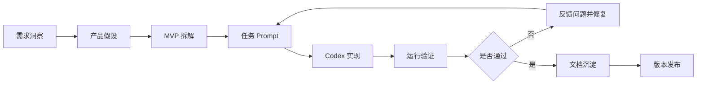
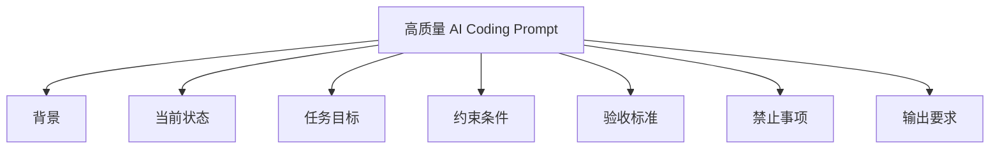
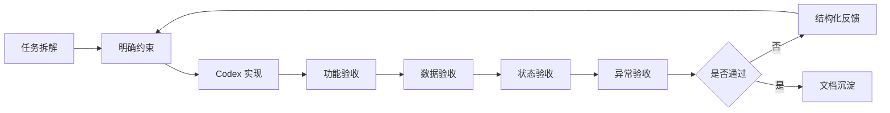
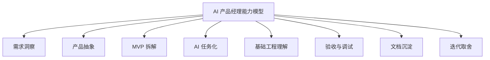

# Pedit AI Coding 复盘：AI 产品经理如何用 Codex 完成插件从 0 到 1

## 0. 文档信息

| 字段 | 内容 |
|---|---|
| 项目名称 | Pedit |
| 文档类型 | AI Coding 复盘 |
| 当前版本 | v0.1.0-alpha |
| 项目形态 | Codex 本地图片编辑插件 |
| 复盘视角 | AI 产品经理 |
| 核心工具 | Codex、MCP、本地插件、GitHub |
| 文档目标 | 复盘 Pedit 从需求洞察、产品拆解、AI Coding、工程验证到 GitHub 发布的完整过程 |
| 核心关键词 | AI Coding、Product-driven、MVP、Handoff、Version Graph、Codex Plugin |

---

## 1. 项目起点：为什么我要做 Pedit

Pedit 的起点不是“我想做一个图片编辑插件”，而是我在体验 AI 图片编辑工具时，观察到一个明显的工作流断点：当前 AI 修图工具越来越强，但用户真正困难的并不只是“生成一张图”，而是如何围绕一张图进行可控、连续、可回退的多轮编辑。

在很多 AI 修图场景中，用户的实际需求往往不是一次性完成的，而是类似这样的过程：

```text
上传原图
→ 整体优化画面质感
→ 发现局部不满意
→ 圈选局部继续修改
→ 上传参考图调整风格
→ 保留多个候选版本
→ 回到某个历史版本重新探索
→ 导出满意结果
```

但传统 AI 修图流程通常更像是：

```text
上传图片
→ 输入 Prompt
→ 等待生成结果
→ 下载图片
→ 不满意就重新描述
→ 再上传 / 再生成 / 再保存
```

这导致用户需要自己管理原图、生成结果、Prompt、参考图、历史版本和最终文件。问题并不是模型不会生成图片，而是 AI 修图缺少一个能承载上下文、局部意图、任务执行和版本历史的工作流工作台。

我最初观察到的核心问题包括：

1. 用户很难表达“改哪里”。自然语言适合表达意图，但不擅长精确表达局部范围，例如“把左边那个东西删掉”“把这里变亮一点”“替换包装上的文字”。
2. 用户很难管理多轮结果。AI 生成结果具有不确定性，用户需要回退、对比和分支探索。
3. Prompt、图片、参考图和结果是割裂的。用户需要在对话框、本地文件夹和不同工具之间反复切换。
4. AI Agent 有执行能力，但缺少视觉任务工作台。Codex 可以理解和执行任务，但对图片编辑来说，仅靠对话框很难承载完整上下文。

因此，我决定用 AI Coding 快速验证一个产品方向：在 Codex 中做一个本地图片编辑插件，让用户通过画布、局部标注、Handoff 和版本树完成 AI 图片编辑工作流。

Pedit 适合用 AI Coding 验证，原因是它的 MVP 假设比较清晰：**画布、局部标注、Handoff 和版本树，能否有效承载 AI 图片编辑工作流？** 这个假设可以通过本地插件快速验证，不需要一开始就做账号系统、云端存储、模型调用平台或商业化系统。

---

## 2. 我的角色定位：不是独立开发者，而是 AI 产品经理

在 Pedit 项目中，我的角色不是传统意义上的独立开发者，也不是单纯“让 AI 帮我写代码”的使用者，而是一个借助 AI Coding 完成产品验证的 AI 产品经理。

我的核心职责不是亲手写每一行代码，而是：

1. 发现 AI 修图场景中的真实问题；
2. 将模糊想法转化为明确的产品假设；
3. 定义 MVP 范围和非目标；
4. 将产品功能拆解成 Codex 可以执行的开发任务；
5. 为每个任务提供背景、约束和验收标准；
6. 对 Codex 的输出进行判断、反馈和修正；
7. 在开发过程中持续做产品和架构取舍；
8. 完成 GitHub 发布和文档沉淀。

在 AI Coding 中，PM 的价值并没有消失，反而更重要。AI 可以快速生成代码，但它无法天然知道产品真正解决什么问题、哪些功能必须进入 MVP、哪些需求应该暂时不做、哪些结果是可接受的、哪些技术方案不符合当前阶段。



Codex 更像是一个可执行的工程协作者，而不是完全自主的产品负责人。我需要持续告诉它：当前产品是什么、当前阶段做什么、本轮任务只解决什么问题、不要影响哪些已有能力，以及做完后应该满足什么验收标准。

这次项目让我形成了一个判断：**AI Coding 并不降低产品经理的价值。相反，它要求产品经理更清楚地定义目标、边界、结构和验收标准。**

---

## 3. 从模糊想法到 MVP：我是如何拆解产品的

Pedit 最初的想法是“用自然语言 P 图”。但如果只停留在这个层面，产品边界会非常模糊。“自然语言 P 图”可以指很多事情：一句话自动改图、圈选局部修改、上传参考图迁移风格、像 Photoshop 一样做图层编辑、把修图流程保存成 Skill，甚至通过 Agent 自动完成复杂设计任务。

这些方向都成立，但不可能在 MVP 阶段全部实现。因此，我先把产品假设收敛为：

> AI 图片编辑需要一个比对话框更适合承载编辑过程的工作台。这个工作台需要同时支持图片上下文、局部编辑意图、参考图、任务交接和版本管理。

基于这个假设，Pedit 的 MVP 不是做一个“万能 AI 修图工具”，而是验证：

```text
画布 + 局部标注 + Handoff + 版本树
```

是否能够有效承载 AI 图片编辑工作流。

MVP 重点做以下能力：

| 模块 | 作用 |
|---|---|
| 图片项目管理 | 组织一次图片编辑任务 |
| 图片上传 | 将原图纳入工作流 |
| 画布展示 | 承载图片和编辑上下文 |
| 局部标注 | 帮助用户表达“改哪里” |
| 参考图上传 | 帮助用户表达风格、色调或构图参考 |
| Handoff 生成 | 将用户意图转化为 Codex 可执行任务 |
| 一键复制 | 降低半自动交接成本 |
| 结果回流 | 将 Codex 结果纳入 Pedit |
| 版本树 | 管理多轮结果、回退和分支 |
| 图片导出 | 完成最终使用闭环 |

MVP 暂不做以下内容：

| 暂不做 | 原因 |
|---|---|
| 不直接内置图像生成 API | 避免 API Key、成本、账号和服务端复杂度 |
| 不承担用户模型调用成本 | 当前定位是本地插件，而不是 SaaS 服务 |
| 不强行自动调用 Codex/image2 | 当前链路耗时长且不稳定 |
| 不做完整图层系统 | Pedit 优先解决版本管理，而不是复刻 Photoshop |
| 不做复杂图片质检 | 当前先验证工作流，质检后置 |
| 不做完整用户反馈系统 | 反馈闭环在后续 beta 阶段补齐 |
| 不做 Skill 市场 | 先验证个人复用价值，再考虑生态 |
| 不做多人协作 | 当前聚焦单用户本地图片编辑流程 |

功能模块拆解如下：



确定模块后，我没有让 Codex 一次性实现整个产品，而是拆成可执行的小任务：搭建插件工程骨架、实现项目管理、实现图片上传、实现 Canvas 展示、实现局部选区、实现 Handoff、一键复制、结果回流、版本树和发布文档。

这个拆解让 Pedit 从一个模糊创意，变成了 Codex 可以逐步实现的产品方案。

---

## 4. AI Coding 工作流：我如何和 Codex 协作

在 Pedit 项目中，我逐渐形成了一套相对稳定的 AI Coding 工作流。



这套流程和随机 vibe coding 最大的区别在于：我不是想到什么就让 Codex 写什么，而是先定义产品目标，再拆解成明确任务，再通过验收标准控制 Codex 输出。

第一步是先让 Codex 理解上下文。我不会直接说“帮我做一个 AI P 图插件”，而是会说明：当前项目是 Codex 本地图片编辑插件，目标不是做完整 Photoshop，而是验证 AI 修图工作流；当前阶段是 MVP，不接中心化图像 API，不做账号系统，不做复杂图层。

第二步是先讨论方案，而不是直接写代码。对于版本树、MCP 交接、结果回流这样的复杂能力，我会先要求 Codex 设计方案，说明数据结构、状态流和异常情况，再决定是否进入实现。

第三步是每一轮只处理一个明确任务。例如：“本轮只实现局部选区创建，不要改动 Handoff 和版本树。” 这样可以降低 Codex 误改无关模块的概率。

第四步是用验收标准约束结果。例如实现图片上传时，我会要求上传后必须创建 ImageAsset、创建 root VersionNode、更新 Project.currentVersionId，并提供失败提示。

第五步是运行验证和反馈修正。Codex 生成代码后，并不代表任务完成。我需要检查功能是否跑通、数据是否写入正确对象、状态是否正确流转、是否影响已有功能、是否符合 MVP 边界。

第六步是用文档反向稳定上下文。随着项目变复杂，单靠对话上下文不够稳定，所以我开始把项目总览、PRD、产品架构设计、数据结构、状态流和版本规划沉淀成文档。文档不只是给人看的，也是给后续 AI 协作看的。

最终，我在 Pedit 中形成的协作模式是：用产品目标定义方向，用文档提供上下文，用任务拆解控制范围，用验收标准判断结果，用反馈循环不断收敛。

---

## 5. 关键开发阶段复盘

### 5.1 阶段总览

Pedit 的开发不是一次性完成的，而是围绕 MVP 闭环逐步推进。


| 阶段 | 核心目标 | 主要验证问题 |
|---|---|---|
| 插件工程骨架 | 让 Pedit 能在 Codex 环境中运行 | 插件形态是否可行 |
| 图片项目与画布 | 让图片进入工作台 | 能否组织原图和当前版本 |
| 局部标注与参考图 | 让用户表达编辑上下文 | 能否表达“改哪里”和“参考什么” |
| Handoff 与 Codex 协作 | 让任务可以交给 Codex | 半自动交接是否可用 |
| 版本树与结果回流 | 让结果回到 Pedit | 是否能形成版本化闭环 |
| GitHub 发布与文档沉淀 | 让项目成为数字资产 | 是否具备对外展示和复盘价值 |

---

### 5.2 插件工程骨架搭建

第一阶段的目标不是马上做完整功能，而是先回答一个基础问题：Pedit 是否可以作为一个 Codex 本地插件运行，并具备后续承载 Canvas、MCP、数据和任务的基础工程结构？

这个阶段主要完成：Codex 插件目录与 manifest、本地 MCP Server 基础结构、前端 Canvas 应用入口、Core 类型与领域对象初版、本地开发与构建脚本、README 与基础运行说明。

从产品视角看，这个阶段的价值是：先让 Pedit 拥有一个可运行的容器，再逐步往里面填充图片编辑工作流能力。

Codex 很适合处理工程初始化、目录组织、脚手架搭建、类型补全等任务，但我需要明确告诉它：当前产品是 Codex 本地插件，不需要复杂云端后端，MCP Server 只服务本地桥接，前端重点是 Canvas 工作台，代码结构要为后续 Project、Task、Version 预留空间。

这一阶段的核心收获是：**AI 可以很快搭出工程骨架，但产品经理必须先定义这个工程要服务什么产品形态。**

---

### 5.3 Canvas 画布与图片项目

第二阶段的目标，是让用户可以创建图片项目、上传图片，并在画布中看到当前图片。这一步决定了 Pedit 是否能从“对话式修图”变成“工作台式修图”。

这个阶段主要完成：创建图片项目、项目列表和项目入口、上传原图、将图片保存为 ImageAsset、创建 root VersionNode、在 Canvas 中展示当前版本、将 Project.currentVersionId 指向当前展示版本。

如果只是做图片上传，Pedit 会变成普通文件处理工具。我希望图片上传后立刻进入项目和版本体系：

```text
上传原图
→ 创建 ImageAsset
→ 创建 root VersionNode
→ 更新 Project.currentVersionId
→ Canvas 展示当前版本
```

这样后续所有编辑任务都可以基于某个版本发起，而不是基于一张孤立图片。

这一阶段让我意识到：**AI Coding 中，数据对象设计比 UI 更重要。如果图片没有进入 Project、ImageAsset、VersionNode 体系，后续再漂亮的画布也无法支撑连续编辑。**

---

### 5.4 局部标注与选区

局部标注是 Pedit 的核心差异能力之一。它要解决的是用户在 AI 修图中最常见的问题之一：我想修改的是图片中的某个局部，但纯自然语言很难准确表达“改哪里”。

这个阶段主要完成：在 Canvas 中进入局部标注模式、用户圈选图片区域、系统显示选区边界、用户为选区填写局部编辑指令、选区与当前版本绑定、后续 Handoff 可以读取选区信息。

局部选区看起来是前端交互问题，但真正关键的是坐标体系。选区不能只保存画布上的屏幕坐标，因为画布可能被缩放、拖拽，不同设备上的显示比例也不同。选区必须转换为基于原图的坐标，才能稳定进入 Handoff 和后续执行链路。

```text
Canvas 显示坐标
→ 转换为原图像素坐标
→ 保存 Selection.bounds
→ 与 VersionNode 绑定
→ 进入 EditTask
```

如果任务描述不清，Codex 可能只实现“画一个框”的 UI，而没有考虑坐标是否基于原图、选区是否与当前版本关联、选区是否能进入 Handoff、选区删除后历史任务是否还能追溯。

这一阶段的核心收获是：**在 AI 产品中，用户的一次交互动作，往往需要转化为可被 Agent 理解的结构化上下文。**

---

### 5.5 Handoff 与 Codex 协作

Handoff 是 Pedit 当前版本最关键的连接层。它要解决的是：Pedit 如何把画布中组织好的图片、选区、参考图和用户指令，交给 Codex 执行？

当前阶段没有稳定的自动调用 Codex/image2 链路，因此 Pedit 采用半自动 Handoff：

```text
Pedit 生成结构化任务
→ 用户一键复制
→ 用户粘贴到 Codex
→ Codex 执行
→ 结果回流
```

这个阶段主要完成：根据 Project、Version、ImageAsset、Selection、Reference 和 Prompt 生成 EditTask；为每次任务生成 task_id；生成结构化 Handoff；支持一键复制；给用户下一步提示；为后续结果回流匹配 task_id。

Handoff 不是普通 Prompt，它必须包含完整任务上下文：任务 ID、项目名称、当前版本、任务类型、当前图片、选区信息、参考图信息、用户编辑要求、需要保留的内容、输出要求和结果回写要求。

这一阶段让我意识到：**在 AI Agent 产品中，任务交接本身就是一个产品能力。** Pedit 当前虽然不是全自动执行，但它已经把用户意图从零散 Prompt 升级为结构化任务，这是后续自动化的基础。

---

### 5.6 版本树与结果回流

版本树与结果回流是 Pedit 闭环的关键。如果 Codex 生成了图片，但结果不能回到 Pedit，那么 Pedit 就只是任务组织器。只有结果回流并成为版本节点，Pedit 才真正完成工作流闭环。

这个阶段主要完成：Codex 结果通过 task_id 匹配 EditTask；结果保存为 generated ImageAsset；根据 baseVersionId 创建新的 VersionNode；新 VersionNode 关联 parentVersionId；新 VersionNode 关联 taskId；更新 Project.currentVersionId；Canvas 展示新版本；用户可以继续编辑、回退或导出。

结果回流的关键不只是“保存一张图片”，而是要正确关联：

```text
result image
→ ImageAsset
→ VersionNode
→ EditTask
→ parentVersionId
→ Project.currentVersionId
```

AI 修图结果不稳定。版本树能解决结果保留、历史回退、分支探索、多版本对比、基于某个版本继续编辑，以及后续质检和反馈挂载。

这一阶段的核心收获是：**AI 产品不应只关注模型输出，还要关注输出如何进入用户的长期工作流。**

---

### 5.7 GitHub 发布与文档整理

当核心 MVP 可以跑通后，我开始整理 GitHub 仓库和文档。这一步的目标不是“把代码传上去”这么简单，而是让 Pedit 从一次本地实验，变成一个可阅读、可复盘、可展示、可继续迭代的数字资产。

这个阶段主要完成：整理 GitHub 仓库结构、补充 README、补充中文 README、创建 release、标注 alpha 阶段能力边界、整理项目总览文档、编写 PRD、编写产品架构设计、编写 AI Coding 复盘，并规划用户手册、Release Notes 和项目复盘文章。

在 AI Coding 项目中，文档不是最后的包装，而是长期协作的上下文基础设施。文档可以帮助未来的自己理解当时取舍，帮助其他人快速理解项目，也帮助 Codex 在后续开发中保持稳定上下文。

这一阶段让我意识到：**一个 AI Coding 项目的最终产出，不只是代码，而是代码、文档、版本、复盘和方法论的组合资产。**

---

### 5.8 本章总结

Pedit 的开发过程不是随机推进的，而是围绕 MVP 闭环逐步完成：

```text
插件骨架
→ 图片项目
→ 画布
→ 选区
→ Handoff
→ 结果回流
→ 版本树
→ GitHub 发布
→ 文档沉淀
```

每个阶段都不是孤立功能，而是在补齐 AI 图片编辑工作流的一环。这次实践让我更加明确：AI Coding 的价值不在于让 AI 一次生成完整产品，而在于通过持续拆解、执行、验收和复盘，把一个产品假设逐步推进成可运行的系统。

---

## 6. 遇到的关键问题与取舍

### 6.1 问题与取舍总览

Pedit 的开发过程中，真正有价值的不是“遇到哪些 Bug”，而是面对产品和技术不确定性时做了哪些取舍。

| 取舍问题 | 最终选择 | 核心原因 |
|---|---|---|
| 是否直接接图像 API | 暂不接 | 避免成本、账号、隐私和服务端复杂度 |
| 是否强行自动调用 Codex/image2 | 暂不作为主链路 | 当前耗时长且不稳定 |
| 是否做完整图层系统 | 暂不做 | 版本树更符合 AI 生成式编辑 |
| 是否做 SaaS | 暂不做 | 本地插件更适合 MVP 验证 |
| 是否做复杂质检和反馈 | 后置 | 先验证核心工作流 |
| 是否做完整 Skill 市场 | 后置 | 先验证个人模板复用价值 |

---

### 6.2 为什么没有直接接图像 API

从体验上看，直接接入图像编辑 API 可以让链路更顺滑：用户点击开始优化，后端调用图像 API，返回结果，然后写回版本树。

但我没有选择这个方案，因为它会让 MVP 复杂度急剧上升。如果直接接 API，需要处理 API Key、模型调用成本、用户额度、调用失败重试、图片上传到服务端、图片隐私与合规、服务端存储、账号和计费、不同模型能力差异等问题。

而 Pedit 当前要验证的核心假设不是“哪个图像模型效果最好”，而是：

> 画布、选区、Handoff 和版本树是否能承载 AI 修图工作流。

因此，直接接 API 虽然看似体验更完整，但会转移项目重点，让我过早陷入模型调用和服务端问题。

---

### 6.3 为什么采用半自动 Handoff

当前版本采用的是半自动 Handoff：Pedit 生成结构化任务，用户一键复制，粘贴到 Codex，Codex 执行，结果回流。

这不是最终理想形态，但它是当前阶段最可控的方案。

| 优点 | 说明 |
|---|---|
| 降低平台依赖 | 不依赖 Codex 暴露自动调用接口 |
| 降低模型成本 | 不需要 Pedit 自己承担模型调用 |
| 用户授权明确 | 用户主动粘贴并发送任务 |
| 更适合 alpha 阶段 | 优先验证工作流，而不是自动化能力 |
| 后续可演进 | Handoff 可以逐步升级为 Executor 输入 |

半自动 Handoff 不是终点，但它是当前阶段验证 Pedit 工作流的最小可行桥梁。

---

### 6.4 为什么自动调用 Codex/image2 暂不作为主链路

长期来看，我希望 Pedit 的链路是：Pedit 创建任务，自动调用 Codex/image2，等待结果，结果自动回流，生成版本节点。

但之前尝试中，自动调用链路遇到几个问题：耗时长、执行结果不稳定、依赖本地环境、可能受浏览器扩展或 CLI 状态影响、用户授权和确认机制不清晰、失败后不容易恢复。

因此，我没有把它写进 MVP 验收标准。更合理的方式是将 Codex/image2 抽象为未来的执行器之一：

```text
Executor:
- codex_handoff
- codex_image2
- external_api
- local_model
- user_skill
```

当前默认执行器是 `codex_handoff`。未来如果 Codex/image2 的调用能力稳定，可以把它作为新的 Executor 接入，而不需要重构整个 Pedit。

---

### 6.5 为什么先做版本树而不是图层系统

图片编辑产品很容易让人想到图层、蒙版、滤镜、调色、局部擦除等传统设计能力。但 Pedit 当前没有优先做完整图层系统，而是先做版本树。

传统修图中，用户往往需要精细控制每个图层。AI 修图中，用户更常遇到的是生成结果不确定：这版整体好但局部不好，那版局部好但风格不对，想回到上一版重新试，想保留多个方向，想基于某个历史版本继续生成。

因此，AI 修图首先需要的是：保存、回退、分支、对比和继续编辑，而不是一开始就做复杂图层。

版本树更符合 Pedit 的 MVP 目标，也更符合 AI 生成式工作流的特点。

---

### 6.6 为什么先做本地插件而不是 SaaS

Pedit 也可以被想象成 SaaS：用户登录，上传图片到云端，后端调用模型，云端保存版本，在线编辑和分享。但 SaaS 会带来大量非 MVP 必需能力：用户系统、云端存储、图片安全、模型调用成本、计费、运维、合规、数据同步、权限控制。

Pedit 当前更适合以 Codex 本地插件形态验证产品假设。本地插件贴近 Codex 使用场景，复用用户自己的 Codex 能力，图片默认本地存储，开发成本更低，更符合个人 AI Coding 项目阶段。

---

### 6.7 为什么暂不做完整质检和反馈系统

图片质检和用户反馈很重要，但我没有把它们作为 v0.1 的核心功能。原因是质检和反馈应该建立在“任务能够完成、结果能够回流、版本能够生成”的基础上。

如果核心链路不稳定，过早做质检和反馈会让产品复杂度上升，但无法解决最核心的问题。

因此，我把它们放到后续阶段：v0.1 跑通工作流，v0.2 优化 Handoff 和回流，v0.3 补任务状态和轻量反馈，v0.5 补基础质检和模板复用，v1.0 形成稳定工作流平台。

---

### 6.8 本章总结

Pedit 开发中的关键取舍可以概括为一句话：

> 先验证工作流，再追求自动化；先建立版本体系，再追求复杂编辑；先复用用户 Codex 能力，再考虑中心化模型服务。

这些取舍让 Pedit 保持了 MVP 的聚焦，也避免项目在早期陷入技术、成本和平台依赖的复杂问题。

---

## 7. Prompt 与任务拆解方法

### 7.1 为什么 Prompt 方法很重要

在 AI Coding 中，Prompt 不是简单的“指令文本”，而是产品经理与 AI 工程助手之间的任务协议。

一个模糊 Prompt 会导致 Codex 自行扩大范围、引入不需要的技术方案、修改无关代码、破坏已有模块、忽略 MVP 边界，最后导致结果难以验收。

一个好的 Prompt 则可以明确上下文、限定任务范围、约束实现方向、保留已有能力、指定验收标准，并降低返工成本。

因此，我把 Prompt 写作视为 AI Coding 中的核心产品能力。

---

### 7.2 高质量 AI Coding Prompt 的结构

我逐渐总结出一个适合 Pedit 的 Prompt 结构：



| 部分 | 作用 |
|---|---|
| 背景 | 让 Codex 理解项目是什么 |
| 当前状态 | 告诉 Codex 目前已有能力 |
| 任务目标 | 明确本轮要完成什么 |
| 约束条件 | 限制实现范围和技术方向 |
| 验收标准 | 定义做到什么程度算完成 |
| 禁止事项 | 明确不要动哪些模块 |
| 输出要求 | 要求 Codex 给出修改说明、测试方式或文件列表 |

---

### 7.3 功能开发 Prompt 模板

```markdown
# 背景
当前项目是 Pedit，一个运行在 Codex 中的本地图片编辑插件。
产品目标是验证 AI 图片编辑工作流：图片项目、画布、局部标注、Handoff、结果回流和版本树。

# 当前状态
目前已经支持：
- 项目创建；
- 图片上传；
- Canvas 展示当前图片；
- root VersionNode 创建。

# 本轮任务
请实现局部选区创建能力。

# 约束条件
1. 当前只支持单选区；
2. 选区坐标必须基于原图坐标，而不是画布显示坐标；
3. 选区需要与当前 Project 和 currentVersionId 关联；
4. 不要改动 VersionNode 的核心结构；
5. 不要引入复杂 mask，MVP 阶段只需要基础选区。

# 验收标准
1. 用户可以在画布中创建选区；
2. 选区边界可以可视化展示；
3. 用户可以为选区填写局部编辑指令；
4. Selection 数据可以保存；
5. 后续 Handoff 可以读取 selection 信息。

# 输出要求
请说明：
- 修改了哪些文件；
- 新增了哪些数据结构；
- 如何手动验证；
- 是否存在后续待优化点。
```

---

### 7.4 Bug 修复 Prompt 模板

```markdown
# 背景
当前项目是 Pedit。

# 问题描述
当前局部选区功能存在问题：
1. 选区坐标使用了画布显示坐标；
2. 缩放画布后，Handoff 中的选区位置不准确；
3. 选区数据没有关联 currentVersionId。

# 期望结果
请修复以上问题，让选区坐标基于原图像素坐标，并与当前版本关联。

# 限制范围
1. 只修复选区相关逻辑；
2. 不要修改 VersionNode 结构；
3. 不要重构整个 Canvas；
4. 不要引入多选区能力。

# 验收标准
缩放画布后创建选区，Handoff 中的坐标仍然对应原图真实位置。
```

Bug 修复 Prompt 的关键是明确问题、限定范围、保护已有模块。

---

### 7.5 方案评审 Prompt 模板

对于复杂功能，我通常先让 Codex 设计方案。

```markdown
# 背景
Pedit 需要支持版本树，用于管理 AI 修图过程中产生的多个结果。

# 任务
请先设计版本树方案，不要写代码。

# 需要回答
1. root version 如何创建；
2. generated version 如何创建；
3. VersionNode 需要哪些字段；
4. 如何支持从历史版本继续编辑；
5. 如何处理版本图片缺失；
6. 如何与 EditTask 关联；
7. MVP 阶段哪些能力先不做。

# 约束
1. 当前不做复杂版本对比；
2. 当前不做图层系统；
3. 版本树需要支持后续分支编辑；
4. 方案要尽量简单，适合 MVP。
```

这种 Prompt 的价值是让 Codex 先暴露思路。如果思路有问题，我可以先纠正方案，而不是等代码写完再大规模返工。

---

### 7.6 文档生成 Prompt 模板

在项目后期，我也会让 Codex 帮助生成文档，但前提是我先明确文档定位。

```markdown
# 背景
Pedit 是一个 Codex 本地图片编辑插件，目前处于 v0.1 alpha 阶段。

# 文档目标
请撰写一份产品架构设计文档，读者是 AI 产品经理、研发接手人和未来维护者。

# 写作要求
1. 不要写成纯技术文档，要从产品架构视角解释；
2. 重点说明为什么采用 Local-first、Handoff、Version Graph；
3. 要包含当前 MVP 架构和长期 Executor 架构；
4. 要用流程图或 Mermaid 表达模块关系；
5. 要诚实说明当前半自动 Handoff 是阶段性取舍。
```

---

### 7.7 不好的 Prompt 示例

不好的 Prompt 通常是范围模糊、没有上下文、没有验收标准。

例如：

```text
帮我做一下局部修图。
```

问题是：不知道局部修图具体指什么，不知道是否需要选区，不知道是否要调用模型，不知道结果如何回流，也不知道是否要生成版本。

另一个例子是：

```text
把这个项目优化一下。
```

问题是范围过大，AI 容易随意重构，很难验收，也容易引入新 Bug。

AI Coding 中，模糊 Prompt 最容易导致“看似产出很多，实际难以使用”。

---

### 7.8 Prompt 拆解方法总结

我的 Prompt 拆解方法可以概括为：

```text
把模糊需求拆成任务
把任务绑定到模块
把模块绑定到数据对象
把数据对象绑定到验收标准
把验收标准绑定到用户流程
```

例如：

```text
模糊需求：支持局部修图
→ 任务：支持局部选区
→ 模块：Canvas + Selection + Handoff
→ 数据对象：Selection
→ 验收：选区可创建、可保存、可进入 Handoff
→ 用户流程：圈选区域 → 写指令 → 生成 Handoff
```

这套方法帮助我把 AI Coding 从“灵感驱动”变成“任务驱动”。

---

## 8. 验收、调试与质量控制

### 8.1 为什么验收很重要

AI Coding 的一个风险是：代码看起来生成得很快，但并不意味着产品真的可用。

Codex 可能会出现以下问题：功能表面完成但用户流程跑不通，数据写入错误对象，状态没有正确流转，改一个功能影响另一个模块，过度设计超出 MVP 范围，异常状态没有处理，文档和实际实现不一致，术语前后不统一。

因此，我需要建立一套自己的验收方法，而不是只看“有没有生成代码”。

---

### 8.2 我的验收维度

我通常从七个维度验收 Codex 的输出。

| 验收维度 | 需要回答的问题 |
|---|---|
| 功能可用 | 用户是否能完成目标动作 |
| 用户流程 | 是否符合预期操作路径 |
| 数据正确 | 是否写入正确对象和字段 |
| 状态正确 | 是否有正确状态流转 |
| 异常可控 | 失败时是否有提示和兜底 |
| 范围收敛 | 是否只改了本轮该改的内容 |
| 架构一致 | 是否符合现有 Project、Task、Version 设计 |

例如，验收“图片上传”时，我不会只看图片是否显示，而会检查是否创建 ImageAsset、是否创建 root VersionNode、Project.currentVersionId 是否正确、刷新后项目是否能恢复、上传失败是否有提示、是否影响已有项目列表。

---

### 8.3 功能验收清单

#### 8.3.1 项目与图片上传

| 验收项 | 是否必须 |
|---|---|
| 可以创建项目 | 是 |
| 可以上传图片 | 是 |
| 图片能在 Canvas 展示 | 是 |
| 创建 ImageAsset | 是 |
| 创建 root VersionNode | 是 |
| Project.currentVersionId 正确 | 是 |
| 上传失败有提示 | 是 |

#### 8.3.2 局部标注

| 验收项 | 是否必须 |
|---|---|
| 可以进入局部标注模式 | 是 |
| 可以创建选区 | 是 |
| 选区可视化展示 | 是 |
| 坐标基于原图 | 是 |
| Selection 关联当前版本 | 是 |
| 可以填写局部指令 | 是 |
| Handoff 可以读取选区信息 | 是 |

#### 8.3.3 Handoff

| 验收项 | 是否必须 |
|---|---|
| 可以生成 task_id | 是 |
| Handoff 包含项目和版本信息 | 是 |
| Handoff 包含任务类型 | 是 |
| 局部任务包含选区信息 | 是 |
| 参考图任务包含参考说明 | 是 |
| 可以一键复制 | 是 |
| 复制失败有手动兜底 | 建议 |

#### 8.3.4 结果回流与版本树

| 验收项 | 是否必须 |
|---|---|
| 结果可以匹配 task_id | 是 |
| 结果保存为 ImageAsset | 是 |
| 结果生成 VersionNode | 是 |
| 新版本关联 parentVersionId | 是 |
| 新版本关联 taskId | 是 |
| Project.currentVersionId 更新 | 是 |
| Canvas 展示新版本 | 是 |
| 可以基于历史版本继续编辑 | 建议 |

---

### 8.4 如何处理 Bug 和返工

AI Coding 中，返工是正常的。关键不是避免 Bug，而是让返工可控。

我通常会把 Bug 反馈写成结构化格式：

```markdown
# 当前问题
局部选区在画布缩放后位置不准确。

# 复现路径
1. 上传图片；
2. 放大画布；
3. 在图片右上角创建选区；
4. 生成 Handoff；
5. Handoff 中的选区坐标偏移。

# 预期结果
选区坐标应基于原图像素坐标，不受画布缩放影响。

# 限制范围
只修复坐标转换逻辑，不要改动 VersionNode、Handoff 模板和本地存储结构。

# 验收标准
缩放画布后创建选区，Handoff 中的坐标仍然对应原图真实位置。
```

这种反馈比“这个选区不准，修一下”更有效。

---

### 8.5 如何避免 AI 过度发挥

Codex 有时会试图“顺手优化”无关模块，这在 AI Coding 中很常见。例如，本来只是修复选区坐标，它可能同时重构 Canvas、修改 VersionNode、改变项目数据结构、引入新的状态管理库、调整 UI 风格或改 Handoff 模板。

因此，我会在 Prompt 里明确写：

```text
不要改动以下模块：
- VersionNode 数据结构；
- Handoff 模板；
- 项目存储结构；
- 现有上传逻辑。
```

或者：

```text
本轮只做最小修改，不要重构无关代码。
```

AI Coding 的质量控制，很大一部分来自范围控制。

---

### 8.6 如何在无完整工程背景下控制质量

作为 AI 产品经理，我不需要像资深工程师一样亲手写完所有代码，但我必须理解几个关键问题：数据对象是否合理，状态是否可追踪，用户流程是否跑通，异常是否有兜底，新功能是否破坏旧功能，架构是否还能继续演进。

我控制质量的方式主要有五种：

1. 用文档约束方向；
2. 用小任务降低风险；
3. 用验收标准判断结果；
4. 用异常场景补充验证；
5. 用版本和文档沉淀阶段成果。

---

### 8.7 质量控制中的关键指标

虽然 Pedit 当前是 alpha 阶段，但我仍然会用一些指标来判断 AI Coding 结果是否有效。

| 指标 | 说明 |
|---|---|
| 核心流程跑通率 | 用户能否从上传到版本生成 |
| Handoff 生成成功率 | 任务是否能被结构化 |
| 结果回流成功率 | Codex 结果是否能进入 Pedit |
| 版本节点生成成功率 | 版本树是否稳定 |
| 单项目版本数 | 用户是否能多轮编辑 |
| 导出成功率 | 最终结果是否可用 |
| 返工次数 | AI 输出是否稳定 |
| 无关代码修改次数 | Codex 是否过度发挥 |

这些指标不一定都需要埋点，但它们能帮助我判断项目是否真的在变稳定。

---

### 8.8 验收与质量控制方法总结

Pedit 的质量控制可以概括为：



这套流程的核心是：AI Coding 不是生成即完成，而是生成、验收、反馈、修正和沉淀的循环。

---

## 9. 这次 AI Coding 给我的启发

### 9.1 AI 产品经理的新能力模型

Pedit 项目让我看到，AI Coding 时代的产品经理能力模型正在发生变化。过去产品经理主要通过 PRD、原型和需求评审影响产品实现。而在 AI Coding 中，产品经理可以更直接地进入实现环节，但这也要求 PM 具备更强的复合能力。



其中最重要的不是“会不会写代码”，而是：能否把一个产品问题拆成 AI 能执行、自己能验收、系统能演进的任务。

---

### 9.2 AI Coding 的优势

这次项目让我感受到 AI Coding 的几个明显优势：

1. 极大降低从想法到原型的成本。借助 Codex，我可以直接从产品假设推进到可运行 MVP。
2. 适合探索 AI 原生产品形态。Pedit 本身就是一个 AI 原生工作流产品，用 AI Coding 开发它能让我更快理解 AI 工具和 AI 产品之间的关系。
3. 能帮助 PM 更深入理解实现边界。推进过程中，我必须理解本地插件、MCP、数据对象、结果回流和版本树。
4. 能快速形成作品集资产。Pedit 不只是想法和 PPT，而是形成了仓库、插件、Release、README、PRD、架构文档和复盘文档。

---

### 9.3 AI Coding 的边界

AI Coding 也有明显边界：

1. AI 不会自动替你做产品取舍。如果我让 Codex 做“完整 AI 修图工具”，它可能会给出非常庞大的方案。
2. AI 容易上下文漂移。项目复杂后，Codex 可能忘记早期约定，或者使用新的术语和结构。
3. AI 容易过度发挥。AI 有时会在修一个问题时顺手重构其他模块。
4. AI 生成不等于产品可用。代码能跑只是最低标准，产品是否可用还要看用户流程、状态、异常、数据一致性和长期维护性。
5. 复杂链路仍然需要人工判断。比如自动调用 Codex/image2、MCP 桥接、结果回流和版本树，都不是简单让 AI 写代码就能解决的。

---

### 9.4 如果重新做一遍，我会如何改进

如果重新做一遍 Pedit，我会更早做几件事：

1. 更早写 PRD，让 Codex 更清楚产品目标、用户流程、MVP 边界和验收标准。
2. 更早定义数据结构，尤其是 Project、ImageAsset、VersionNode、EditTask、Selection。
3. 更早定义状态机，尤其是 EditTask 的 draft、handoff_generated、handoff_copied、waiting_for_codex、succeeded、failed。
4. 更早建立测试和验收清单，减少“看起来好了但其实链路没通”的情况。
5. 更早沉淀 Prompt 模板，让功能开发、Bug 修复、方案评审、文档生成更稳定。

---

## 10. 总结：从 Vibe Coding 到 Product-driven AI Coding

Pedit 最初可以被理解为一次 Vibe Coding 尝试，但在推进过程中，它逐渐变成了一次 Product-driven AI Coding 实践。

我不再只是让 AI 帮我写代码，而是先定义产品问题，再拆解 MVP，再将每个功能转化为 Codex 可以执行的任务，并通过验收标准、架构文档和复盘文档持续校准方向。

这次实践让我看到，AI 产品经理在 AI Coding 时代的价值不是被削弱，而是被放大了。因为 AI 可以更快地完成实现，但前提是有人能够清楚地定义问题、拆解任务、判断结果、控制边界，并把一次开发过程沉淀为可复用的方法论。

Pedit 的长期价值不只是一个图片编辑插件，而是一次完整的 AI 产品经理能力验证：

```text
需求洞察
→ 产品定义
→ MVP 拆解
→ AI Coding
→ 架构取舍
→ 工程验证
→ GitHub 发布
→ 文档沉淀
```

这也是我对这次项目最重要的复盘结论：

> 好的 AI Coding 不是随机 vibe，而是以产品目标为中心，用文档、任务、约束和验收标准驱动 AI 完成可持续迭代的产品闭环。
