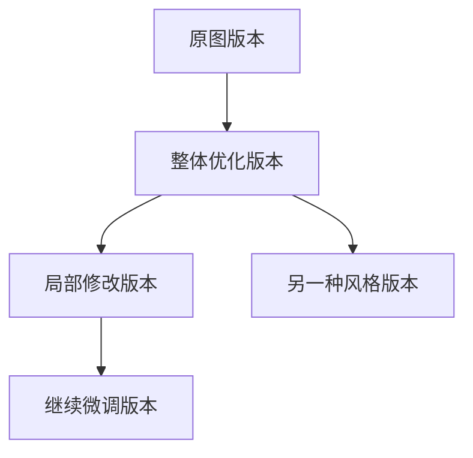

# Pedit 功能说明与用户手册

适用版本：`v0.1.0-alpha`
产品形态：Codex 本地图片编辑插件
适用用户：希望在 Codex 中完成 AI 图片编辑工作流的用户

---

## 0. 文档信息

| 字段 | 内容 |
|---|---|
| 产品名称 | Pedit |
| 文档类型 | 功能说明与用户手册 |
| 当前版本 | v0.1.0-alpha |
| 产品形态 | Codex 本地图片编辑插件 |
| 适用用户 | AI 修图用户、内容创作者、产品/运营/设计人员、AI Agent 工具探索者 |
| 文档目标 | 帮助用户理解 Pedit 能做什么，并完成一次完整的 AI 图片编辑流程 |
| 当前核心链路 | 上传图片 → 画布编辑 → 生成 Handoff → 复制到 Codex 执行 → 结果回流 → 版本树管理 → 导出图片 |

---

## 1. Pedit 是什么

### 1.1 一句话介绍

Pedit 是一个运行在 Codex 中的本地图片编辑插件，帮助用户通过图片项目、画布、局部标注、参考图、Handoff 和版本树，完成 AI 图片编辑工作流。

简单来说：

```text
你把图片放进 Pedit
→ 在画布里说明想改哪里、怎么改
→ Pedit 把图片、选区、参考图和指令整理成任务
→ 你把任务交给 Codex 执行
→ Codex 完成后，结果回到 Pedit 的版本树中
→ 你可以继续修改、回退、对比或导出
```

### 1.2 Pedit 解决什么问题

普通 AI 修图通常更像一次性 Prompt 生成：

```text
上传图片
→ 输入 Prompt
→ 等待结果
→ 下载图片
→ 不满意就重新上传、重新描述、重新保存
```

这种方式在简单任务中可用，但在多轮编辑、局部修改、参考图风格迁移和多版本探索中，会遇到明显问题：

- 很难准确表达“改哪里”；
- 很难保留每次修改的历史；
- 很难知道哪个 Prompt 对应哪个结果；
- 很难从某个历史版本继续编辑；
- 图片、参考图、Prompt 和生成结果分散在多个地方。

Pedit 的目标是把 AI 修图从一次性对话，变成一个可组织、可回退、可继续编辑的工作流。

### 1.3 当前版本能力边界

Pedit 当前仍处于 alpha 阶段。核心流程已经可以用于小范围试用和验证，但它还不是一个完全自动化的 AI 修图产品。

当前版本采用半自动 Handoff：

```text
Pedit 生成结构化任务
→ 用户一键复制
→ 用户粘贴到 Codex 对话中发送
→ Codex 执行图片编辑
→ 结果回流到 Pedit
```

这意味着：

- Pedit 当前不会直接自动调用 Codex/image2；
- 你需要把 Pedit 生成的 Handoff 粘贴到 Codex 中执行；
- 插件安装、MCP 工具加载、结果回流等步骤可能受本地环境影响；
- 局部修改和参考图效果仍可能受模型理解能力影响。

---

## 2. 适合谁使用

### 2.1 AI 修图尝鲜用户

适合想使用自然语言修图，但又希望保留原图、历史版本和修改过程的用户。

你可能会使用 Pedit 来：

- 优化照片质感；
- 修改局部内容；
- 尝试不同风格；
- 保留多个候选结果；
- 对不满意结果进行继续修改。

### 2.2 内容创作者

适合经常处理小红书、公众号、视频封面、活动图、头像、商品图等视觉素材的人。

你可能会使用 Pedit 来：

- 提亮图片；
- 替换背景；
- 删除杂物；
- 局部换字；
- 参考其他图片风格；
- 生成多个版本对比。

### 2.3 产品、运营、设计人员

适合需要快速处理配图、营销图、活动图、产品示意图或汇报素材的人。

Pedit 可以帮助你：

- 快速做图像探索；
- 保留不同版本；
- 记录编辑过程；
- 导出最终结果；
- 用自然语言完成轻量修图任务。

### 2.4 AI Agent / Codex 工具探索者

适合希望探索 Codex、MCP、本地插件和 AI 图片编辑工作流的人。

你可以通过 Pedit 观察：

- 画布如何承载视觉任务；
- Handoff 如何把任务交给 Codex；
- 版本树如何管理 AI 生成结果；
- 本地插件如何组织图片工作流。

---

## 3. 使用前准备

### 3.1 环境要求

使用 Pedit 前，请确保你已经准备：

- Codex Desktop，并启用插件能力；
- Node.js 20 或更新版本；
- pnpm；
- Git；
- 可以运行本地插件和 MCP Server 的环境；
- 至少一张待编辑图片。

### 3.2 当前版本推荐使用方式

当前 Pedit 仍是 alpha 版本，如果你只是想试用，推荐优先使用 GitHub Release 中的发布包；如果你希望查看源码或继续开发，可以 clone 仓库后本地构建。

### 3.3 本地数据说明

Pedit 是本地插件，项目、上传图片、生成图片和任务状态默认保存在本机。请不要把这些目录上传到公开仓库：

```text
.pedit-runtime/
packages/server/.pedit-runtime/
docs/validation/
```

这些目录通常用于保存本地运行数据、用户图片、生成结果或验证材料。

---

## 4. 安装与启动

> 注意：以下步骤适用于从源码安装。不同 Codex 版本和插件加载方式可能存在差异，请结合你当前 Codex 环境调整。

### 4.1 克隆仓库

```bash
git clone https://github.com/812745450-png/pedit_plugin.git
cd pedit_plugin
```

如果你是从 Release 下载压缩包，请先解压，再进入解压后的项目目录。

### 4.2 安装依赖

```bash
pnpm install
```

### 4.3 构建项目

```bash
pnpm build
```

### 4.4 校验插件配置

如果项目提供插件校验脚本，可以执行：

```bash
pnpm validate:plugin
```

如果你的本地版本没有该脚本，请以仓库实际 `package.json` 为准。

### 4.5 在 Codex 中启用插件

构建完成后，在 Codex 中将该文件夹作为本地插件安装或启用。

建议启用后新开一个 Codex 线程，再输入：

```text
@pedit 打开
```

如果插件没有立刻出现，通常是因为 Codex 线程还没有重新加载 MCP 工具。可以尝试：

1. 关闭当前 Codex 线程；
2. 重新打开一个新线程；
3. 再次输入 `@pedit 打开`；
4. 确认 MCP Server 是否正常启动；
5. 确认插件配置文件是否被 Codex 正确读取。

---

## 5. 快速开始：完成第一次 AI 修图

本节以“整体提升图片质感”为例，说明如何完成一次完整 AI 修图流程。


### 5.1 第一步：打开 Pedit

在 Codex 中输入：

```text
@pedit 打开
```

如果插件加载成功，会打开 Pedit 的图片编辑界面。

### 5.2 第二步：创建图片项目

点击「新建项目」，输入项目名称，例如：

```text
人像照片优化测试
```

图片项目用于管理同一张图片的原图、编辑任务、历史版本和导出结果。

### 5.3 第三步：上传图片

进入项目后，点击「上传图片」，选择本地图片。

上传成功后：

- 图片会显示在画布中；
- 系统会创建项目原图；
- 系统会生成第一个根版本；
- 后续编辑都会基于当前版本继续进行。

### 5.4 第四步：输入修图需求

如果你想做整图优化，可以直接输入：

```text
请整体提升这张图片的质感，让光线更柔和、画面更干净，但保持人物脸部特征和服装基本不变。
```

建议指令中同时说明：

- 想修改什么；
- 想保留什么；
- 想要什么风格；
- 有没有不能改变的内容。

### 5.5 第五步：点击开始优化

点击「开始优化」后，Pedit 会根据当前图片和编辑指令生成结构化 Handoff。

Handoff 是一段给 Codex 的任务说明，通常包含：

- 当前项目；
- 当前版本；
- 当前图片；
- 用户修图要求；
- 保留要求；
- 输出和回写要求。

### 5.6 第六步：一键复制 Handoff

点击「一键复制」，将 Handoff 复制到剪贴板。

复制成功后，回到 Codex 对话框。

### 5.7 第七步：粘贴到 Codex 执行

将 Handoff 粘贴到 Codex 对话中，并发送。

Codex 会根据任务说明执行图片编辑。当前版本中，这一步需要用户手动发送。

### 5.8 第八步：查看回流结果

Codex 完成修图后，结果会回流到 Pedit，并成为版本树中的新版本节点。

你可以：

- 查看新结果；
- 和历史版本对比；
- 基于当前版本继续编辑；
- 回到历史版本重新尝试；
- 导出满意结果。

### 5.9 第九步：导出图片

当你满意当前版本后，点击「导出」，保存当前图片。

导出前请确认：

- 当前画布展示的是你想导出的版本；
- 该版本图片已经正常加载；
- 不要误导出历史版本或中间版本。

---

## 6. 核心功能说明

### 6.1 图片项目管理

图片项目是 Pedit 管理一次图片编辑过程的基本单位。

一个项目可以包含：

- 原图；
- 当前版本；
- 历史版本；
- 编辑任务；
- 参考图；
- 导出结果。

适合使用项目管理的场景：

- 同一张图片需要多轮编辑；
- 想保留不同结果；
- 想从某个历史版本继续修改；
- 想把一次修图过程作为项目资产保存。

基本操作：

1. 打开 Pedit；
2. 点击「新建项目」；
3. 输入项目名称；
4. 上传图片；
5. 后续编辑结果会保存在该项目中。

### 6.2 画布

画布是 Pedit 的核心工作区，用于查看当前图片、创建选区、查看结果和继续编辑。

在画布中，你可以：

- 查看当前图片；
- 放大或移动图片；
- 圈选局部区域；
- 上传参考图；
- 输入编辑需求；
- 基于当前版本继续编辑；
- 查看版本树中的历史结果。

画布的核心作用是帮助用户把抽象的自然语言修图需求转化为更清晰的视觉上下文。

### 6.3 整图编辑

整图编辑适合对整张图片进行整体优化。

适合场景：

- 整体增强画质；
- 调整照片氛围；
- 统一风格；
- 更换整体背景；
- 优化光线和色调；
- 让画面更自然、更高级；
- 按参考图统一整体风格。

示例指令：

```text
请整体提升这张图片的质感，让画面更明亮、更干净，光线更柔和，但保持主体和构图基本不变。
```

使用建议：

- 明确说明想要的整体风格；
- 明确说明主体是否需要保持不变；
- 如果有人像，建议强调保持脸部特征；
- 如果有产品，建议强调保持产品形态和文字准确。

### 6.4 局部标注

局部标注用于告诉 Pedit 和 Codex：这次只想修改图片中的某个区域。


适合场景：

- 只修改包装上的文字；
- 只改变衣服颜色；
- 只去除某个小物体；
- 只调整某个区域的细节；
- 只修改背景中的某个对象；
- 只修复局部瑕疵。

示例指令：

```text
只修改选中区域，把衣服颜色改成黑色，保持人物脸部和背景不变。
```

使用建议：

- 选区尽量覆盖完整目标，不要只圈目标的一小部分；
- 不要把选区画得过小，否则模型可能难以理解；
- 不要把整张图都圈成局部，如果是整图任务，直接使用整图编辑；
- 指令中要明确“只修改选中区域”；
- 指令中要明确“非选区区域保持不变”。

### 6.5 参考图

参考图用于帮助 Codex 理解你想要的风格、色调、构图、背景或材质。

适合场景：

- 参考另一张图的色调；
- 参考另一张图的光影；
- 参考另一张图的构图；
- 参考另一张图的产品质感；
- 参考另一张图的人像摄影风格；
- 参考另一张图的背景氛围。

上传参考图后，不建议只写：

```text
参考这张图。
```

更推荐写清楚参考维度：

```text
参考这张图的暖色调和柔和光线，但不要改变原图人物的脸部特征和服装。
```

或者：

```text
参考这张图的高级灰色调和背景氛围，保留当前图片中的产品主体和构图。
```

### 6.6 Handoff

Handoff 是 Pedit 当前版本中最重要的概念之一。

它是一段结构化任务说明，用于把 Pedit 中的图片、选区、参考图和修图要求交给 Codex。

当前 alpha 版本中，Pedit 不会直接自动调用 Codex/image2。用户需要：

```text
点击开始优化
→ Pedit 生成 Handoff
→ 点击一键复制
→ 粘贴到 Codex 对话
→ 发送给 Codex 执行
```

Handoff 通常包含：

- 任务 ID；
- 项目名称；
- 当前版本；
- 当前图片；
- 任务类型；
- 选区信息；
- 参考图信息；
- 用户修图要求；
- 需要保留的内容；
- 结果回写要求。

为什么需要 Handoff？

因为它可以减少用户手动组织 Prompt 的成本，并让 Codex 更清楚地理解：

- 当前基于哪张图；
- 当前要改哪里；
- 是否有参考图；
- 哪些内容要保留；
- 结果应该如何回到 Pedit。

### 6.7 版本树

版本树用于记录每次 AI 修图结果。



上传原图后，Pedit 会创建根版本。每次 Codex 生成结果并回流后，Pedit 会创建新的版本节点。

你可以：

- 查看历史版本；
- 回到某个版本；
- 基于历史版本继续编辑；
- 保留多个探索方向；
- 导出满意版本。

需要注意：

> 回退版本不会删除历史结果，只是切换当前查看和编辑的版本。

### 6.8 导出图片

当你对某个版本满意后，可以点击「导出」保存当前图片。

导出前建议确认：

- 当前画布显示的是你想导出的版本；
- 图片已经成功回流；
- 当前版本处于可用状态；
- 文件保存位置符合预期。

---

## 7. 典型使用场景

### 7.1 整体提升图片质感

适合：人像、产品图、社交媒体配图、营销图。

示例指令：

```text
请整体提升这张图片的质感，让画面更明亮、更干净，光线更柔和，但保持主体和构图基本不变。
```

人像场景可以写得更具体：

```text
请把这张照片优化成专业摄影师拍摄的效果，提升光线、质感和氛围，但保持人物脸部特征、服装和主体位置基本不变。
```

### 7.2 局部修改图片内容

适合：删除物体、修改颜色、替换文字、修复细节。

示例指令：

```text
只修改选中区域，删除背景中的这个路人，保持周围背景自然衔接。
```

或者：

```text
只修改选中区域，把包装上的文字替换为“新品上市”，先清除原文字，再保持包装材质和透视自然。
```

### 7.3 使用参考图调整风格

适合：风格参考、色调参考、构图参考、产品质感参考。

示例指令：

```text
参考这张图的高级灰色调和柔和光线，优化当前图片的整体氛围，但保持原图主体不变。
```

如果是产品图，可以写：

```text
参考这张图的产品摄影质感，让当前产品看起来更高级、更干净，但不要改变产品本身的形状和文字。
```

### 7.4 多版本探索与回退

适合：尝试不同风格、保留多个候选方案。

使用方式：

1. 基于原图生成一个版本；
2. 如果想尝试另一种风格，回到原图或某个历史版本；
3. 输入新的编辑指令；
4. 生成新的分支版本；
5. 在版本树里比较不同结果。

### 7.5 基于历史版本继续编辑

适合：某个历史版本整体满意，但还想局部微调。

使用方式：

1. 在版本树中选择历史版本；
2. 画布切换到该版本；
3. 圈选需要修改的区域；
4. 输入局部指令；
5. 生成新的子版本。

---

## 8. 当前版本限制

Pedit 当前仍处于 `v0.1.0-alpha` 阶段，适合小范围试用和继续迭代。当前版本存在以下限制。

### 8.1 当前仍是 alpha 版本

alpha 版本意味着核心流程已经可以验证，但稳定性、安装体验、自动化程度和错误提示还在持续优化中。

你可能会遇到：

- 插件加载不稳定；
- Codex 线程未及时加载 MCP 工具；
- 本地环境配置问题；
- 结果回流不稳定；
- 部分异常提示不够完善。

### 8.2 当前采用半自动 Handoff

当前点击「开始优化」后，Pedit 会生成 Handoff，用户需要一键复制并粘贴到 Codex 中执行。

这不是最终理想形态。长期目标是探索更自动化的任务投递和结果回流。

### 8.3 自动调用 Codex/image2 尚未作为主链路

Pedit 长期希望实现：

```text
Pedit 创建任务
→ 自动调用 Codex/image2
→ 等待结果
→ 结果自动回流
```

但当前该链路仍存在稳定性和耗时问题，因此没有作为 alpha 阶段主流程。

### 8.4 局部编辑效果可能不稳定

局部标注可以帮助表达修改范围，但 AI 模型仍可能出现：

- 改错区域；
- 非选区被影响；
- 选区边缘融合不自然；
- 小区域修改失败；
- 文案或细节不准确。

如果局部修改效果不好，可以尝试放大选区、简化指令，或分多轮处理。

### 8.5 参考图理解可能存在偏差

参考图需要配合明确说明使用。

建议说明：

- 参考风格；
- 参考色调；
- 参考光影；
- 参考构图；
- 参考背景；
- 参考材质；
- 不要改变哪些内容。

否则 Codex 可能不知道应该参考哪一部分。

### 8.6 安装和运行可能受本地环境影响

Pedit 依赖 Codex 插件能力、本地 MCP Server、Node.js、pnpm 和本地文件权限。如果插件无法打开或 MCP 工具未加载，可以尝试：

- 重新构建项目；
- 重新开启 Codex 线程；
- 检查 Node.js 版本；
- 检查 pnpm 安装；
- 检查插件是否启用；
- 检查本地 MCP Server 是否启动。

---

## 9. 常见问题 FAQ

### Q1：Pedit 和普通 AI 修图工具有什么区别？

普通 AI 修图工具通常更关注一次性生成结果。Pedit 更关注图片编辑过程本身：它通过项目、画布、局部标注、Handoff 和版本树，帮助用户管理多轮编辑、历史结果和版本分支。

Pedit 的重点不是替代所有修图软件，而是帮助用户在 Codex 中组织 AI 图片编辑工作流。

### Q2：为什么点击开始优化后还要复制到 Codex？

当前 alpha 版本采用半自动 Handoff 方案。Pedit 负责整理图片、选区、参考图和编辑指令，并生成结构化任务；用户复制后交给 Codex 执行。

这样做可以降低当前阶段对自动调用接口的依赖，也能复用用户自己的 Codex 能力。

### Q3：结果没有回流怎么办？

可以检查：

1. 是否已经把 Handoff 粘贴并发送给 Codex；
2. Codex 是否完成了图片编辑任务；
3. Handoff 中是否包含 task_id 或结果回写要求；
4. Pedit 是否仍然打开对应项目；
5. 本地 MCP Server 是否正常运行；
6. Codex 线程是否加载了 Pedit 相关 MCP 工具。

如果仍未回流，可以尝试：

- 重新复制 Handoff；
- 重新打开 Codex 线程；
- 重新打开 Pedit 项目；
- 手动保存 Codex 生成结果；
- 后续版本可通过手动导入结果进行兜底。

### Q4：局部修改效果不好怎么办？

可以尝试：

1. 选区不要过小；
2. 选区尽量覆盖完整目标区域；
3. 指令中明确“只修改选中区域”；
4. 明确说明非选区区域需要保持不变；
5. 分多轮修改，不要一次要求太复杂；
6. 如果是换文字，说明“先清除原文字，再添加新文字”；
7. 如果是删除物体，说明“保持周围背景自然衔接”。

### Q5：参考图没有被正确遵循怎么办？

建议不要只上传参考图，而要说明参考维度。

可以写：

```text
参考这张图的色调和柔和光线，不参考人物姿势，不改变原图主体。
```

或者：

```text
参考这张图的产品摄影质感，但保持当前产品的形状、Logo 和文字不变。
```

如果结果仍不理想，可以把任务拆成多轮：先调整整体风格，再单独处理局部细节。

### Q6：版本树有什么用？

版本树用于记录每次 AI 修图结果。你可以：

- 回到历史版本；
- 基于某个版本继续编辑；
- 保留不同风格方案；
- 对比多个结果；
- 导出满意版本。

版本树的价值在于：你不需要每次都回到原图重来，也不需要靠本地文件名手动管理结果。

### Q7：回退版本会删除后面的版本吗？

不会。回退只是切换当前查看或继续编辑的版本，不会自动删除历史版本。

如果你从历史版本继续编辑，新结果会成为该历史版本下的新分支。

### Q8：Pedit 会把我的图片上传到云端吗？

Pedit 当前是本地插件，项目、上传图片、生成图片和任务状态默认保存在本机。
但当你把 Handoff 和图片任务交给 Codex 执行时，具体数据如何被 Codex 处理，取决于 Codex 的运行环境和相关产品机制。

请不要把 `.pedit-runtime/` 等本地数据目录上传到公开仓库。

### Q9：为什么插件没有打开？

可以检查：

1. 是否已经安装并构建项目；
2. 是否使用 Node.js 20 或更新版本；
3. 是否安装 pnpm；
4. 是否在 Codex 中启用了插件；
5. 是否新开了 Codex 线程；
6. 是否输入了 `@pedit 打开`；
7. MCP Server 是否启动成功。

### Q10：我可以把 Pedit 当作 Photoshop 使用吗？

不建议。Pedit 当前不是传统专业修图软件，也不是完整图层编辑器。它更适合 AI 图片编辑工作流：上传图片、表达编辑意图、交给 Codex 执行、管理版本和继续编辑。

---

## 10. 最佳实践

### 10.1 写清楚“修改什么”和“保留什么”

好的指令不只是说要改什么，还要说明不要改什么。

不推荐：

```text
优化一下这张图。
```

推荐：

```text
请整体提升这张图片的质感，让画面更明亮、更干净，但保持人物脸部特征、服装和背景结构基本不变。
```

### 10.2 局部编辑时明确范围和目标

不推荐：

```text
改一下这里。
```

推荐：

```text
只修改选中区域，把衣服颜色改成黑色，保持人物脸部、手部和背景不变。
```

### 10.3 换文字时先说明清除原内容

如果要替换文字，建议写：

```text
请先清除选中区域中的原文字，并保持背景材质自然，然后添加新文字“新品上市”，文字需要贴合原图透视和光影。
```

### 10.4 使用参考图时说明参考维度

不推荐：

```text
参考这张图。
```

推荐：

```text
参考这张图的暖色调、柔和光线和高级感，但不要改变原图人物的脸部特征和服装。
```

### 10.5 不要一次要求太复杂

如果任务很复杂，建议拆成多轮：

```text
第一轮：整体提升质感
第二轮：局部删除杂物
第三轮：微调色调
第四轮：导出最终版本
```

这样比一次要求模型完成所有复杂修改更稳定。

### 10.6 充分使用版本树

如果某次结果不满意，不一定要从原图重来。你可以：

- 回到上一个版本；
- 基于当前版本继续修改；
- 从历史版本生成新分支；
- 保留多个方案对比。

### 10.7 对结果不满意时，优先明确失败原因

如果结果不好，不要只写“重新做”。
可以说明具体问题：

```text
这次结果整体不错，但人物脸部变化太大。请基于上一个版本重新优化，保持人物脸部完全一致，只调整光线和背景氛围。
```

---

## 11. 后续计划

Pedit 后续会围绕三个方向继续迭代。

### 11.1 更顺滑的任务投递

当前是：

```text
一键复制 Handoff → 粘贴到 Codex 执行
```

后续希望进一步降低用户操作成本，探索更自然的任务投递方式。

### 11.2 更稳定的结果回流和版本管理

后续会继续优化：

- task_id 匹配；
- 结果回流；
- 版本节点生成；
- 回流失败兜底；
- 手动导入结果；
- 版本备注和对比。

### 11.3 图片质检、用户反馈和 Skill

长期方向包括：

- 图片基础质检；
- 用户满意度反馈；
- 失败原因标记；
- Handoff 模板复用；
- 用户自定义修图 Skill；
- 多执行器适配；
- Codex/image2 自动调用探索。

Pedit 的长期目标不是只做一个 Prompt 生成器，而是成为一个以画布为中心的 AI 图片编辑工作流平台。

---

## 12. 本文档维护建议

建议在仓库 README 中加入以下链接：

```markdown
更多详细使用说明请查看：[功能说明与用户手册](./docs/05_user_guide.md)
```

后续每次发布新版本时，建议同步更新：

- 安装步骤；
- 当前版本能力；
- 已知限制；
- FAQ；
- 最佳实践；
- 后续计划。
