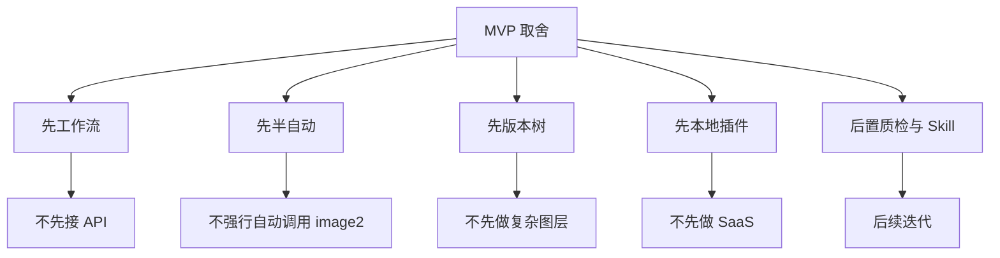
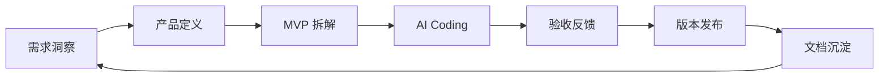

# 从 Prompt 修图到 AI 图片编辑工作流：Pedit 项目复盘

一个 AI 产品经理借助 Codex，从需求洞察、MVP 拆解、AI Coding 到 GitHub 发布的完整实践。

---

## 0. 文档信息

| 字段 | 内容 |
|---|---|
| 项目名称 | Pedit |
| 文档类型 | 项目复盘 / Case Study |
| 当前版本 | v0.1.0-alpha |
| 项目形态 | Codex 本地图片编辑插件 |
| 复盘视角 | AI 产品经理 |
| 核心主题 | 从 Prompt 修图到 AI 图片编辑工作流 |
| 文档目标 | 复盘 Pedit 从问题发现、产品设计、AI Coding 到 GitHub 发布的完整过程 |
| 核心关键词 | AI 修图、AI Coding、Codex、Handoff、Version Graph、MVP、Product-driven |

---

## 摘要

Pedit 是一个运行在 Codex 中的本地图片编辑插件，目标是把 AI 修图从一次性 Prompt 交互，升级为可追踪、可回退、可迭代的图片编辑工作流。

这个项目起点来自我对 AI 修图场景的观察：用户真正困难的不是让模型生成一张图片，而是在多轮编辑中组织图片、局部修改意图、参考图、历史版本和生成结果。

基于这个判断，我以 AI 产品经理的方式定义了 Pedit 的 MVP：图片项目、画布、局部标注、参考图、Handoff、版本树和结果回流。随后借助 Codex 完成插件开发，并发布到 GitHub。

这份文档复盘 Pedit 从问题发现、产品定义、MVP 取舍、AI Coding 到 GitHub 发布的完整过程。

---

## 1. 项目背景：为什么我开始做 Pedit

### 1.1 AI 修图变强了，但工作流还很弱

我最初关注 Pedit，并不是因为想做一个新的 P 图工具，而是在持续体验 AI 图片编辑工具时，发现了一个很明显的断点：AI 生成能力越来越强，但用户真正想把一张图修到满意，仍然很难。

很多时候，用户不是只想“一次生成一张图”，而是想围绕一张图片进行多轮编辑：

```text
先整体优化
→ 再局部修改
→ 再参考另一张图调整风格
→ 再回到某个历史版本重新尝试
→ 最后从多个版本中选择满意结果
```

但当前大多数 AI 修图流程仍然是对话式的。用户上传图片、写 Prompt、下载结果，不满意后再重新描述、重新生成、重新保存。

这个流程在简单任务中可以接受，但一旦进入多轮编辑，就会出现明显的上下文和版本管理问题。

---

### 1.2 用户真正困难的不是生成，而是连续编辑

AI 修图的难点正在从“模型能不能生成”转向“用户能不能可控地完成编辑过程”。

很多 AI 工具已经可以根据自然语言生成图片或修改图片，但用户仍然需要自己处理：

- 原图和结果图的关系；
- 哪次 Prompt 对应哪个结果；
- 哪张参考图用于哪次任务；
- 局部修改到底作用在哪里；
- 不同版本如何保存和回退；
- 如何从某个历史结果继续编辑；
- 最终哪个版本可以导出使用。

这些问题不是单纯靠更强的模型就能解决的。它更像是一个产品工作流问题。

---

### 1.3 我看到的产品机会

我开始意识到，AI 修图真正缺少的，可能不是另一个更强的生成按钮，而是一个能够承载图片上下文、局部意图、参考图、任务执行和历史版本的工作流工作台。

这个工作台需要帮助用户完成：

```text
上传图片
→ 表达编辑意图
→ 组织局部选区和参考图
→ 将任务交给 AI 执行
→ 接收结果
→ 记录版本
→ 继续编辑、回退或导出
```

这就是 Pedit 的产品机会。

我希望验证一个问题：

> 是否可以在 Codex 中做一个本地图片编辑插件，让用户通过画布、局部标注、Handoff 和版本树完成 AI 图片编辑工作流？

---

### 1.4 项目叙事主线


Pedit 的项目主线不是“我写了一个图片编辑插件”，而是：

> 我发现了 AI 修图中的工作流问题，并用 AI Coding 的方式快速完成了一个 AI 原生产品机会的 MVP 验证。

---

## 2. 问题定义：AI 修图到底缺什么

### 2.1 局部修改难表达

用户经常不是想改整张图，而是想改图片中的某个局部：

- 改变眼睛颜色；
- 修改衣服颜色；
- 删除背景物体；
- 替换包装文字；
- 调整局部光影；
- 修复某个瑕疵。

但如果只能靠文字描述：

```text
把左边那个东西删掉
把这里变亮一点
把人物旁边的文字换掉
```

模型很容易理解错位置，也可能误改不该修改的区域。

所以，我判断 AI 修图需要一个可视化方式来表达“改哪里”。这也是 Pedit 设计画布和局部标注的原因。

---

### 2.2 多轮编辑上下文断裂

AI 修图通常不是一次完成的。用户可能会经历：

```text
上传原图
→ 第一次整体优化
→ 发现局部不满意
→ 针对局部继续修改
→ 上传参考图调整风格
→ 对比多个结果
→ 回到某个历史版本继续编辑
```

但在传统对话式修图流程中，图片、Prompt、参考图和历史结果往往分散在不同位置。用户需要依赖自己的记忆和本地文件命名来管理上下文。

这会导致几个问题：

- 用户很难知道当前图片是基于哪个版本生成的；
- 用户很难回到某个中间结果继续编辑；
- 多轮 Prompt 和图片结果之间缺少结构化关联；
- 同一张图的多个探索方向难以管理。

因此，Pedit 需要一个能够承载图片上下文和历史结果的项目工作台。

---

### 2.3 版本管理缺失

AI 生成结果具有不确定性。用户经常会遇到：

- 第一次结果整体不错，但某些局部不好；
- 第二次局部修好了，但整体风格变差；
- 想回到之前版本重新尝试另一种方向；
- 想保留多个方案做对比；
- 想基于某个历史版本继续分支编辑。

如果没有版本管理，用户只能依赖本地文件夹手动保存不同结果。这种方式不仅成本高，也无法清晰记录每个版本之间的父子关系和编辑历史。

因此，AI 修图产品需要类似“版本树”的能力，让每次 AI 结果都可以被记录、回退、分支和继续编辑。

---

### 2.4 Prompt、图片、参考图和结果割裂

一次 AI 修图任务可能包含多个要素：

- 原图；
- 当前版本；
- 用户 Prompt；
- 局部选区；
- 参考图；
- 保留要求；
- 输出要求；
- 生成结果；
- 后续反馈。

但在很多工具中，这些信息并没有被组织成一个结构化任务。它们分散在对话框、本地文件夹、下载目录和用户记忆里。

这导致：

- 任务无法复盘；
- 结果无法追踪；
- 经验无法沉淀；
- 失败原因难以分析；
- 成功的修图方法无法复用。

---

### 2.5 我的核心判断

基于这些观察，我对 AI 修图问题做了一个重新定义：

> AI 修图不是单次生成问题，而是一个需要画布、选区、任务、执行结果和版本历史共同承载的工作流问题。

这也是 Pedit 的核心出发点。

---

## 3. 产品方案：Pedit 想解决什么

### 3.1 一句话定位

Pedit 是一个运行在 Codex 中的本地图片编辑插件，通过画布、局部标注、参考图、Handoff 和版本树，把 AI 修图从一次性 Prompt 交互升级为可追踪、可回退、可迭代的图片编辑工作流。

---

### 3.2 核心用户

Pedit 当前主要面向四类用户：

| 用户类型 | 典型需求 |
|---|---|
| AI 修图尝鲜用户 | 想用自然语言修图，但希望保留历史版本 |
| 内容创作者 | 需要处理封面、配图、商品图、社交内容素材 |
| 产品/运营/设计人员 | 需要快速处理活动图、产品图、汇报配图 |
| AI Agent 工具探索者 | 希望探索 Codex、MCP 和 AI 图像工作流 |

这些用户的共同点是：他们不只是想生成一张图，而是希望在多轮编辑中保持控制感。

---

### 3.3 核心场景

Pedit 当前主要覆盖以下场景：

1. **整图优化**
   例如提升图片质感、调整色调、优化光线、改变整体风格。

2. **局部修改**
   例如删除背景物体、替换文字、改变衣服颜色、修复局部瑕疵。

3. **参考图辅助编辑**
   例如参考另一张图的色调、光影、构图、背景或材质。

4. **多版本探索**
   例如保留多个结果、从历史版本继续编辑、回退到满意版本。

5. **Codex 内完成图片编辑工作流**
   用户不需要在多个工具之间反复上传、下载和管理文件，而是在 Codex 里完成任务组织与执行协作。

---

### 3.4 MVP 功能设计

Pedit 的 MVP 聚焦以下核心功能：

| 功能 | 解决的问题 |
|---|---|
| 图片项目 | 组织一次完整修图过程 |
| 画布 | 承载图片和编辑上下文 |
| 局部标注 | 表达“改哪里” |
| 参考图 | 表达风格、色调、构图等视觉要求 |
| Handoff | 把任务结构化交给 Codex |
| 版本树 | 管理多轮生成结果 |
| 导出 | 完成最终结果交付 |

这些功能共同构成一个 AI 图片编辑闭环。

---

### 3.5 产品闭环


当前版本的核心闭环是：

```text
创建项目
→ 上传图片
→ 画布表达编辑意图
→ 生成 Handoff
→ 复制到 Codex 执行
→ 结果回流
→ 生成版本节点
→ 继续编辑 / 回退 / 导出
```

这条闭环是 Pedit MVP 的核心价值。

---

## 4. MVP 取舍：为什么这样做

### 4.1 取舍总览

Pedit 的 MVP 不是把所有想法一次做完，而是围绕“工作流是否成立”做了多次收敛。



这些取舍不是能力不足，而是为了让 MVP 更聚焦、更可验证。

---

### 4.2 为什么不直接接图像 API

直接接入图像 API 可以让链路更顺滑：

```text
用户点击开始优化
→ 后端调用图像 API
→ 返回结果
→ 写回版本树
```

但这会引入一系列 MVP 阶段不必要的复杂度：

- API Key；
- 模型调用成本；
- 用户额度管理；
- 账号体系；
- 服务端图片存储；
- 图片隐私和合规；
- 服务稳定性和运维成本。

Pedit 当前要验证的是工作流，而不是模型调用服务。所以 MVP 阶段不直接内置中心化 API。

---

### 4.3 为什么采用半自动 Handoff

当前版本采用半自动 Handoff：

```text
Pedit 生成结构化任务
→ 用户一键复制
→ 用户粘贴到 Codex
→ Codex 执行
→ 结果回流
```

这不是因为我没有意识到自动化更好，而是因为 Codex/image2 自动调用链路在当前阶段还不够稳定。此前尝试中，自动调用存在耗时较长、环境依赖复杂、失败恢复困难等问题。

通过 Handoff，Pedit 可以先把图片、选区、参考图和指令组织成结构化任务，再由用户确认后交给 Codex 执行。

这个方案有几个好处：

| 优点 | 说明 |
|---|---|
| 降低技术不确定性 | 不强依赖自动调用接口 |
| 降低模型成本 | 不需要 Pedit 承担 API 费用 |
| 用户确认明确 | 用户主动复制并发送 |
| 适合 MVP | 先验证任务组织和版本闭环 |
| 可继续演进 | 后续可升级为 Executor Layer |

半自动 Handoff 不是终点，但它是当前阶段最合理的桥梁。

---

### 4.4 为什么先做版本树而不是图层系统

Pedit 当前不是要复刻 Photoshop，也不是要做完整专业设计工具。

传统图像编辑软件更关注图层、蒙版、滤镜和精修能力。
但 AI 生成式编辑中，用户首先遇到的是结果不确定：

- 这版整体好，但局部不好；
- 那版局部好，但风格不对；
- 想回到上一版重新试；
- 想保留多个方向；
- 想基于某个历史版本继续生成。

所以 Pedit 优先做版本树，而不是复杂图层系统。

版本树更适合解决：

- 保存结果；
- 回退历史；
- 分支探索；
- 多版本对比；
- 基于历史版本继续编辑。

这比在 MVP 阶段做复杂图层更符合当前产品目标。

---

### 4.5 为什么先做本地插件而不是 SaaS

Pedit 也可以被设计成 SaaS：

```text
用户登录
→ 上传图片到云端
→ 后端调用模型
→ 云端保存版本
→ 在线编辑和分享
```

但这会带来大量非 MVP 必需能力：

- 用户系统；
- 云端存储；
- 服务端稳定性；
- 图片安全；
- 模型成本；
- 计费；
- 合规；
- 数据同步；
- 权限管理。

当前阶段，我更希望快速验证产品假设，所以选择 Codex 本地插件形态。

本地插件的优势是：

- 贴近 Codex 使用场景；
- 复用用户自己的 Codex 能力；
- 图片默认本地存储；
- 开发成本更低；
- 适合快速迭代；
- 更符合个人 AI Coding 项目阶段。

---

### 4.6 为什么把质检、反馈、Skill 放到后续

图片质检、用户反馈和修图 Skill 都很重要，但它们应该建立在核心链路稳定的基础上。

如果连：

```text
上传图片 → 生成 Handoff → Codex 执行 → 结果回流 → 版本树
```

都不稳定，过早做质检、反馈和 Skill 只会增加复杂度。

所以当前规划是：

```text
v0.1：跑通工作流
v0.2：优化 Handoff 和回流
v0.3：补任务状态和轻量反馈
v0.5：补基础质检和模板复用
v1.0：形成稳定工作流平台
```

这个取舍背后的原则是：

> 先完成工作流闭环，再优化质量闭环，最后沉淀 Skill 生态。

---

## 5. 开发过程：我是如何用 AI Coding 推进的

### 5.1 从产品想法到任务拆解

Pedit 最初只是一个模糊想法：自然语言 P 图。

但直接让 Codex “做一个自然语言 P 图插件”范围太大，也不容易控制结果。因此，我先把它拆成明确的产品模块：

```text
图片项目
→ 图片上传
→ 画布
→ 局部标注
→ 参考图
→ Handoff
→ 结果回流
→ 版本树
→ 导出
```

再进一步拆成工程任务：

```text
任务 1：搭建 Codex 插件工程骨架
任务 2：实现项目创建和项目列表
任务 3：实现图片上传和本地存储
任务 4：实现 Canvas 图片展示
任务 5：实现局部选区
任务 6：实现 Handoff 生成和一键复制
任务 7：实现版本树数据结构
任务 8：实现结果回流和版本节点生成
任务 9：完善 README 和发布说明
```

这种拆解让 AI Coding 过程更可控。

---

### 5.2 与 Codex 的协作方式

我的协作方式逐渐从“让 AI 写代码”转向“用产品任务驱动 AI 执行”。

整体流程是：


我通常不会直接让 Codex 写完整功能，而是会先输入：

- 项目背景；
- 当前状态；
- 本轮任务；
- 约束条件；
- 验收标准；
- 不要改动的模块。

例如：

```text
当前项目是 Pedit，一个 Codex 本地图片编辑插件。
当前已经支持图片项目和上传。
本轮只实现局部选区创建。
要求：
1. 选区坐标基于原图坐标；
2. 当前只支持单选区；
3. 选区需要与当前版本关联；
4. 不要改动版本树逻辑；
5. 完成后 Handoff 可以读取 selection 信息。
```

这类任务描述明显比“帮我做局部修图功能”更稳定。

---

### 5.3 关键开发阶段

Pedit 的开发大致经历了几个阶段。

#### 5.3.1 插件工程骨架

第一步不是做复杂功能，而是先让 Pedit 能以 Codex 本地插件形态运行。

这一阶段主要完成：

- 插件配置；
- 本地 MCP Server；
- 前端 Canvas 入口；
- 基础类型定义；
- 本地开发脚本；
- README 初版。

这一步的重点是让后续功能有一个可运行的工程容器。

#### 5.3.2 图片项目与画布

第二步是让图片进入工作流。

这一阶段主要完成：

- 创建项目；
- 上传图片；
- 保存 ImageAsset；
- 创建 root VersionNode；
- Canvas 展示当前图片。

关键不是“图片能显示”，而是图片必须进入 Project 和 Version 体系。

#### 5.3.3 局部标注与参考图

第三步是让用户可以表达更复杂的编辑上下文。

局部标注解决“改哪里”，参考图解决“参考什么”。

这一阶段的核心问题是：用户在画布中的操作，如何转化为 Codex 可理解的结构化任务上下文。

#### 5.3.4 Handoff 与 Codex 协作

第四步是打通 Pedit 和 Codex 之间的任务交接。

Pedit 生成结构化 Handoff，用户一键复制，并粘贴到 Codex 执行。

这个阶段的关键是把 Handoff 从普通 Prompt 升级为结构化任务说明。

#### 5.3.5 版本树与结果回流

第五步是让 Codex 的结果回到 Pedit，并成为版本节点。

这一步让 Pedit 从“任务组织器”变成了“工作流闭环工具”。

#### 5.3.6 GitHub 发布与文档沉淀

最后一步是整理仓库、README、Release 和完整文档体系，让 Pedit 从一次本地实验变成可展示、可复盘、可继续迭代的项目资产。

---

### 5.4 遇到的问题和修正

开发过程中，最主要的问题不是单个 Bug，而是几个产品与技术边界问题。

#### 5.4.1 自动调用 Codex/image2 不稳定

一开始理想链路是：

```text
Pedit → 自动调用 Codex/image2 → 等待结果 → 自动回流
```

但实际尝试中，这条链路耗时长且不稳定，容易受本地环境和 Codex 能力边界影响。

最终我选择把它后置，先用半自动 Handoff 跑通主链路。

#### 5.4.2 局部标注不是简单画框

局部标注看似是前端 UI，但真正关键的是坐标体系和任务上下文。

如果只保存画布显示坐标，后续 Handoff 和结果处理都会不稳定。因此选区必须基于原图坐标，并与当前版本关联。

#### 5.4.3 版本树需要提前稳定

如果版本结构不稳定，结果回流、回退、分支和导出都会受影响。

所以我逐渐把 VersionNode 作为核心对象，而不是只保存图片文件。

#### 5.4.4 文档必须成为上下文基础设施

随着项目复杂度提升，仅靠对话上下文会漂移。
因此，我开始沉淀项目总览、PRD、架构设计、AI Coding 复盘和用户手册。

这些文档不仅给人看，也可以给后续 Codex 开发作为稳定上下文输入。

---

### 5.5 GitHub 发布和文档沉淀

Pedit 发布到 GitHub 后，我开始将它从“一个本地插件”沉淀为“项目资产”。

当前已规划和沉淀的文档包括：

| 文档 | 作用 |
|---|---|
| 项目总览 | 让别人快速理解 Pedit 是什么 |
| PRD | 说明产品目标、功能边界和指标 |
| 产品架构设计 | 说明系统如何拆解和演进 |
| AI Coding 复盘 | 复盘如何借助 Codex 开发 |
| 用户手册 | 帮助用户安装和使用 |
| Release Notes | 记录版本变化 |
| 项目复盘文章 | 对外传播项目故事 |

这个过程让我意识到：

> AI Coding 项目的最终产出，不只是代码，而是代码、文档、版本、复盘和方法论的组合资产。

---

## 6. 当前成果：Pedit 已经做到什么

### 6.1 当前版本能力

当前 Pedit 已经完成 v0.1 alpha 阶段的核心工作流验证。

| 维度 | 当前成果 |
|---|---|
| 产品形态 | Codex 本地图片编辑插件 |
| 核心链路 | 上传图片 → 画布编辑 → Handoff → Codex 执行 → 结果回流 → 版本树 |
| 核心功能 | 项目管理、画布、局部标注、参考图、Handoff、版本树、导出 |
| 执行方式 | 半自动 Handoff |
| 数据管理 | 本地图片和项目数据 |
| 发布状态 | 已发布到 GitHub |
| 文档资产 | 项目总览、PRD、架构设计、AI Coding 复盘、用户手册等 |

---

### 6.2 当前产品闭环

当前可以跑通的核心闭环是：

```text
用户创建图片项目
→ 上传原图
→ 在画布中输入整图或局部编辑需求
→ 可选上传参考图
→ Pedit 生成结构化 Handoff
→ 用户一键复制并粘贴到 Codex
→ Codex 执行图片编辑
→ 结果回流到 Pedit
→ 生成新的版本节点
→ 用户继续编辑、回退或导出
```

这说明 Pedit 已经完成了 AI 图片编辑工作流的基础验证。

---

### 6.3 当前仍存在的问题

Pedit 当前仍然处于 alpha 阶段，主要问题包括：

| 问题 | 影响 |
|---|---|
| 仍需手动复制 Handoff | 执行链路不够顺滑 |
| 自动调用 Codex/image2 尚未稳定 | 全自动体验暂未形成 |
| 结果回流可能受本地环境影响 | 版本树闭环稳定性需继续优化 |
| 局部修改效果不稳定 | 需要更好的选区表达和质检 |
| 参考图理解可能偏差 | 需要参考维度引导 |
| 反馈和质检尚未完整 | 难以持续优化修图效果 |
| Skill 机制尚未实现 | 用户经验还不能系统复用 |

这些问题并不否定 MVP 价值，而是说明 Pedit 已经从“能不能做”进入“如何做得更稳定、更顺滑、更可复用”的阶段。

---

### 6.4 当前成果的意义

Pedit 当前的价值不在于它已经是一个成熟商业产品，而在于它完成了一个 AI 原生产品方向的早期验证：

> AI 图片编辑需要的不只是模型能力，而是一个能够组织图片、任务、版本和结果的工作流系统。

这个方向已经通过 Pedit 的 alpha 版本初步跑通。

---

## 7. 复盘总结：这次项目验证了什么

### 7.1 产品假设层面的验证

这次项目验证了一个产品假设：

> AI 图片编辑不仅需要模型能力，还需要工作流承载。

通过 Pedit，我验证了画布、局部标注、Handoff 和版本树的组合，可以帮助用户更好地组织 AI 修图过程。

尤其是：

- 画布可以承载图片和编辑上下文；
- 局部标注可以帮助表达“改哪里”；
- Handoff 可以把复杂编辑意图结构化；
- 版本树可以管理 AI 生成结果的不确定性；
- 本地插件可以快速验证 Codex 图像工作流。

---

### 7.2 AI Coding 层面的验证

这次项目也验证了 AI Coding 的可行性：

> 产品经理可以借助 Codex，将一个模糊产品想法推进为可运行、可发布、可复盘的 MVP。

但前提是，不能只是随机 vibe coding，而要做到：

- 先定义产品问题；
- 再拆解 MVP；
- 再设计任务边界；
- 再用 Prompt 驱动 Codex；
- 再通过验收标准检查结果；
- 最后用文档沉淀上下文。

AI Coding 的核心不是让 AI 一次性完成所有事情，而是把 AI 变成一个可以持续协作的工程伙伴。

---

### 7.3 AI 产品经理能力层面的验证

这次项目让我进一步确认：

> AI 产品经理的价值不是被 AI Coding 削弱，而是被放大。

因为 AI 可以加速实现，但以下事情仍然需要人来判断：

- 用户问题是否真实；
- 产品机会是否成立；
- MVP 边界是否合理；
- 哪些功能先做，哪些后置；
- 技术方案是否符合当前阶段；
- 结果是否满足用户流程；
- 文档是否能沉淀为长期资产。

AI 产品经理在 AI Coding 时代，需要具备更复合的能力：



---

### 7.4 我最大的收获

我最大的收获是：

> AI Coding 的关键不是“想到什么就让 AI 写什么”，而是以产品目标为中心，把需求、架构、任务、代码、验收和文档组织成一个闭环。

Pedit 最初是一次 Vibe Coding 尝试，但最后变成了一次 Product-driven AI Coding 实践。

---

## 8. 后续规划：Pedit 接下来往哪里走

### 8.1 优化 Handoff 和结果回流

短期重点是让当前半自动链路更顺滑，包括：

- 优化 Handoff 模板；
- 增加 task_id 匹配；
- 增加任务状态提示；
- 优化一键复制后的用户引导；
- 增加结果回流失败提示；
- 支持手动导入结果；
- 提升版本节点生成稳定性。

目标是让当前流程从“能跑通”变成“顺手可用”。

---

### 8.2 探索自动调用 Codex/image2

长期继续探索：

```text
Pedit 创建任务
→ 自动调用 Codex/image2
→ 等待执行
→ 结果自动回流
→ 生成版本节点
```

但不会在能力稳定前把它作为唯一主链路。

更合理的架构是把 Codex/image2 抽象为一个 Executor：

```text
Executor:
- codex_handoff
- codex_image2
- external_api
- local_model
- user_skill
```

这样可以避免过早绑定单一执行能力。

---

### 8.3 增加图片质检和用户反馈

后续需要判断生成结果是否真正可用。

质检方向包括：

- 图片是否成功生成；
- 是否修改了目标区域；
- 是否保留了非目标区域；
- 是否遵循参考图；
- 人像是否崩坏；
- 文字是否错误；
- 局部融合是否自然。

反馈方向包括：

- 满意 / 一般 / 不满意；
- 改错区域；
- 风格不对；
- 参考图没跟上；
- 文字错误；
- 人脸或主体崩坏；
- 结果太慢；
- 是否愿意保存为 Skill。

这些能力可以帮助 Pedit 从“完成任务”升级为“持续优化结果”。

---

### 8.4 支持用户自定义修图 Skill

长期可以支持用户把常用修图方式保存为 Skill。

例如：

- 人像精修 Skill；
- 电商白底图优化 Skill；
- 小红书封面提亮 Skill；
- 背景替换 Skill；
- 海报文案替换 Skill；
- 宠物写真风格化 Skill；
- 婚礼照片调色 Skill。

Skill 的价值是把用户一次成功的修图经验，沉淀为可复用的工作流资产。

---

### 8.5 从插件走向工作流平台

Pedit 的长期目标不是一个 Prompt 生成器，而是一个以画布为中心的 AI 图片编辑工作流平台。

未来完整链路可以是：

```text
用户上传图片
→ 在画布中组织原图、选区、参考图和编辑意图
→ 选择通用编辑方式或自定义 Skill
→ Pedit 创建结构化修图任务
→ 调度 Codex/image2 或其他图像编辑执行器
→ 等待执行结果
→ 自动进行结果质检
→ 用户反馈满意度和问题类型
→ 结果进入版本树
→ 用户继续编辑、回退、导出或沉淀为 Skill
```

---

## 9. 结语：AI 产品经理如何把想法变成产品

Pedit 最初只是一个关于“自然语言 P 图”的模糊想法，但在推进过程中，它逐渐变成了一次完整的 AI 产品实践：从问题发现、产品定义、MVP 拆解、AI Coding、架构取舍，到 GitHub 发布和文档沉淀。

这次项目让我意识到，AI Coding 的关键不是让 AI 随机生成代码，而是用产品目标、任务边界、验收标准和文档上下文驱动 AI 完成可持续迭代的产品闭环。

对 AI 产品经理来说，未来最重要的能力不是单纯会不会写代码，而是能否发现 AI 原生场景中的真实问题，并借助 AI Coding 快速完成产品验证。

Pedit 的意义不只是一个图片编辑插件，而是一次关于 AI 产品经理如何在 AI Coding 时代完成 0 到 1 的实践样本。

最后，我会用一句话总结这次项目：

> Pedit 不是一次随机 vibe coding，而是一次以产品问题为起点、以 AI Coding 为手段、以工作流验证为目标的 Product-driven AI Coding 实践。
